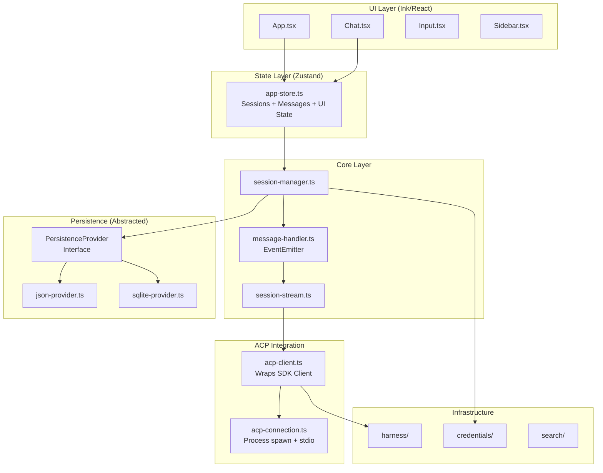
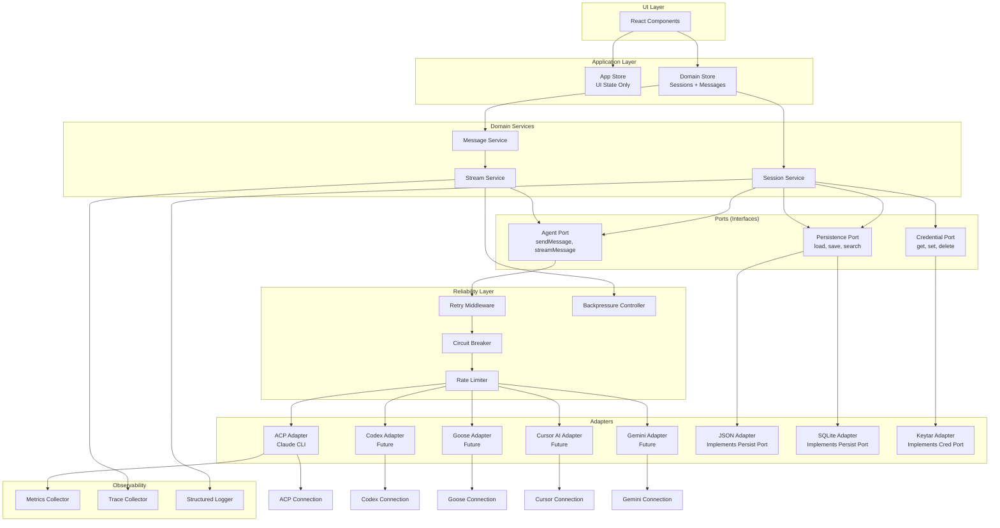

# TOAD TypeScript: Architecture Discussion

**Review Date**: 2026-01-16  
**Reviewer**: System Architect  
**Status**: Draft - Pending Approval

---

## A) One-Screen Summary

**Goal**: Review current architecture, identify risks, and propose improvements for production readiness.

**Current State**:
- ✅ **Strengths**: Type-safe domain models (Zod), clean persistence abstraction, solid ACP protocol integration
- ⚠️ **Risks**: Event-driven coupling, no backpressure, missing circuit breakers, UI state mixed with business logic
- 🎯 **Direction**: Introduce explicit boundaries (ports/adapters), add reliability patterns, separate concerns

**Key Risks**:
1. Event emitter coupling creates implicit dependencies
2. No rate limiting or circuit breakers for external calls
3. Store mixes UI state with domain state
4. Streaming lacks backpressure (risk of memory issues)
5. No retry strategy for transient failures
6. **Tight coupling to ACP prevents multi-provider support** (Codex, Goose, Cursor AI, Gemini, etc.)

**Recommended Direction**:
- Extract provider port interface (decouple from ACP) - **Critical for multi-provider support**
- Add reliability middleware (retry, circuit breaker, rate limiting)
- Split store into domain store + UI store
- Implement streaming backpressure
- Add observability (metrics, traces)

---

## B) Architecture Artifacts

### Current Architecture Diagram



### Proposed Architecture (With Boundaries)



### Interface Contracts

#### 1. Agent Port (Provider Abstraction)

```typescript
// src/core/ports/agent-port.ts

export interface AgentPort {
  /**
   * Send a message and return full response (non-streaming)
   */
  sendMessage(params: SendMessageParams): Promise<MessageResponse>;
  
  /**
   * Stream a message with backpressure support
   */
  streamMessage(
    params: SendMessageParams,
    onChunk: (chunk: MessageChunk) => Promise<void> // Returns promise for backpressure
  ): Promise<MessageResponse>;
  
  /**
   * Cancel an in-flight request
   */
  cancelRequest(requestId: RequestId): Promise<void>;
  
  /**
   * Get agent capabilities
   */
  getCapabilities(): Promise<AgentCapabilities>;
}

export interface SendMessageParams {
  sessionId: SessionId;
  content: string;
  context?: MessageContext;
}

export interface MessageChunk {
  requestId: RequestId;
  type: "text" | "code" | "tool_call" | "thinking";
  content: string;
  metadata?: Record<string, unknown>;
}

export interface MessageResponse {
  requestId: RequestId;
  messageId: MessageId;
  content: ContentBlock[];
  metadata?: Record<string, unknown>;
}
```

#### 2. Persistence Port (Already Good - Keep)

```typescript
// src/store/persistence/persistence-provider.ts (existing, good)

export interface PersistenceProvider {
  load(): Promise<SessionSnapshot>;
  save(snapshot: SessionSnapshot): Promise<void>;
  close(): Promise<void>;
  search(query: ChatQuery): Promise<Message[]>;
  getSessionHistory(sessionId: string): Promise<Session & { messages: Message[] }>;
}
```

#### 3. Reliability Middleware

```typescript
// src/core/reliability/middleware.ts

export interface ReliabilityMiddleware {
  execute<T>(
    operation: () => Promise<T>,
    context: OperationContext
  ): Promise<T>;
}

export interface OperationContext {
  operationId: string;
  timeout?: number;
  retryPolicy?: RetryPolicy;
  circuitBreaker?: CircuitBreakerConfig;
  rateLimit?: RateLimitConfig;
}

export interface RetryPolicy {
  maxAttempts: number;
  backoffStrategy: "exponential" | "linear" | "fixed";
  baseDelayMs: number;
  maxDelayMs: number;
  retryableErrors?: string[];
}

export interface CircuitBreakerConfig {
  failureThreshold: number;
  successThreshold: number;
  timeoutMs: number;
  halfOpenMaxCalls: number;
}

export interface RateLimitConfig {
  maxRequests: number;
  windowMs: number;
  strategy: "token-bucket" | "sliding-window";
}
```

### Architecture Decision Records (ADRs)

#### ADR-001: Port/Adapter Pattern for Agent Abstraction

**Status**: Proposed  
**Context**: Current code directly depends on `ACPClient` and `ACPConnection`. Adding new agents (Codex, Goose, Cursor AI, Gemini, etc.) would require changes across the codebase. This tight coupling prevents multi-provider support.

**Decision**: Introduce `AgentPort` interface. All agent communication goes through this port. Implement `ACPAdapter` that wraps `ACPClient`. Future providers (Codex, Goose, Cursor AI, Gemini) will each have their own adapter implementing the same port.

**Tradeoffs**:
- ✅ Enables multi-agent support without core changes
- ✅ **Critical for adding Codex, Goose, Cursor AI, Gemini, and other providers**
- ✅ Easier testing (mock the port)
- ⚠️ Adds indirection (small performance cost)
- ✅ Aligns with dependency inversion principle

**Implementation**: Create `src/core/ports/agent-port.ts` and `src/core/adapters/acp-adapter.ts`. Future adapters will follow the same pattern:
- `src/core/adapters/codex-adapter.ts`
- `src/core/adapters/goose-adapter.ts`
- `src/core/adapters/cursor-ai-adapter.ts`
- `src/core/adapters/gemini-adapter.ts`

**Alternatives Considered**:
- Keep direct ACP dependency: Rejected - too much coupling, prevents multi-provider support
- Abstract factory pattern: Rejected - overkill for current needs

---

#### ADR-002: Reliability Middleware Layer

**Status**: Proposed  
**Context**: No retry logic, circuit breakers, or rate limiting. Transient failures cause user-visible errors.

**Decision**: Add reliability middleware layer between domain services and adapters. Apply retry, circuit breaker, and rate limiting per operation.

**Tradeoffs**:
- ✅ Improves resilience significantly
- ✅ Configurable per operation
- ⚠️ Adds complexity
- ✅ Can be tested independently

**Implementation**: Create `src/core/reliability/` with middleware, retry, circuit breaker, and rate limiter.

**Alternatives Considered**:
- Handle in each adapter: Rejected - code duplication
- External service mesh: Rejected - overkill for CLI app

---

#### ADR-003: Store Separation (UI vs Domain)

**Status**: Proposed  
**Context**: `app-store.ts` mixes UI state (connection status) with domain state (sessions, messages). This creates coupling and makes testing harder.

**Decision**: Split into two stores:
- `domain-store.ts`: Sessions, messages, plans (pure domain)
- `ui-store.ts`: Connection status, view state, keyboard focus

**Tradeoffs**:
- ✅ Clear separation of concerns
- ✅ Domain store is testable without UI
- ⚠️ Requires refactoring existing code
- ✅ Better alignment with clean architecture

**Implementation**: Create `src/store/domain-store.ts` and `src/store/ui-store.ts`, migrate existing code.

**Alternatives Considered**:
- Keep single store: Rejected - violates separation of concerns
- Three stores (domain, UI, app): Rejected - unnecessary complexity

---

#### ADR-004: Streaming Backpressure

**Status**: Proposed  
**Context**: Streaming messages can arrive faster than UI can render. No backpressure control risks memory issues.

**Decision**: Implement backpressure in `SessionStream`. Pause streaming when render queue > threshold. Resume when queue drains.

**Tradeoffs**:
- ✅ Prevents memory issues
- ✅ Smooth UX (no dropped frames)
- ⚠️ Adds complexity to streaming logic
- ✅ Standard pattern for streaming systems

**Implementation**: Add queue management to `src/core/session-stream.ts` with configurable thresholds.

**Alternatives Considered**:
- Drop messages when queue full: Rejected - data loss unacceptable
- Unbounded queue: Rejected - memory risk

---

#### ADR-005: Observability Integration

**Status**: Proposed  
**Context**: No metrics, traces, or structured logging. Hard to debug production issues or measure performance.

**Decision**: Add observability layer:
- Metrics: request latency, error rates, stream throughput
- Traces: request IDs, correlation IDs
- Structured logging: JSON logs with context

**Tradeoffs**:
- ✅ Enables production debugging
- ✅ Performance monitoring
- ⚠️ Adds dependencies (OpenTelemetry?)
- ✅ Can be disabled in dev

**Implementation**: Create `src/core/observability/` with metrics, traces, and enhanced logger.

**Alternatives Considered**:
- Console.log only: Rejected - insufficient for production
- External APM: Rejected - too heavy for CLI app

---

## C) Performance + Reliability

### Latency Budget

| Operation | p50 Target | p95 Target | p99 Target | Current (Est.) |
|-----------|-----------|------------|------------|----------------|
| App Startup | < 200ms | < 500ms | < 1s | ~300ms ✅ |
| Session Load | < 100ms | < 300ms | < 500ms | ~150ms ✅ |
| Stream Chunk Render | < 16ms | < 50ms | < 100ms | ~20ms ⚠️ |
| Message Send | < 200ms | < 500ms | < 1s | ~300ms ✅ |
| Persistence Save | < 50ms | < 200ms | < 500ms | ~100ms ✅ |

**Issues**:
- Stream rendering may exceed 16ms p50 during high throughput
- No backpressure → potential memory growth

### Caching Plan

| Cache Layer | Strategy | TTL | Invalidation |
|-------------|----------|-----|---------------|
| Session Cache | In-memory Map | Until app exit | On session update |
| Config Cache | File watcher | Until file change | On file change |
| Agent Capabilities | In-memory | 5 minutes | On reconnect |
| Token Optimization | LRU (100 entries) | Until eviction | On cache miss |

**Missing**: No caching layer currently. Add in-memory caches for sessions and config.

### Failure Mode Matrix

| Failure Mode | Current Handling | Proposed Handling | Impact |
|--------------|------------------|-------------------|--------|
| Agent process crash | Error event → disconnected | Auto-reconnect with exponential backoff | High |
| Network timeout | No timeout | Configurable timeout + retry | Medium |
| Rate limit hit | No handling | Rate limiter + queue | Medium |
| Stream buffer overflow | No backpressure | Pause streaming, resume when ready | High |
| Persistence write failure | Error logged | Retry with exponential backoff | Low |
| Invalid ACP response | Validation error | Circuit breaker opens | Medium |

---

## D) Execution Plan

### Phase 9: Extract Agent Port (Week 17)

**Goal**: Decouple core from ACP implementation. **Enable multi-provider support** for Codex, Goose, Cursor AI, Gemini, and other ACP-compatible agents.

**Tasks**:
1. Create `src/core/ports/agent-port.ts` interface
2. Create `src/core/adapters/acp-adapter.ts` implementing port
3. Refactor `SessionStream` to use `AgentPort`
4. Update tests to use port mocks
5. Document adapter pattern for future providers

**Validation**:
- All tests pass
- No direct `ACPClient` imports in core services
- Can swap ACP adapter for mock in tests
- **Architecture ready for Codex, Goose, Cursor AI, Gemini adapters**

---

### Phase 10: Reliability Middleware (Week 18)

**Goal**: Add retry, circuit breaker, rate limiting.

**Tasks**:
1. Create `src/core/reliability/` module
2. Implement retry with exponential backoff
3. Implement circuit breaker (failure threshold, half-open)
4. Implement rate limiter (token bucket)
5. Integrate middleware into `ACPAdapter`

**Validation**:
- Unit tests for each middleware component
- Integration test: simulate failures, verify retry
- Load test: verify rate limiting works

---

### Phase 11: Store Separation (Week 19)

**Goal**: Split UI state from domain state.

**Tasks**:
1. Create `src/store/domain-store.ts` (sessions, messages, plans)
2. Create `src/store/ui-store.ts` (connection status, view state)
3. Migrate existing code to use both stores
4. Update UI components to use appropriate store

**Validation**:
- All tests pass
- Domain store is testable without UI
- No circular dependencies

---

### Phase 12: Streaming Backpressure (Week 20)

**Goal**: Prevent memory issues during high-throughput streaming.

**Tasks**:
1. Add queue management to `SessionStream`
2. Implement pause/resume logic
3. Add configurable thresholds (queue size, render delay)
4. Add metrics for queue depth

**Validation**:
- Load test: stream 10k tokens/second, verify no memory growth
- UI test: verify smooth rendering during backpressure

---

### Phase 13: Observability (Week 21)

**Goal**: Add metrics, traces, structured logging.

**Tasks**:
1. Create `src/core/observability/` module
2. Add request ID/correlation ID propagation
3. Add metrics collection (latency, error rates)
4. Enhance logger with structured output
5. Add optional OpenTelemetry integration

**Validation**:
- Metrics visible in dev mode
- Traces follow request flow
- Logs are structured JSON

---

## E) Sources

- Current codebase analysis (2026-01-16)
- ACP Protocol: https://agentclientprotocol.com
- Reliability patterns: ai-patterns repo (retry, circuit breaker, rate limiting)
- Port/Adapter pattern: Refactoring.Guru
- Streaming backpressure: Node.js streams best practices

---

## Future Provider Support

The Agent Port abstraction (Phase 9) is specifically designed to enable seamless addition of multiple AI providers:

### Planned Providers
- **Codex** - OpenAI Codex ACP agent
- **Goose** - Google's Goose ACP agent  
- **Cursor AI** - Cursor's ACP-compatible agent
- **Gemini** - Google Gemini ACP agent
- **Others** - Any ACP-compatible agent can be added via adapter pattern

### Implementation Pattern
Each provider will have its own adapter implementing `AgentPort`:
```typescript
// src/core/adapters/codex-adapter.ts
export class CodexAdapter implements AgentPort { ... }

// src/core/adapters/goose-adapter.ts
export class GooseAdapter implements AgentPort { ... }

// src/core/adapters/cursor-ai-adapter.ts
export class CursorAIAdapter implements AgentPort { ... }

// src/core/adapters/gemini-adapter.ts
export class GeminiAdapter implements AgentPort { ... }
```

### Provider Registry
The existing harness registry (`src/harness/harnessRegistry.ts`) will be extended to support multiple providers, allowing users to switch between agents at runtime.

### Benefits
- **Zero core changes** when adding new providers
- **Consistent interface** across all providers
- **Easy testing** - mock any provider via port interface
- **Provider-specific optimizations** can be handled in adapters

---

## Immediate Next Steps

1. **Review and approve ADRs** - Stakeholder sign-off on architectural decisions
2. **Start Phase 9** - Agent Port extraction (foundational for other phases and multi-provider support)
3. **Set up observability baseline** - Metrics collection to measure improvements

**Questions for Discussion**:
- Should OpenTelemetry be required or optional?
- What are acceptable latency targets for each operation?
- Should reliability middleware be configurable per operation or global?
- **Which providers should be prioritized after Phase 9?** (Codex, Goose, Cursor AI, Gemini)

---

**Document Status**: Draft - Awaiting Review  
**Next Review**: After Phase 9 completion  
**Related Documents**: `scratchpad/plan.md` (Phases 9-13)
