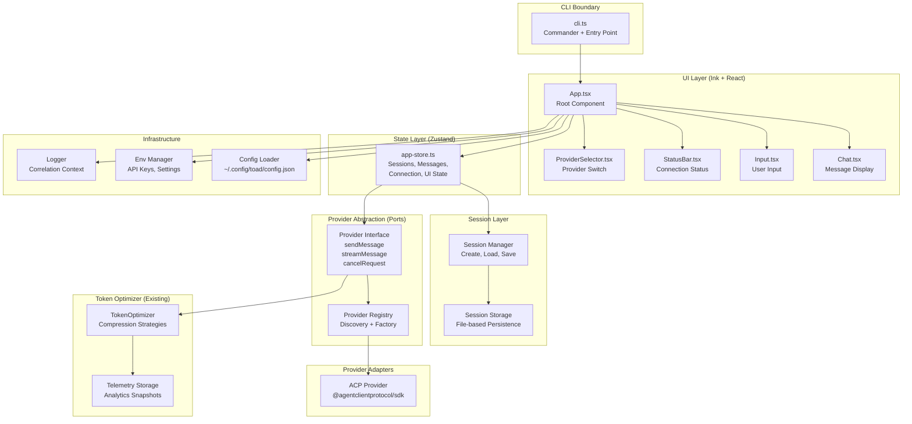

# TOADSTOOL Architecture

## System Architecture



## Layer Contracts

### 1. Provider Abstraction (Port)

```typescript
// src/providers/types.ts

export interface Message {
  readonly id: string;
  readonly role: "user" | "assistant" | "system";
  readonly content: string;
  readonly timestamp: Date;
}

export interface StreamChunk {
  readonly content: string;
  readonly done: boolean;
  readonly error?: Error;
}

export interface ProviderConfig {
  readonly apiKey: string;
  readonly model?: string;
  readonly maxTokens?: number;
  readonly temperature?: number;
  readonly timeout?: number;
}

export interface SendMessageOptions {
  readonly messages: readonly Message[];
  readonly stream?: boolean;
  readonly abortSignal?: AbortSignal;
}

export interface ProviderResponse {
  readonly message: Message;
  readonly usage?: {
    readonly promptTokens: number;
    readonly completionTokens: number;
    readonly totalTokens: number;
  };
}

export interface Provider {
  readonly id: string;
  readonly name: string;
  readonly config: ProviderConfig;
  
  sendMessage(options: SendMessageOptions): Promise<ProviderResponse>;
  
  streamMessage(
    options: SendMessageOptions,
    onChunk: (chunk: StreamChunk) => void
  ): Promise<ProviderResponse>;
  
  cancelRequest(requestId: string): Promise<void>;
  
  validateConfig(): Promise<boolean>;
}
```

### 2. Session Management (Port)

```typescript
// src/sessions/types.ts

export interface Session {
  readonly id: string;
  readonly providerId: string;
  readonly messages: readonly Message[];
  readonly createdAt: Date;
  readonly updatedAt: Date;
  readonly metadata?: Record<string, unknown>;
}

export interface SessionStorage {
  save(session: Session): Promise<void>;
  load(sessionId: string): Promise<Session | null>;
  list(): Promise<readonly Session[]>;
  delete(sessionId: string): Promise<void>;
  findLatest(providerId?: string): Promise<Session | null>;
}
```

### 3. State Management (Zustand Store)

```typescript
// src/store/app-store.types.ts

export interface AppState {
  // Sessions
  readonly sessions: Map<string, Session>;
  readonly currentSessionId: string | null;
  
  // Messages (current session)
  readonly messages: readonly Message[];
  
  // Connection
  readonly connectionStatus: "disconnected" | "connecting" | "connected" | "error";
  readonly currentProvider: Provider | null;
  
  // UI State
  readonly inputValue: string;
  readonly inputHistory: readonly string[];
  readonly historyIndex: number;
  readonly isStreaming: boolean;
  readonly error: Error | null;
  
  // Actions
  createSession(providerId: string): string;
  switchSession(sessionId: string): void;
  addMessage(message: Message): void;
  setInputValue(value: string): void;
  setConnectionStatus(status: AppState["connectionStatus"]): void;
  setProvider(provider: Provider | null): void;
  startStreaming(): void;
  stopStreaming(): void;
  setError(error: Error | null): void;
  
  // Computed
  getCurrentSession(): Session | null;
  getCurrentProvider(): Provider | null;
}
```

### 4. Token Optimizer Integration

```typescript
// src/providers/provider-with-optimizer.ts

export interface OptimizedProvider extends Provider {
  readonly optimizer: TokenOptimizer;
  
  sendMessageWithOptimization(
    options: SendMessageOptions & {
      readonly compressionType?: CompressionType;
      readonly optimizePrompt?: boolean;
    }
  ): Promise<ProviderResponse>;
}
```

## Component Hierarchy

```
App (Root)
├── ProviderSelector (Modal/Dropdown)
├── Chat
│   ├── MessageList
│   │   └── MessageItem (Markdown + Syntax Highlighting)
│   └── StreamingIndicator
├── Input
│   ├── TextInput (Multi-line)
│   └── InputHistory (↑/↓ navigation)
└── StatusBar
    ├── ConnectionStatus
    ├── ProviderName
    └── KeyboardShortcuts
```

## Data Flow

### Message Send Flow

```
User Input → Input Component
  → Store.setInputValue()
  → Store.sendMessage() [Action]
    → Provider.streamMessage()
      → TokenOptimizer.optimize() [Optional]
      → ACP Agent CLI (Claude/Gemini/Codex)
        → Stream Chunks → Store.addMessageChunk()
          → Chat Component Re-render
    → Store.addMessage() [Complete]
      → SessionManager.save()
```

### Session Load Flow

```
App Mount → Store.loadSessions()
  → SessionStorage.list()
    → Store.setSessions()
  → Store.findLatestSession()
    → SessionStorage.load()
      → Store.switchSession()
        → Store.setMessages()
```

## Dependency Injection Container

```typescript
// src/core/container.ts

export interface AppDependencies {
  readonly env: Env;
  readonly logger: Logger;
  readonly config: Config;
  readonly tokenOptimizer: TokenOptimizer;
  readonly sessionStorage: SessionStorage;
  readonly providerRegistry: ProviderRegistry;
}

export const createAppDependencies = (): AppDependencies => {
  const env = new Env(EnvManager.getInstance());
  const logger = createLogger();
  const config = loadConfig();
  const tokenOptimizer = createTokenOptimizer();
  const sessionStorage = createSessionStorage(config);
  const providerRegistry = createProviderRegistry(env, config);
  
  return {
    env,
    logger,
    config,
    tokenOptimizer,
    sessionStorage,
    providerRegistry,
  };
};
```

## Performance & Reliability

### Latency Budget

| Operation | p50 Target | p95 Target | p99 Target | Notes |
|-----------|------------|------------|------------|-------|
| **App Startup** | < 200ms | < 500ms | < 1s | Load config, init providers |
| **Session Load** | < 100ms | < 300ms | < 500ms | Read from disk, parse JSON |
| **Message Send** | N/A | N/A | N/A | Depends on provider API |
| **Stream Chunk Render** | < 16ms | < 50ms | < 100ms | 60fps target, terminal refresh |
| **Token Optimization** | < 50ms | < 200ms | < 500ms | Strategy-dependent |
| **Provider Switch** | < 500ms | < 1s | < 2s | Validate config, test connection |

### Caching Strategy

```typescript
// Cache layers
interface CacheStrategy {
  // Session cache (in-memory Map)
  sessionCache: Map<string, Session>;
  
  // Config cache (file watcher)
  configCache: Config | null;
  configWatcher: chokidar.FSWatcher;
  
  // Provider validation cache (TTL: 5min)
  providerValidationCache: Map<string, { valid: boolean; expires: number }>;
  
  // Token optimization cache (LRU, max 100 entries)
  optimizationCache: LRUCache<string, OptimizationResult>;
}
```

### Failure Mode Matrix

| Failure Mode | Detection | Mitigation | Recovery |
|--------------|-----------|------------|----------|
| **Provider API timeout** | Request timeout (30s) | Retry with exponential backoff (max 3x) | Show error, allow retry |
| **Provider API rate limit** | 429 status code | Queue requests, exponential backoff | Auto-retry after delay |
| **Invalid API key** | 401 status code | Validate on startup | Prompt user to update key |
| **Session file corruption** | JSON parse error | Backup before write, validate on load | Fallback to empty session |
| **Disk full** | Write error | Check free space before write | Warn user, disable persistence |
| **Network disconnect** | Connection error | Queue messages, retry on reconnect | Auto-reconnect with indicator |
| **Token optimizer failure** | Strategy exception | Fallback to passthrough | Log warning, continue |
| **Terminal resize** | SIGWINCH signal | Re-render UI, recalculate layout | Graceful resize |

### Rate Limiting & Backpressure

```typescript
// Rate limiter per provider
interface RateLimiter {
  readonly requestsPerMinute: number;
  readonly requestsPerHour: number;
  readonly queue: p-queue.Queue;
  
  async execute<T>(fn: () => Promise<T>): Promise<T>;
}

// Backpressure: pause streaming if render queue > 10 chunks
const MAX_PENDING_CHUNKS = 10;
```

### Observability

```typescript
// Metrics to track
interface Metrics {
  // Performance
  messageLatency: Histogram; // p50/p95/p99
  streamChunkLatency: Histogram;
  sessionLoadTime: Histogram;
  
  // Reliability
  providerErrors: Counter; // by provider, by error type
  retryCount: Counter;
  sessionCorruptionCount: Counter;
  
  // Usage
  messagesPerSession: Histogram;
  tokensOptimized: Counter;
  costSavings: Gauge; // USD
}
```

## Architecture Decision Records (ADRs)

### ADR-001: Provider Abstraction via Interface

**Decision**: Use TypeScript interfaces (ports) for provider abstraction, not abstract classes.

**Rationale**:
- Enables multiple inheritance (e.g., `OptimizedProvider extends Provider`)
- Easier to mock in tests
- Aligns with dependency inversion principle
- TypeScript interfaces are zero-cost at runtime

**Alternatives Considered**:
- Abstract base class: More runtime overhead, single inheritance
- Strategy pattern only: Less flexible for provider-specific features

**Tradeoffs**:
- ✅ Type-safe, compile-time checks
- ✅ Easy to extend with new providers
- ⚠️ Requires discipline to maintain interface contracts

---

### ADR-002: Zustand for State Management

**Decision**: Use Zustand instead of Redux or Context API.

**Rationale**:
- Minimal boilerplate (no actions, reducers, selectors)
- TypeScript-first with excellent inference
- Small bundle size (~1KB)
- Built-in middleware support (persist, devtools)
- No provider wrapper needed

**Alternatives Considered**:
- Redux Toolkit: More boilerplate, larger bundle
- React Context: Performance issues with frequent updates (streaming)
- Jotai/Recoil: Overkill for terminal app, more complex

**Tradeoffs**:
- ✅ Simple API, fast learning curve
- ✅ Good performance for terminal rendering
- ⚠️ Less ecosystem than Redux (but sufficient for TUI)

---

### ADR-003: File-based Session Persistence

**Decision**: Store sessions as JSON files in `~/.config/toad/sessions/`.

**Rationale**:
- Simple, no external dependencies (no SQLite, no DB)
- Easy to backup/restore (just copy directory)
- Human-readable for debugging
- Fast enough for terminal app scale (< 1000 sessions)

**Alternatives Considered**:
- SQLite: Overkill, adds dependency
- In-memory only: Loses sessions on restart (bad UX)
- Remote storage: Adds complexity, network dependency

**Tradeoffs**:
- ✅ Zero dependencies, portable
- ✅ Easy to inspect/debug
- ⚠️ No concurrent write protection (mitigated by single-process CLI)
- ⚠️ Slower for large session lists (mitigated by lazy loading)

---

### ADR-004: Token Optimizer as Optional Middleware

**Decision**: Make token optimization opt-in per request, not always-on.

**Rationale**:
- Some prompts don't benefit from compression (already minimal)
- Optimization adds latency (50-200ms)
- User should control cost/quality tradeoff
- Strategies may fail (fallback to passthrough)

**Alternatives Considered**:
- Always optimize: Unnecessary latency, potential failures
- Auto-detect: Complex heuristics, unreliable

**Tradeoffs**:
- ✅ User control over optimization
- ✅ Graceful degradation on failure
- ⚠️ Requires user education on when to use

---

### ADR-005: Streaming-First Message Rendering

**Decision**: Render stream chunks immediately, don't buffer.

**Rationale**:
- Terminal UX requires real-time feedback
- Ink handles re-renders efficiently
- User can cancel mid-stream (Ctrl+C)
- Lower memory footprint

**Alternatives Considered**:
- Buffer full response: Worse UX, higher memory
- Chunk batching: Adds complexity, still needs real-time feel

**Tradeoffs**:
- ✅ Best UX (immediate feedback)
- ✅ Lower memory usage
- ⚠️ More re-renders (mitigated by React memoization)

---

### ADR-006: Dependency Injection via Factory Functions

**Decision**: Use factory functions for DI, not a container library (InversifyJS, TSyringe).

**Rationale**:
- No runtime overhead (pure functions)
- TypeScript-native (no decorators, no metadata)
- Easy to test (just pass mocks)
- Explicit dependencies (no magic)

**Alternatives Considered**:
- InversifyJS: Adds dependency, decorator overhead
- TSyringe: Similar overhead, less TypeScript-native
- Manual DI: What we're doing (factory functions)

**Tradeoffs**:
- ✅ Zero dependencies, zero runtime cost
- ✅ Type-safe, explicit
- ⚠️ More boilerplate than container (acceptable for small app)

---

### ADR-007: ESM-Only Module System

**Decision**: Use ESM (`"type": "module"`), no CommonJS.

**Rationale**:
- Modern Node.js standard (20+)
- Better tree-shaking
- Aligns with TypeScript ESNext target
- Future-proof

**Alternatives Considered**:
- CommonJS: Legacy, worse tree-shaking
- Dual package: Complexity, maintenance burden

**Tradeoffs**:
- ✅ Modern, aligned with ecosystem
- ✅ Better bundling (tsup)
- ⚠️ Some packages still CJS-only (workarounds exist)

## Execution Plan

### Phase 1: Foundation (Week 1-2)

**Goal**: Core ACP infrastructure and provider abstraction.

**Tasks**:
1. ✅ Token optimizer (already implemented)
2. Define `AgentConnection` interface (ACP + future direct providers)
3. Implement ACP JSON-RPC stdio client (`src/core/acp-connection.ts`)
4. Add protocol version + capability negotiation scaffolding
5. Define content block types (text/code/resource/resource_link)
6. Add ACP connection tests (unit + mock)

**Deliverables**:
- ACP connection scaffolding with JSON-RPC stdio transport
- AgentConnection abstraction for ACP and future direct providers
- Content block types in core domain types
- Unit tests for ACP connection basics

**Validation**:
- `npm test` passes
- Manual test: ACP handshake and ping works

---

### Phase 2: State & Sessions (Week 2-3)

**Goal**: Zustand store, session persistence, and session modes.

**Tasks**:
1. Create Zustand store (`src/store/app-store.ts`)
2. Define store types (`src/store/app-store.types.ts`)
3. Implement session storage (`src/sessions/session-storage.ts`)
4. Create session manager with modes (`read-only`, `auto`, `full-access`)
5. Support `session/setMode` and mode-aware permissions
6. Add store + session tests

**Deliverables**:
- Working Zustand store with all actions
- File-based session persistence
- Session CRUD operations with mode awareness

**Validation**:
- Create session → persists to disk
- Load session → messages restored
- Switch mode → permissions enforced

---

### Phase 3: UI Layer (Week 3-4)

**Goal**: Ink components and CLI entry point.

**Tasks**:
1. Create CLI entry point (`src/cli.ts`) with Commander
2. Create root App component (`src/ui/App.tsx`)
3. Create Chat component (`src/ui/Chat.tsx`) with content block rendering
4. Create Input component (`src/ui/Input.tsx`) with history
5. Create StatusBar component (`src/ui/StatusBar.tsx`)
6. Create ProviderSelector component (`src/ui/ProviderSelector.tsx`)
7. Wire up keyboard shortcuts
8. Add UI tests with `ink-testing-library`

**Deliverables**:
- Working TUI with all components
- Keyboard navigation
- Content blocks rendered (code/resource/resource_link)

**Validation**:
- `npm run dev` launches TUI
- Can send message, see streaming response
- Keyboard shortcuts work (Ctrl+P, Ctrl+C, etc.)

---

### Phase 4: Integration & Polish (Week 4-5)

**Goal**: Tool system, approvals, ACP interoperability, and polish.

**Tasks**:
1. Implement tool system (`fs/*`, `terminal/*`) with approval flow (allow/ask/deny)
2. Add tool call visualization + result streaming
3. Add slash command discovery + routing
4. Add agent plan handling + UI approval
5. Add MCP server configuration + capability mapping
6. Add error boundaries, retry logic, and rate limiting
7. Add config file support (`~/.config/toad/config.json`)
8. Performance optimization + E2E scenario tests

**Deliverables**:
- Tool system with approvals and UI feedback
- Slash commands and agent plan UI
- MCP server integration
- Error handling and retries
- E2E tests

**Validation**:
- `npm run test:e2e` passes
- Tool calls require approval in `auto` mode
- Slash commands execute correctly
- MCP tools available to agents

---

### Phase 5: Search & Indexing (Week 5)

**Goal**: Fast file discovery and text/AST search tooling.

**Tasks**:
1. Add ripgrep integration (`@vscode/ripgrep`) with `rg --json`
2. Build file indexer with `fdir`
3. Add glob queries with `fast-glob` or `tinyglobby`
4. Add fuzzy search with `fuzzysort`
5. Optional AST search via `@ast-grep/napi`

**Deliverables**:
- Structured search results
- Cached file index with scoped search
- Glob and fuzzy search tools

### Phase 6: Documentation & Release (Week 6)

**Goal**: Advanced features, documentation, and release.

**Tasks**:
1. Implement subagent system and delegation flow
2. Add AGENTS.md auto-load into session context
3. Add rich content types (images/audio)
4. Update README with usage examples
5. Add architecture documentation (this doc)
6. Add contributing guide
7. Add changelog
8. Version bump and npm publish
9. Create release notes

**Deliverables**:
- Advanced agent features shipped or deferred
- Complete documentation
- Published npm package
- Release notes

---

## File Structure

```
src/
├── cli.ts                    # Entry point (Commander)
├── index.ts                  # Library exports
│
├── core/
│   └── container.ts          # DI factory
│
├── providers/
│   ├── types.ts             # Provider interface
│   ├── registry.ts          # Provider discovery + factory
│   └── acp-provider.ts      # ACP adapter
│
├── store/
│   ├── app-store.ts         # Zustand store implementation
│   └── app-store.types.ts   # Store types
│
├── sessions/
│   ├── types.ts             # Session types
│   ├── session-storage.ts   # File-based storage
│   └── session-manager.ts  # Session business logic
│
├── ui/
│   ├── App.tsx              # Root component
│   ├── Chat.tsx             # Message display
│   ├── MessageList.tsx     # Message list component
│   ├── MessageItem.tsx     # Single message (markdown)
│   ├── Input.tsx            # User input
│   ├── StatusBar.tsx        # Status bar
│   └── ProviderSelector.tsx # Provider switch modal
│
├── config/
│   ├── loader.ts            # Config file loader
│   └── types.ts             # Config schema (Zod)
│
└── utils/                    # Existing utilities
    ├── env/
    ├── logging/
    └── token-optimizer/
```

## Validation Tests

### Unit Tests
- Provider adapters (mock ACP agents)
- Session storage (mock filesystem)
- Token optimizer (existing)
- Store actions (Zustand)

### Integration Tests
- Provider → Token Optimizer → Response
- Store → Session Manager → Storage
- Config loader → Provider registry

### E2E Tests (Playwright-like, but for CLI)
- Full message send flow
- Session persistence across restarts
- Provider switching
- Error recovery

## Sources

- **Ink Documentation**: https://github.com/vadimdemedes/ink
- **Zustand Documentation**: https://github.com/pmndrs/zustand
- **TypeScript Design Patterns**: https://refactoring.guru/design-patterns/typescript
- **Node.js ESM Guide**: https://nodejs.org/api/esm.html
- **Claude CLI**: https://docs.anthropic.com/claude-code
- **ACP Protocol**: https://github.com/Anthropic-ai/acp-spec
