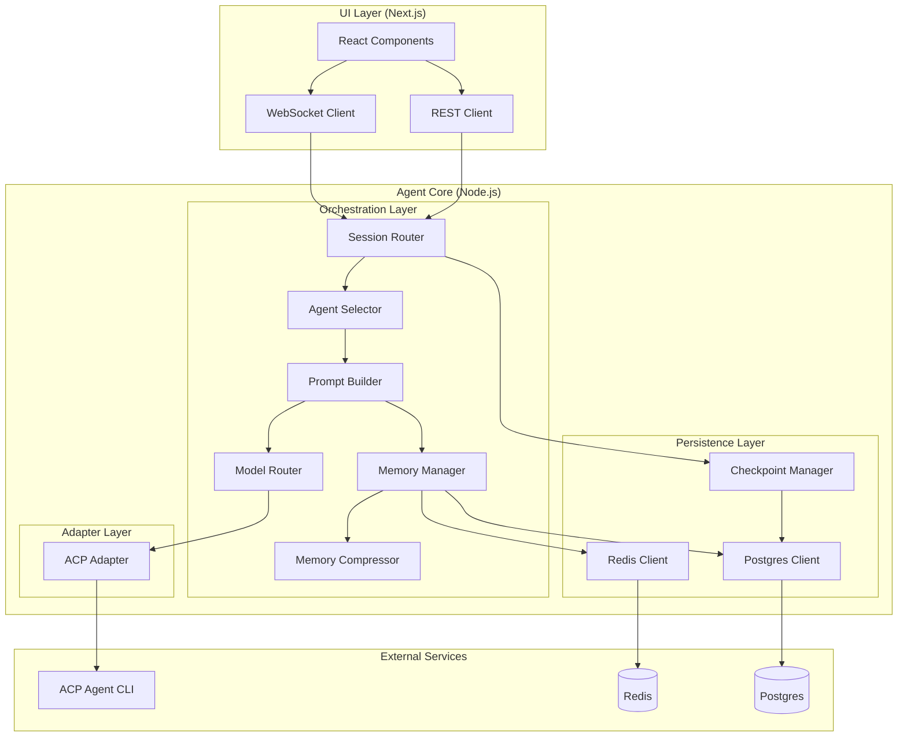

# Engineering Design Plan: Glass Agent Orchestrator

Revision: v1.1.0
Document Role: Engineering architecture reference; complements spec.md, not canonical types.

---

## A. One-Screen Summary

### Goal
Build a production-ready, multi-agent orchestration system with deterministic replay, long-lived sessions, and a glassmorphic UI. The system must survive UI restarts and scale to hours-long workflows.

### Constraints
- **Type Safety:** TypeScript strict mode, no `any`, Zod at all boundaries
- **Architecture:** UI never calls models directly; all intelligence flows through Agent Core
- **Interoperability:** ACP-compatible adapters (JSON-RPC over stdio)
- **Determinism:** Every session must be reproducible (replay validation)
- **Performance:** Real-time streaming (<100ms latency), multi-hour sessions without drift
- **Reliability:** Redis loss must not destroy sessions (Postgres is canonical)

### Key Risks
1. **Memory Compression Complexity:** Compression must preserve decisions/constraints while reducing tokens
2. **Deterministic Replay:** Prompt hashing and validation must catch all non-deterministic sources
3. **WebSocket Reliability:** Long-lived connections need reconnection logic and state sync
4. **Token Budget Management:** Accurate estimation and compression triggers
5. **Model Adapter Abstraction:** ACP adapter + agent profiles must be swappable without breaking orchestrator
6. **Tool Approvals & Session Modes:** Permission UX and enforcement must be consistent across agents

### Recommended Direction
**Layered architecture with explicit ports/adapters pattern:**
- **UI Layer:** React/Next.js, WebSocket client, REST client (no business logic)
- **Orchestration Layer:** Agent selector, prompt builder, memory manager, model router
- **Adapter Layer:** ACP adapter (JSON-RPC) for CLI agents
- **Persistence Layer:** Redis (hot state), Postgres (canonical), checkpoint manager
- **Memory Layer:** Working memory, compression engine, external memory

**Start with shared types package, then build adapters, then orchestrator, then UI.**

---

## B. Architecture Artifacts

### System Architecture Diagram



### Interface Contracts

#### 1. Model Adapter Interface (Port)

```typescript
/**
 * Port: Model execution abstraction
 * Implementations: ACPAdapter
 */
interface IModelAdapter {
  /**
   * Execute a model call with streaming support
   * @param prompt - Full prompt string (system + memory + task)
   * @param options - Model-specific options (temperature, max_tokens, etc.)
   * @returns Async generator of output chunks + final result
   */
  execute(
    prompt: string,
    options: ModelOptions
  ): AsyncGenerator<StreamChunk, ModelResult, void>
  
  /**
   * Estimate token count for a prompt
   * Must be fast (no model calls)
   */
  estimateTokens(prompt: string): number
  
  /**
   * Get adapter metadata
   */
  getMetadata(): ModelAdapterMetadata
}

type ModelOptions = {
  temperature?: number
  maxTokens?: number
  tools?: ToolDefinition[]
  model?: string // e.g., "claude-3-5-sonnet-20241022"
  sessionMode?: 'read-only' | 'auto' | 'full-access'
  toolPolicy?: ToolPolicy
  mcpServers?: MCPServerConfig[]
}

type StreamChunk = {
  type: 'text' | 'code' | 'resource' | 'tool_call' | 'done'
  content: string
  timestamp: number
}

type ModelResult = {
  output: string
  tokensUsed: number
  model: string
  durationMs: number
  toolCalls?: ToolCall[]
}

type ModelAdapterMetadata = {
  id: 'sdk' | 'cli' | 'acp'
  name: string
  supportsStreaming: boolean
  supportsTools: boolean
  maxTokens: number
}

type ToolPolicy = {
  mode: 'allow' | 'ask' | 'deny'
}

type MCPServerConfig = {
  id: string
  transport: 'http' | 'sse'
  url: string
}
```

#### 2. Memory Manager Interface

```typescript
/**
 * Port: Memory management abstraction
 * Implementation: LayeredMemoryManager
 */
interface IMemoryManager {
  /**
   * Get memory for an agent (Working + Compressed only)
   * System and External are handled separately
   */
  getAgentMemory(agentId: string, sessionId: string): Promise<AgentMemory>
  
  /**
   * Update working memory after a turn
   */
  appendWorkingMemory(
    agentId: string,
    sessionId: string,
    turn: Turn
  ): Promise<void>
  
  /**
   * Check if compression is needed
   */
  shouldCompress(agentId: string, sessionId: string): Promise<boolean>
  
  /**
   * Compress memory (triggers model call)
   * Returns compressed memory that replaces old working memory
   */
  compressMemory(
    agentId: string,
    sessionId: string,
    compressionPrompt: string
  ): Promise<CompressedMemory>
  
  /**
   * Get external memory (files, tools)
   */
  getExternalMemory(agentId: string, sessionId: string): Promise<ExternalMemory>
}

type AgentMemory = {
  working: Message[] // Last N turns
  compressed: CompressedMemory | null
}

type CompressedMemory = {
  summary: string
  decisions: string[]
  constraints: string[]
  openTasks: string[]
  compressedAt: number
  originalTurnCount: number
}

type ExternalMemory = {
  files: FileReference[]
  toolArtifacts: ToolArtifact[]
  logs: LogEntry[]
}
```

#### 3. Orchestrator Interface

```typescript
/**
 * Port: Orchestration engine
 * Implementation: DeterministicOrchestrator
 */
interface IOrchestrator {
  /**
   * Start a new session
   */
  createSession(config: SessionConfig): Promise<Session>
  
  /**
   * Resume a session from checkpoint
   */
  resumeSession(sessionId: string): Promise<Session>
  
  /**
   * Execute next turn in session
   * Returns async generator for streaming output
   */
  executeTurn(
    sessionId: string,
    userInput?: string
  ): AsyncGenerator<TurnEvent, TurnResult, void>
  
  /**
   * Pause a session (saves checkpoint)
   */
  pauseSession(sessionId: string): Promise<void>
  
  /**
   * Fork a session (creates new session with same state)
   */
  forkSession(sessionId: string): Promise<Session>
  
  /**
   * Replay a session (deterministic execution)
   */
  replaySession(sessionId: string): AsyncGenerator<TurnEvent, void, void>
}

type TurnEvent = 
  | { type: 'agent_selected'; agentId: string; reason: string }
  | { type: 'prompt_built'; promptHash: string; tokenEstimate: number }
  | { type: 'compression_started'; agentId: string }
  | { type: 'compression_completed'; agentId: string }
  | { type: 'model_selected'; adapter: 'sdk' | 'cli'; reason: string }
  | { type: 'stream_chunk'; content: string }
  | { type: 'turn_completed'; turn: number; result: ModelResult }

type TurnResult = {
  turn: number
  agentId: string
  output: string
  tokensUsed: number
  nextAgentId?: string
  sessionStatus: SessionStatus
}
```

#### 4. Persistence Interface

```typescript
/**
 * Port: Persistence abstraction
 * Implementations: RedisPersistence, PostgresPersistence
 */
interface IPersistence {
  // Hot state (Redis)
  getSessionState(sessionId: string): Promise<SessionState | null>
  setSessionState(sessionId: string, state: SessionState, ttl?: number): Promise<void>
  
  // Canonical state (Postgres)
  saveSession(session: Session): Promise<void>
  getSession(sessionId: string): Promise<Session | null>
  saveCheckpoint(sessionId: string, checkpoint: Checkpoint): Promise<void>
  getCheckpoint(sessionId: string, turn: number): Promise<Checkpoint | null>
  saveReplayLog(sessionId: string, log: ReplayLogEntry): Promise<void>
}

type SessionState = {
  status: SessionStatus
  currentTurn: number
  activeAgentId: string | null
  tokenUsage: number
  lastActivity: number
}

type Checkpoint = {
  sessionId: string
  turn: number
  state: SessionState
  agentStates: Record<string, AgentInstance>
  createdAt: number
}

type ReplayLogEntry = {
  sessionId: string
  turn: number
  agentId: string
  promptHash: string
  model: string
  createdAt: number
}
```

### ADRs (Architecture Decision Records)

#### ADR-001: Ports/Adapters Pattern for Model Execution
**Decision:** Use interface-based abstraction for ACP adapters and CLI agents.  
**Rationale:** 
- Enables swapping adapters without changing orchestrator logic
- Allows testing with mock adapters
- Supports future ACP-compatible agents
**Tradeoffs:**
- Slight overhead from abstraction layer
- Need to maintain adapter parity (both support same features)
**Alternatives Considered:** Direct integration (rejected - too coupled)

#### ADR-002: Layered Memory System
**Decision:** Mandatory 4-layer memory (System, Working, Compressed, External).  
**Rationale:**
- Prevents token overflow in long sessions
- Preserves critical context (decisions, constraints) during compression
- Separates concerns (immutable system vs. mutable working)
**Tradeoffs:**
- Compression adds latency (model call)
- Complexity in managing memory state
**Alternatives Considered:** Single memory blob (rejected - doesn't scale)

#### ADR-003: Redis + Postgres Dual Storage
**Decision:** Redis for hot state, Postgres for canonical state.  
**Rationale:**
- Redis: Fast reads/writes for active sessions (<10ms)
- Postgres: Durable, queryable history for replay and audit
- Redis loss is survivable (reload from Postgres)
**Tradeoffs:**
- Need to sync Redis → Postgres (eventual consistency)
- Two storage systems to maintain
**Alternatives Considered:** Postgres only (rejected - too slow for hot state)

#### ADR-004: Deterministic Replay via Prompt Hashing
**Decision:** Hash every prompt before execution, log hash + result, validate on replay.  
**Rationale:**
- Catches non-deterministic sources (timestamps, random IDs, etc.)
- Enables debugging "why did this session diverge?"
- Required for multi-hour session reliability
**Tradeoffs:**
- Need to ensure all non-deterministic data is excluded from prompts
- Replay validation adds test complexity
**Alternatives Considered:** No replay validation (rejected - breaks determinism guarantee)

#### ADR-005: WebSocket for Streaming, REST for Control
**Decision:** WebSocket for real-time output, REST for session control (pause/resume/fork).  
**Rationale:**
- WebSocket: Low latency streaming (<100ms), bidirectional
- REST: Simple, stateless, cacheable control operations
- Clear separation of concerns
**Tradeoffs:**
- Need WebSocket reconnection logic
- Two protocols to maintain
**Alternatives Considered:** REST only (rejected - too slow for streaming), WebSocket only (rejected - overkill for control)

---

## C. Performance + Reliability

### Latency Budget

| Operation | p50 | p95 | p99 | Notes |
|-----------|-----|-----|-----|-------|
| WebSocket message delivery | 50ms | 100ms | 200ms | Local network |
| REST control (pause/resume) | 100ms | 200ms | 500ms | Includes DB write |
| Memory compression | 2s | 5s | 10s | Model call overhead |
| Session resume | 200ms | 500ms | 1s | Load from Postgres + Redis |
| Token estimation | <1ms | <1ms | <1ms | Local calculation |
| Prompt building | <10ms | <20ms | <50ms | String concatenation |
| Agent selection | <5ms | <10ms | <20ms | Rule-based logic |

### Caching Plan

```typescript
// Cache layers
type CacheStrategy = {
  // L1: In-memory (Node.js process)
  agentDefinitions: Map<string, AgentDefinition> // TTL: never (immutable)
  sessionState: Map<string, SessionState> // TTL: 5min (active sessions only)
  
  // L2: Redis (hot state)
  sessionState: Redis // TTL: 1 hour (inactive sessions)
  workingMemory: Redis // TTL: 1 hour (last N turns)
  
  // L3: Postgres (canonical)
  sessions: Postgres // TTL: never
  checkpoints: Postgres // TTL: never
  replayLogs: Postgres // TTL: never
}
```

**Cache Invalidation:**
- Agent definitions: Never (immutable)
- Session state: On every turn completion
- Working memory: On compression or turn completion

### Failure Mode Matrix

| Failure | Impact | Mitigation | Recovery |
|---------|--------|------------|----------|
| Redis down | Hot state lost | Load from Postgres | Resume session from checkpoint |
| Postgres down | Cannot save new sessions | Read-only mode, queue writes | Retry writes when Postgres recovers |
| Agent rate limit | Model calls fail | Exponential backoff, queue requests | Auto-retry with backoff |
| ACP agent process crash | Session stalls | Restart agent process, reconnect | Retry with alternate ACP agent |
| WebSocket disconnect | Streaming stops | Auto-reconnect, sync state | Resume streaming from last chunk |
| Memory compression fails | Token overflow risk | Pause session, alert user | Manual compression or reduce working memory window |
| Orchestrator crash | Session stops | Checkpoint on every turn | Resume from last checkpoint |

### Retry Strategy

```typescript
// Retry configuration (centralized, typed)
const RETRY_CONFIG = {
  modelCall: {
    maxAttempts: 3,
    initialDelay: 1000, // 1s
    maxDelay: 10000, // 10s
    backoff: 'exponential' as const,
    retryableErrors: ['rate_limit', 'timeout', 'network_error']
  },
  persistence: {
    maxAttempts: 5,
    initialDelay: 500, // 500ms
    maxDelay: 5000, // 5s
    backoff: 'exponential' as const,
    retryableErrors: ['connection_error', 'timeout']
  },
  websocket: {
    maxAttempts: Infinity, // Keep trying
    initialDelay: 1000,
    maxDelay: 30000, // 30s
    backoff: 'exponential' as const,
    jitter: true // Add randomness to prevent thundering herd
  }
} as const
```

### Circuit Breaker Pattern

```typescript
// Circuit breaker for model adapters
interface CircuitBreakerState {
  state: 'closed' | 'open' | 'half-open'
  failureCount: number
  lastFailureTime: number
  nextAttemptTime: number
}

// Open circuit after 5 failures in 1 minute
// Half-open after 30 seconds
// Close after 2 successful calls
```

---

## D. Execution Plan

### Phase 1: Foundation (Weeks 1-2)

**Goal:** Shared types, schemas, and basic infrastructure.

#### Tasks:
1. **Shared Types Package** (`src/packages/types`)
   - [ ] Define `AgentDefinition`, `AgentInstance`, `Session` types
   - [ ] Define `Memory` types (Working, Compressed, External)
   - [ ] Define `Turn`, `ModelResult`, `StreamChunk` types
   - [ ] Define `ContentBlock`, `ToolCall`, `ToolResult` types
   - [ ] Define `SessionMode`, `ToolPolicy`, `SlashCommand`, `AgentPlan` types
   - [ ] Define `MCPServerConfig` types
   - [ ] Export all types from index

2. **Schemas Package** (`src/packages/schemas`)
   - [ ] Zod schemas for all types
   - [ ] Validation helpers (`parseAgentDefinition`, etc.)
   - [ ] Runtime type guards
   - [ ] Schemas for content blocks, tool calls, session modes
   - [ ] Schemas for MCP server configs and slash commands

3. **Constants Package** (`src/packages/constants`)
   - [ ] Agent roles enum (`planner`, `coder`, `critic`, `custom`)
   - [ ] Session status enum (`idle`, `running`, `paused`, `completed`)
   - [ ] Model preference enum (`sdk`, `cli`, `auto`)
   - [ ] Session mode enum (`read-only`, `auto`, `full-access`)
   - [ ] Tool permission enum (`allow`, `ask`, `deny`)
   - [ ] Magic string constants (no inline strings)

4. **Utils Package** (`src/packages/utils`)
   - [ ] Token estimation utility (`estimateTokens`)
   - [ ] Prompt rendering helpers (`renderMessages`, `renderCompressed`)
   - [ ] Hash utilities (`hashPrompt` for replay)
   - [ ] Retry utilities (exponential backoff)

**Acceptance:**
- ✅ All types exported and usable
- ✅ All schemas validate correctly
- ✅ No magic strings in codebase
- ✅ Token estimation is fast (<1ms)
- ✅ ACP content blocks and session modes are typed

---

### Phase 2: Adapters (Weeks 3-5)

**Goal:** ACP adapter with clean interfaces and CLI agent profiles.

#### Tasks:
1. **ACP Adapter** (`src/services/acp`)
   - [ ] Implement JSON-RPC over stdio
   - [ ] Protocol version + capability negotiation
   - [ ] Session lifecycle (`session/new`, `session/load`, `session/prompt`)
   - [ ] Tool call streaming and result handling
   - [ ] Content block support (code/resource/resource_link)
   - [ ] MCP server config pass-through

2. **CLI Agent Profiles**
   - [ ] Define agent configs (Claude CLI, Gemini CLI, Codex CLI)
   - [ ] Command discovery + spawn configuration
   - [ ] Per-agent capabilities + slash command metadata

3. **Adapter Tests**
   - [ ] Unit tests for ACP adapter
   - [ ] Mock ACP agent for testing
   - [ ] Integration tests (real CLI calls, skipped in CI)

**Acceptance:**
- ✅ ACP adapter implements the shared interface
- ✅ ACP handshake and capability negotiation pass
- ✅ Streaming works correctly
- ✅ Error handling is robust
- ✅ Agents are swappable without code changes

---

### Phase 3: Memory Manager (Weeks 6-7)

**Goal:** Layered memory with compression.

#### Tasks:
1. **Memory Manager** (`src/services/memory`)
   - [ ] Implement `IMemoryManager` interface
   - [ ] Working memory window (last N turns)
   - [ ] Compression trigger logic (token threshold, session duration)
   - [ ] Compression prompt builder
   - [ ] Compression execution (calls model adapter)
   - [ ] Memory replacement (compressed replaces working)
   - [ ] Tool artifacts and resource blocks stored in External Memory

2. **Persistence Integration**
   - [ ] Redis client for hot state
   - [ ] Postgres client for canonical state
   - [ ] Checkpoint manager
   - [ ] Replay log manager

3. **Memory Tests**
   - [ ] Unit tests for memory operations
   - [ ] Compression tests (verify decisions preserved)
   - [ ] Persistence tests (Redis + Postgres)

**Acceptance:**
- ✅ Memory layers work correctly
- ✅ Compression preserves decisions/constraints
- ✅ Working memory window is enforced
- ✅ Persistence is reliable (Redis + Postgres)

---

### Phase 4: Orchestrator (Weeks 8-10)

**Goal:** Core orchestration engine.

#### Tasks:
1. **Orchestrator Core** (`src/services/orchestrator`)
   - [ ] Implement `IOrchestrator` interface
   - [ ] Agent selection logic (rule-based, deterministic)
   - [ ] Prompt builder (per agent role)
   - [ ] Model router (ACP agent selection)
   - [ ] Turn execution loop
   - [ ] Streaming output management
   - [ ] Memory injection
   - [ ] Token budget enforcement
   - [ ] Tool approval gating (allow/ask/deny)
   - [ ] Agent plan announcement handling + step tracking
   - [ ] Slash command registry + routing
   - [ ] Content block normalization (code/resource/resource_link)

2. **Session Management**
   - [ ] Session creation
   - [ ] Session resume (from checkpoint)
   - [ ] Session pause (save checkpoint)
   - [ ] Session fork (copy state)
   - [ ] Session mode switching (read-only/auto/full-access)

3. **Replay System**
   - [ ] Replay execution (deterministic)
   - [ ] Replay validation (prompt hash comparison)
   - [ ] Replay logging

4. **Orchestrator Tests**
   - [ ] Unit tests for agent selection
   - [ ] Unit tests for prompt building
   - [ ] Integration tests for full turn execution
   - [ ] Replay validation tests

**Acceptance:**
- ✅ Orchestrator controls all execution flow
- ✅ Prompts are deterministic (same input = same prompt)
- ✅ Replay produces identical results
- ✅ Sessions resume correctly after restart
- ✅ Tool approvals and plans are enforced consistently

---

### Phase 5: Agent Core API (Weeks 11-12)

**Goal:** REST + WebSocket API for UI.

#### Tasks:
1. **REST API** (`src/apps/agent-core/api/rest`)
   - [ ] Session endpoints (create, get, pause, resume, fork)
   - [ ] Session mode endpoints (get/set)
   - [ ] Agent endpoints (list, get)
   - [ ] Memory endpoints (get memory layers)
   - [ ] Tool approval endpoints (list, approve, deny)
   - [ ] Slash command endpoints (list, execute)
   - [ ] MCP server config endpoints (list, add, remove)
   - [ ] Agent plan endpoints (get, approve, reject)
   - [ ] Replay endpoints (start replay, get replay log)
   - [ ] Error handling middleware
   - [ ] Request validation (Zod schemas)

2. **WebSocket API** (`src/apps/agent-core/api/websocket`)
   - [ ] WebSocket server setup
   - [ ] Session connection management
   - [ ] Streaming output (turn events + content blocks)
   - [ ] Tool call updates + approval prompts
   - [ ] Agent plan updates + progress events
   - [ ] Slash command availability updates
   - [ ] Reconnection logic
   - [ ] State sync on reconnect

3. **API Tests**
   - [ ] REST endpoint tests
   - [ ] WebSocket connection tests
   - [ ] Streaming tests

**Acceptance:**
- ✅ REST API is fully typed (tRPC or OpenAPI)
- ✅ WebSocket streaming works reliably
- ✅ Reconnection handles state sync
- ✅ All endpoints validate inputs

---

### Phase 6: UI Foundation (Weeks 13-14)

**Goal:** Basic UI with glass design system.

#### Tasks:
1. **Glass Design Tokens** (`src/packages/ui/tokens`)
   - [ ] Implement glass tokens (from `glass-tokens-implementation.ts`)
   - [ ] Light + dark mode variants
   - [ ] Component-specific tokens

2. **Core Components** (`src/apps/ui/components`)
   - [ ] `AgentCard` (idle/active states)
   - [ ] `OutputStream` (streaming text)
   - [ ] `ContentBlocks` (code/resource rendering)
   - [ ] `ToolApprovalPrompt` (allow/ask/deny)
   - [ ] `PlanViewer` (steps + progress)
   - [ ] `TokenMeter` (progress bar)
   - [ ] `SessionControls` (pause/resume/fork)
   - [ ] `SessionModeToggle` (read-only/auto/full-access)
   - [ ] `TurnTimeline` (horizontal scrollable)

3. **Layout** (`src/apps/ui/app`)
   - [ ] Main session view (Variant 2: Bold layout)
   - [ ] Empty state
   - [ ] Error state

4. **State Management**
   - [ ] Zustand store for session state
   - [ ] React Query for REST endpoints
   - [ ] WebSocket client integration
   - [ ] Slash command state + autocomplete hints

**Acceptance:**
- ✅ Glass tokens are centralized and consistent
- ✅ Components use shadcn base + glass tokens
- ✅ Layout matches design mockups
- ✅ State management is clean (no business logic in UI)
- ✅ Content blocks, tool approvals, and plans render correctly

---

### Phase 7: UI Enhancement (Weeks 15-16)

**Goal:** Memory inspector, replay, polish.

#### Tasks:
1. **Memory Inspector** (`src/apps/ui/components`)
   - [ ] Collapsible memory panel
   - [ ] Tabs for Working/Compressed/External
   - [ ] JSON viewer for memory dumps

2. **Replay UI**
   - [ ] Replay route (`/sessions/:id/replay`)
   - [ ] Replay scrubber (jump to turn)
   - [ ] Replay validation display

3. **Keyboard Shortcuts**
   - [ ] Command palette (`Cmd+K`)
   - [ ] Pause/resume (`Cmd+P`)
   - [ ] Tab navigation

4. **Polish**
   - [ ] Smooth animations (Framer Motion)
   - [ ] Syntax highlighting in output
   - [ ] Rich content rendering (images/audio)
   - [ ] Loading states
   - [ ] Error states

5. **Advanced Agent Features**
   - [ ] Subagent management UI (spawn, switch, inspect)
   - [ ] AGENTS.md viewer and auto-load indicator
   - [ ] MCP server management UI

**Acceptance:**
- ✅ Memory inspector is functional
- ✅ Replay UI works correctly
- ✅ Keyboard shortcuts are documented
- ✅ UI feels polished and responsive
- ✅ Advanced agent features shipped or explicitly deferred

---

## E. Critical Questions

### 1. Agent Selection Logic
**Question:** How does the orchestrator decide which agent to select next?

**Current Spec:** "Agent routing" is listed but not detailed.

**Recommendation:**
- **Rule-based:** Simple state machine (Planner → Coder → Critic → Planner)
- **Plan-based:** Planner outputs a plan with agent sequence, orchestrator follows it
- **Hybrid:** Rule-based with plan override

**Need Answer:** Which approach? If plan-based, how does planner output structured plan?

---

### 2. Token Budget Limits
**Question:** What are the default token budgets and thresholds?

**Current Spec:** Mentions "token budgets" but no numbers.

**Recommendation:**
```typescript
const TOKEN_BUDGETS = {
  sessionMax: 1_000_000, // 1M tokens per session
  workingMemoryMax: 50_000, // 50k tokens before compression
  compressionThreshold: 40_000, // Start compression at 40k
  promptMax: 200_000 // 200k tokens max per prompt
} as const
```

**Need Answer:** Are these numbers acceptable? Should they be configurable per session?

---

### 3. Compression Model Selection
**Question:** Which model adapter should be used for compression?

**Current Spec:** Compression is mentioned but model selection isn't specified.

**Recommendation:**
- Use a dedicated ACP agent profile for compression (fast, structured output)
- Use the active agent model when possible, or fallback to a configured default

**Need Answer:** Confirm approach.

---

### 4. Working Memory Window Size
**Question:** How many turns should be kept in working memory?

**Current Spec:** "Last N turns" but N is undefined.

**Recommendation:**
- Default: 10 turns
- Configurable per agent or session
- Compression reduces to 0 turns (replaced by compressed memory)

**Need Answer:** Is 10 turns acceptable? Should it be token-based instead of turn-based?

---

### 5. Session Fork Behavior
**Question:** What exactly is copied when forking a session?

**Current Spec:** "Fork session" is listed but behavior isn't detailed.

**Recommendation:**
- Copy: Agent definitions, current memory state (working + compressed), session metadata
- Don't copy: Turn history (new session starts at turn 0), checkpoints, replay logs

**Need Answer:** Confirm this behavior.

---

### 6. Error Recovery Strategy
**Question:** What happens when an agent fails (model call error, timeout, etc.)?

**Current Spec:** "Retry and backoff" is mentioned but details are missing.

**Recommendation:**
- Auto-retry with exponential backoff (3 attempts)
- If all retries fail: Pause session, show error in UI, allow manual retry
- If model adapter fails: Fallback to another ACP agent profile

**Need Answer:** Confirm retry strategy and fallback behavior.

---

### 7. WebSocket Reconnection
**Question:** How should WebSocket reconnection handle missed messages?

**Current Spec:** WebSocket is mentioned but reconnection logic isn't detailed.

**Recommendation:**
- On reconnect: Fetch latest session state from REST API
- Resume streaming from last received chunk
- Show "Reconnected" notification in UI
- If session advanced during disconnect: Show diff or jump to current state

**Need Answer:** Confirm reconnection behavior.

---

### 8. Tool Execution
**Question:** How are tools executed? Where does tool execution happen?

**Current Spec:** Tools are mentioned in `AgentDefinition` but execution isn't detailed.

**Recommendation:**
- Tools are executed in Agent Core (not UI)
- Tool results are stored in External Memory
- Tool execution is logged for replay
- Tools are sandboxed (security consideration)
- Tool approvals follow session mode (read-only/auto/full-access)
- Permission profiles default to `ask` with per-tool overrides

**Need Answer:** What tools are supported? How are tools implemented?

---

### 9. ACP Interoperability
**Question:** Which ACP agents and capabilities must be supported at launch?

**Current Spec:** ACP is referenced but no minimum compatibility matrix.

**Recommendation:**
- Target ACP JSON-RPC over stdio with capability negotiation
- Validate with Claude CLI and Gemini CLI ACP modes
- Support MCP server config and slash command discovery

**Need Answer:** Which agents are required for MVP compatibility?

## F. Implementation Notes

### Type Safety Enforcement

```typescript
// Use branded types to prevent mixing
type SessionId = string & { __brand: 'SessionId' }
type AgentId = string & { __brand: 'AgentId' }
type TurnNumber = number & { __brand: 'TurnNumber' }

// Or use Zod to create branded types
const SessionIdSchema = z.string().uuid().brand<'SessionId'>()
type SessionId = z.infer<typeof SessionIdSchema>
```

### Deterministic Prompt Building

```typescript
// All non-deterministic data must be excluded
function buildPrompt(ctx: PromptContext): string {
  // ❌ BAD: Includes timestamp
  // return `${ctx.system}\nTime: ${Date.now()}\n${ctx.task}`
  
  // ✅ GOOD: No timestamps, no random IDs
  return joinSections([
    { title: 'SYSTEM', body: ctx.system },
    { title: 'MEMORY', body: renderCompressed(ctx.compressedMemory) },
    { title: 'RECENT CONTEXT', body: renderMessages(ctx.workingMemory) },
    { title: 'TASK', body: ctx.task }
  ])
}
```

### Memory Compression Safety

```typescript
// Compression must preserve these fields
const COMPRESSION_REQUIREMENTS = {
  preserveDecisions: true,
  preserveConstraints: true,
  preserveOpenTasks: true,
  preserveInvariants: true,
  removeRedundantReasoning: true
} as const

// Compression prompt must explicitly request these
const COMPRESSION_PROMPT = `
You are a memory compression system.

PRESERVE:
- All decisions made
- All constraints mentioned
- All unfinished tasks
- All invariants

REMOVE:
- Redundant reasoning
- Repeated information
- Verbose explanations

Output JSON only.
`
```

### Replay Validation

```typescript
// Every turn must log:
type ReplayLogEntry = {
  turn: number
  agentId: string
  promptHash: string // SHA256 of full prompt
  model: 'sdk' | 'cli'
  modelName: string
  timestamp: number // For debugging only, not in prompt
}

// Replay validation:
function validateReplay(original: ReplayLogEntry[], replayed: ReplayLogEntry[]): boolean {
  if (original.length !== replayed.length) return false
  return original.every((o, i) => 
    o.promptHash === replayed[i].promptHash &&
    o.model === replayed[i].model
  )
}
```

---

## G. Success Criteria

### Functional Requirements
- [ ] Multi-hour sessions run without drift
- [ ] Sessions resume correctly after UI restart
- [ ] Replay produces identical prompts and results
- [ ] Memory compression preserves decisions/constraints
- [ ] ACP agents are swappable
- [ ] WebSocket streaming is smooth (<100ms latency)

### Non-Functional Requirements
- [ ] Type safety: No `any` types, all boundaries validated with Zod
- [ ] Performance: p95 latency < 200ms for control operations
- [ ] Reliability: Redis loss doesn't destroy sessions
- [ ] Observability: All decisions are logged (prompt hashes, model selections)
- [ ] Maintainability: Clear separation of concerns (ports/adapters)

### UI Requirements
- [ ] Glass aesthetic is consistent and accessible
- [ ] Keyboard navigation works for all features
- [ ] Real-time updates feel smooth (no jank)
- [ ] Memory inspector is functional
- [ ] Replay UI works correctly

---

## H. Next Steps

1. **Review this document** with team
2. **Answer critical questions** (1-8 above)
3. **Set up monorepo structure** (Turborepo or Nx)
4. **Initialize packages** (types, schemas, constants, utils)
5. **Set up CI/CD** (type checking, linting, tests)
6. **Begin Phase 1** (Foundation)

---

## I. Sources & References

- **Spec:** `scratchpad/spec.md` (comprehensive system spec)
- **UI Design:** `scratchpad/ui-design-mockups.md` (Variant 2: Bold recommended)
- **Glass Tokens:** `scratchpad/glass-tokens-implementation.ts` (centralized tokens)
- **Designer Notes:** `scratchpad/designer-thoughts.md` (design philosophy)

**Architecture Patterns:**
- Ports/Adapters: [Refactoring.Guru](https://refactoring.guru/design-patterns/adapter)
- Circuit Breaker: [ai-patterns](https://github.com/ai-patterns/ai-patterns)
- Durable Execution: [Restate AI](https://github.com/restatedev/examples)

---

**Document Status:** Active reference  
**Last Updated:** 2026-01-14

---

## Changelog
- v1.1.0 (2026-01-14): Added revision tag and document role; refreshed status/last-updated metadata.
