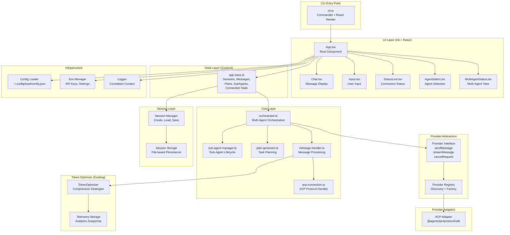

# TOADSTOOL Engineering Design Document

**Revision:** v1.0.0  
**Document Role:** Comprehensive engineering reference for TOAD implementation  
**Last Updated:** 2025-01-27

---

## Table of Contents

1. [Executive Summary](#executive-summary)
2. [System Architecture](#system-architecture)
3. [Component Architecture](#component-architecture)
4. [Data Flow & State Management](#data-flow--state-management)
5. [Provider Abstraction Layer](#provider-abstraction-layer)
6. [Session Management](#session-management)
7. [Multi-Agent Orchestration](#multi-agent-orchestration)
8. [Token Optimizer Integration](#token-optimizer-integration)
9. [Error Handling & Resilience](#error-handling--resilience)
10. [Performance Considerations](#performance-considerations)
11. [Security & Privacy](#security--privacy)
12. [Testing Strategy](#testing-strategy)
13. [Deployment & Distribution](#deployment--distribution)
14. [Implementation Roadmap](#implementation-roadmap)

---

## Executive Summary

### Purpose
TOADSTOOL (Terminal Orchestration for AI Development) is a unified terminal interface for AI coding agents, built with TypeScript, Ink (React for CLIs), and Zustand. It provides a keyboard-first, streaming-enabled interface for ACP-compatible agents (Claude CLI, Gemini CLI, Codex CLI) with session persistence and multi-agent orchestration capabilities.

### Key Architectural Principles

1. **Type Safety First**: TypeScript strict mode, Zod validation at all boundaries, branded types for domain primitives
2. **Ports & Adapters**: Clean provider abstraction enabling multi-provider support
3. **Reactive State**: Zustand for centralized state management with React integration
4. **Streaming-First**: Real-time token-by-token rendering with minimal latency
5. **Session Persistence**: File-based storage with JSON serialization
6. **Multi-Agent Support**: Orchestration layer for coordinating multiple AI agents
7. **Token Optimization**: Optional middleware for prompt compression

### Technology Stack

| Layer | Technology | Rationale |
|-------|------------|-----------|
| **Language** | TypeScript 5.5 | Type safety, modern features, strict mode |
| **TUI Framework** | Ink 5.x | React paradigm in terminal, flexbox layout |
| **UI Components** | @inkjs/ui | Pre-built inputs, selects, spinners |
| **State Management** | Zustand 4.x | Minimal, TypeScript-first, React-compatible |
| **Validation** | Zod 3.x | Runtime type safety, schema validation |
| **ACP SDK** | @agentclientprotocol/sdk | Agent Client Protocol support |
| **Agent CLIs** | Claude CLI, Gemini CLI | ACP-compatible agents |
| **Search & Indexing** | @vscode/ripgrep, fdir, @ast-grep/napi | Fast search and structured queries |
| **Testing** | Vitest | Fast, TypeScript-native, ESM support |
| **Build** | tsup | ESM-native bundler, fast builds |
| **Linting** | Biome | Fast, all-in-one linter/formatter |

---

## System Architecture

### High-Level Architecture



### Layer Responsibilities

| Layer | Responsibility | Dependencies |
|-------|---------------|--------------|
| **UI Layer** | Rendering, user interaction, keyboard shortcuts | State Layer, React/Ink |
| **State Layer** | Centralized state, session management, message tracking | Core Layer |
| **Core Layer** | Orchestration, agent coordination, message processing | Provider Abstraction, Session Layer |
| **Provider Abstraction** | Provider interface, registry, factory | Provider Adapters |
| **Provider Adapters** | ACP integration, streaming, error handling | Agent CLIs |
| **Session Layer** | Persistence, loading, saving | File system |
| **Token Optimizer** | Prompt compression, telemetry | Core Layer (optional) |
| **Infrastructure** | Config, env, logging | File system, process env |

---

## Component Architecture

### UI Component Hierarchy

```
App
├── AgentSelect (conditional - if no agent selected)
├── Chat
│   ├── MessageList
│   │   └── MessageItem (multiple)
│   └── MultiAgentStatus (conditional - if multi-agent mode)
├── Input
└── StatusLine
```

### Component Specifications

#### App.tsx (Root Component)
**Purpose**: Root container, orchestrates all UI components

**Props**: None (uses Zustand store)

**Responsibilities**:
- Initialize application state
- Handle keyboard shortcuts (Ctrl+C, Ctrl+P, etc.)
- Manage component lifecycle
- Coordinate between UI components

**State Dependencies**:
- `connectionStatus` - Connection state
- `currentSessionId` - Active session
- `sessions` - All sessions

#### Chat.tsx (Message Display)
**Purpose**: Main conversation area

**Props**: None (reads from store)

**Responsibilities**:
- Display message list
- Handle scrolling (auto-scroll to bottom)
- Show multi-agent status if active
- Render streaming messages

**State Dependencies**:
- `messages` - All messages
- `currentSessionId` - Active session
- `plans` - Active plans (for multi-agent)

#### MessageList.tsx (Message Container)
**Purpose**: Scrollable message container

**Props**:
```typescript
interface MessageListProps {
  sessionId: SessionId;
  messages: Message[];
  isStreaming: boolean;
}
```

**Responsibilities**:
- Virtual scrolling for long conversations
- Message ordering (chronological)
- Auto-scroll management

#### MessageItem.tsx (Individual Message)
**Purpose**: Single message display

**Props**:
```typescript
interface MessageItemProps {
  message: Message;
  isStreaming?: boolean;
}
```

**Responsibilities**:
- Render message content blocks (text, code, thinking, tool_call)
- Syntax highlighting for code blocks
- Markdown rendering
- Streaming indicator

#### Input.tsx (User Input)
**Purpose**: Multi-line text input

**Props**: None (manages own state, writes to store)

**Responsibilities**:
- Multi-line input (Shift+Enter for newline)
- Input history (Up/Down arrows)
- Send message on Enter
- Cancel request on Escape
- Character count

**State Dependencies**:
- `connectionStatus` - Disable when disconnected
- `isStreaming` - Disable when streaming

#### StatusLine.tsx (Status Bar)
**Purpose**: System status and shortcuts

**Props**: None (reads from store)

**Responsibilities**:
- Display connection status
- Show current agent/session
- Display keyboard shortcuts
- Token count (if available)

**State Dependencies**:
- `connectionStatus` - Status indicator
- `currentSessionId` - Session info
- `sessions` - Session metadata

#### AgentSelect.tsx (Agent Selection)
**Purpose**: Agent/provider selection modal

**Props**: None (manages own state)

**Responsibilities**:
- List available agents/providers
- Allow selection via keyboard
- Initialize connection on selection

#### MultiAgentStatus.tsx (Multi-Agent View)
**Purpose**: Display multi-agent orchestration status

**Props**: None (reads from store)

**Responsibilities**:
- Show active plan
- Display sub-agents and their status
- Show task progress
- Agent coordination visualization

**State Dependencies**:
- `plans` - Active plans
- `subAgents` - Sub-agent statuses
- `tasks` - Task progress

---

## Data Flow & State Management

### State Architecture (Zustand)

#### Store Structure

```typescript
interface AppStore extends AppState {
  // Connection
  connectionStatus: ConnectionStatus;
  setConnectionStatus: (status: ConnectionStatus) => void;
  
  // Sessions
  currentSessionId: SessionId | undefined;
  sessions: Record<SessionId, Session>;
  setCurrentSession: (sessionId: SessionId | undefined) => void;
  upsertSession: (params: UpsertSessionParams) => void;
  getSession: (sessionId: SessionId) => Session | undefined;
  
  // Messages
  messages: Record<MessageId, Message>;
  appendMessage: (message: Message) => void;
  updateMessage: (params: UpdateMessageParams) => void;
  getMessagesForSession: (sessionId: SessionId) => Message[];
  
  // Multi-Agent Orchestration
  plans: Record<PlanId, Plan>;
  subAgents: Record<SubAgentId, SubAgent>;
  upsertPlan: (plan: Plan) => void;
  upsertSubAgent: (agent: SubAgent) => void;
  getPlan: (planId: PlanId) => Plan | undefined;
  getSubAgentsForPlan: (planId: PlanId) => SubAgent[];
  
  // Utilities
  reset: () => void;
}
```

### Data Flow Patterns

#### 1. User Sends Message

```
User types → Input.tsx
  ↓
Input.tsx calls store.appendMessage(userMessage)
  ↓
Store updates messages state
  ↓
Chat.tsx re-renders (subscribed to messages)
  ↓
MessageList.tsx displays new message
  ↓
Orchestrator processes message
  ↓
Provider sends to AI
  ↓
Streaming chunks arrive → store.updateMessage(streamingChunk)
  ↓
Chat.tsx re-renders with streaming content
  ↓
Final message → store.updateMessage(finalMessage)
```

#### 2. Multi-Agent Orchestration

```
User sends complex prompt
  ↓
Orchestrator.createPlan(prompt)
  ↓
PlanGenerator generates tasks
  ↓
Store.upsertPlan(plan)
  ↓
Orchestrator assigns tasks to sub-agents
  ↓
SubAgentManager creates sub-agents
  ↓
Store.upsertSubAgent(agent) for each
  ↓
Each sub-agent processes task
  ↓
Sub-agent messages → store.appendMessage()
  ↓
Task completion → store.updateMessage(taskResult)
  ↓
Plan completion → store.upsertPlan(completedPlan)
```

#### 3. Session Persistence

```
User creates session
  ↓
Store.upsertSession(session)
  ↓
SessionManager.save(session) [async]
  ↓
File system: ~/.config/toad/sessions/{sessionId}.json
  ↓
On app restart
  ↓
SessionManager.loadAll()
  ↓
Store.upsertSession() for each loaded session
```

### State Updates

**Immutable Updates**: All Zustand updates use immutable patterns (spread operator, new objects)

**Validation**: All state updates validated with Zod schemas before storage

**Selective Subscriptions**: Components subscribe to specific slices of state to minimize re-renders

---

## Provider Abstraction Layer

### Provider Interface (Port)

```typescript
// src/providers/types.ts

export interface Message {
  readonly id: MessageId;
  readonly role: "user" | "assistant" | "system";
  readonly content: ContentBlock[];
  readonly timestamp: number;
}

export interface StreamChunk {
  readonly content: string;
  readonly done: boolean;
  readonly error?: Error;
  readonly usage?: TokenUsage;
}

export interface ProviderConfig {
  readonly apiKey: string;
  readonly model?: string;
  readonly maxTokens?: number;
  readonly temperature?: number;
  readonly timeout?: number;
}

export interface SendMessageOptions {
  readonly messages: readonly Message[];
  readonly stream?: boolean;
  readonly abortSignal?: AbortSignal;
  readonly systemPrompt?: string;
}

export interface ProviderResponse {
  readonly message: Message;
  readonly usage?: TokenUsage;
  readonly model?: string;
}

export interface TokenUsage {
  readonly promptTokens: number;
  readonly completionTokens: number;
  readonly totalTokens: number;
}

export interface Provider {
  readonly id: string;
  readonly name: string;
  readonly config: ProviderConfig;
  
  sendMessage(options: SendMessageOptions): Promise<ProviderResponse>;
  
  streamMessage(
    options: SendMessageOptions,
    onChunk: (chunk: StreamChunk) => void
  ): Promise<ProviderResponse>;
  
  cancelRequest(requestId: string): Promise<void>;
  
  validateConfig(): Promise<boolean>;
  
  estimateTokens(prompt: string): number;
}
```

### Provider Implementations

#### ACP Adapter (CLI)

```typescript
// src/providers/acp-provider.ts

import { Client } from "@agentclientprotocol/sdk";
import type { Provider, ProviderConfig, SendMessageOptions, StreamChunk } from "./types";

export class ACPProvider implements Provider {
  private client: Client;
  
  constructor(public readonly config: ProviderConfig) {
    this.client = new Client({
      // ACP-specific configuration
    });
  }
  
  async streamMessage(
    options: SendMessageOptions,
    onChunk: (chunk: StreamChunk) => void
  ): Promise<ProviderResponse> {
    // ACP protocol implementation
    // Uses JSON-RPC 2.0 over stdio or WebSocket
  }
  
  // ... other methods
}
```

### Provider Registry

```typescript
// src/providers/registry.ts

export class ProviderRegistry {
  private providers = new Map<string, Provider>();
  
  register(provider: Provider): void {
    this.providers.set(provider.id, provider);
  }
  
  get(id: string): Provider | undefined {
    return this.providers.get(id);
  }
  
  list(): Provider[] {
    return Array.from(this.providers.values());
  }
  
  async createFromConfig(config: ProviderConfig): Promise<Provider> {
    switch (config.type) {
      case "acp":
        return new ACPProvider(config);
      default:
        throw new Error(`Unknown provider type: ${config.type}`);
    }
  }
}
```

---

## Session Management

### Session Storage Interface

```typescript
// src/sessions/types.ts

export interface SessionStorage {
  save(session: Session): Promise<void>;
  load(sessionId: SessionId): Promise<Session | null>;
  list(): Promise<readonly Session[]>;
  delete(sessionId: SessionId): Promise<void>;
  findLatest(providerId?: string): Promise<Session | null>;
}
```

### File-Based Implementation

```typescript
// src/sessions/file-storage.ts

import { promises as fs } from "fs";
import { join } from "path";
import { homedir } from "os";
import type { Session, SessionId } from "@/types/domain";
import type { SessionStorage } from "./types";

const SESSIONS_DIR = join(homedir(), ".config", "toad", "sessions");

export class FileSessionStorage implements SessionStorage {
  private async ensureDir(): Promise<void> {
    await fs.mkdir(SESSIONS_DIR, { recursive: true });
  }
  
  async save(session: Session): Promise<void> {
    await this.ensureDir();
    const filePath = join(SESSIONS_DIR, `${session.id}.json`);
    await fs.writeFile(filePath, JSON.stringify(session, null, 2), "utf-8");
  }
  
  async load(sessionId: SessionId): Promise<Session | null> {
    const filePath = join(SESSIONS_DIR, `${sessionId}.json`);
    try {
      const content = await fs.readFile(filePath, "utf-8");
      return JSON.parse(content) as Session;
    } catch (error) {
      if ((error as NodeJS.ErrnoException).code === "ENOENT") {
        return null;
      }
      throw error;
    }
  }
  
  async list(): Promise<readonly Session[]> {
    await this.ensureDir();
    const files = await fs.readdir(SESSIONS_DIR);
    const sessions: Session[] = [];
    
    for (const file of files) {
      if (file.endsWith(".json")) {
        const sessionId = file.slice(0, -5) as SessionId;
        const session = await this.load(sessionId);
        if (session) {
          sessions.push(session);
        }
      }
    }
    
    return sessions.sort((a, b) => b.updatedAt - a.updatedAt);
  }
  
  async delete(sessionId: SessionId): Promise<void> {
    const filePath = join(SESSIONS_DIR, `${sessionId}.json`);
    try {
      await fs.unlink(filePath);
    } catch (error) {
      if ((error as NodeJS.ErrnoException).code !== "ENOENT") {
        throw error;
      }
    }
  }
  
  async findLatest(providerId?: string): Promise<Session | null> {
    const sessions = await this.list();
    const filtered = providerId
      ? sessions.filter((s) => s.agentId === providerId)
      : sessions;
    return filtered[0] || null;
  }
}
```

### Session Manager

```typescript
// src/sessions/session-manager.ts

import type { Session, SessionId, Message } from "@/types/domain";
import type { SessionStorage } from "./types";

export class SessionManager {
  constructor(private storage: SessionStorage) {}
  
  async createSession(agentId?: string): Promise<Session> {
    const session: Session = {
      id: this.generateSessionId(),
      agentId,
      messageIds: [],
      createdAt: Date.now(),
      updatedAt: Date.now(),
    };
    
    await this.storage.save(session);
    return session;
  }
  
  async loadSession(sessionId: SessionId): Promise<Session | null> {
    return this.storage.load(sessionId);
  }
  
  async saveSession(session: Session): Promise<void> {
    const updated: Session = {
      ...session,
      updatedAt: Date.now(),
    };
    await this.storage.save(updated);
  }
  
  async listSessions(): Promise<readonly Session[]> {
    return this.storage.list();
  }
  
  private generateSessionId(): SessionId {
    return `session_${Date.now()}_${Math.random().toString(36).slice(2, 9)}` as SessionId;
  }
}
```

---

## Multi-Agent Orchestration

### Architecture

The multi-agent orchestration system coordinates multiple AI agents to work together on complex tasks. It consists of:

1. **Plan Generator**: Breaks down complex prompts into tasks
2. **Orchestrator**: Coordinates sub-agents and task execution
3. **Sub-Agent Manager**: Manages sub-agent lifecycle
4. **Message Handler**: Routes messages between agents

### Plan Generation

```typescript
// src/core/plan-generator.ts

export class PlanGenerator {
  async generatePlan(
    prompt: string,
    provider: Provider
  ): Promise<Plan> {
    const planningPrompt = `
You are a task planning system. Break down the following request into discrete, executable tasks.

Request: ${prompt}

Output a JSON plan with:
- tasks: Array of { id, title, description, dependencies }
- Each task should be atomic and executable by a single agent
- Dependencies should reference task IDs
`;

    const response = await provider.sendMessage({
      messages: [{ role: "user", content: [{ type: "text", text: planningPrompt }] }],
    });
    
    // Parse response and create Plan
    const plan: Plan = {
      id: this.generatePlanId(),
      sessionId: this.currentSessionId,
      originalPrompt: prompt,
      tasks: this.parseTasks(response.message),
      status: "planning",
      createdAt: Date.now(),
      updatedAt: Date.now(),
    };
    
    return plan;
  }
}
```

### Orchestrator

```typescript
// src/core/orchestrator.ts

export class Orchestrator {
  constructor(
    private subAgentManager: SubAgentManager,
    private planGenerator: PlanGenerator,
    private messageHandler: MessageHandler
  ) {}
  
  async executePlan(plan: Plan): Promise<void> {
    // Update plan status
    plan.status = "executing";
    
    // Create sub-agents for each task
    for (const task of plan.tasks) {
      if (task.dependencies.length === 0) {
        // No dependencies, can start immediately
        await this.startTask(task, plan);
      }
    }
    
    // Monitor task completion and start dependent tasks
    await this.monitorTasks(plan);
  }
  
  private async startTask(task: Task, plan: Plan): Promise<void> {
    const subAgent = await this.subAgentManager.createSubAgent({
      planId: plan.id,
      taskId: task.id,
      agentId: this.selectAgentForTask(task),
    });
    
    // Send task to sub-agent
    await this.messageHandler.sendTaskToAgent(subAgent, task);
  }
  
  private async monitorTasks(plan: Plan): Promise<void> {
    // Poll task status, start dependent tasks when ready
    // Handle task completion, failures, coordination
  }
}
```

### Sub-Agent Manager

```typescript
// src/core/sub-agent-manager.ts

export class SubAgentManager {
  private subAgents = new Map<SubAgentId, SubAgent>();
  
  async createSubAgent(params: CreateSubAgentParams): Promise<SubAgent> {
    const subAgent: SubAgent = {
      id: this.generateSubAgentId(),
      planId: params.planId,
      agentId: params.agentId,
      sessionId: params.sessionId,
      currentTaskId: params.taskId,
      status: "idle",
      connectionStatus: "connecting",
      createdAt: Date.now(),
      lastActivityAt: Date.now(),
    };
    
    // Initialize connection
    await this.initializeConnection(subAgent);
    
    this.subAgents.set(subAgent.id, subAgent);
    return subAgent;
  }
  
  async updateSubAgentStatus(
    subAgentId: SubAgentId,
    status: SubAgent["status"]
  ): Promise<void> {
    const agent = this.subAgents.get(subAgentId);
    if (agent) {
      agent.status = status;
      agent.lastActivityAt = Date.now();
    }
  }
}
```

---

## Token Optimizer Integration

### Integration Points

The token optimizer (already implemented) can be integrated at these points:

1. **Before Provider Call**: Compress prompts before sending to AI
2. **Session Compression**: Compress old messages in long sessions
3. **Multi-Agent Coordination**: Compress inter-agent messages

### Usage Pattern

```typescript
// src/core/message-handler.ts

import { createTokenOptimizer } from "@/utils/token-optimizer";

export class MessageHandler {
  private tokenOptimizer = createTokenOptimizer({
    // Configuration
  });
  
  async preparePrompt(messages: Message[]): Promise<string> {
    // Convert messages to prompt string
    const prompt = this.messagesToPrompt(messages);
    
    // Optionally optimize if token count is high
    const tokenCount = this.estimateTokens(prompt);
    if (tokenCount > 100000) {
      const optimized = await this.tokenOptimizer.optimize(prompt, {
        strategy: "markdown", // or "json", "xml", etc.
      });
      return optimized.compressed;
    }
    
    return prompt;
  }
}
```

---

## Error Handling & Resilience

### Error Types

```typescript
// src/types/errors.ts

export class ProviderError extends Error {
  constructor(
    message: string,
    public readonly providerId: string,
    public readonly code: string,
    public readonly retryable: boolean
  ) {
    super(message);
    this.name = "ProviderError";
  }
}

export class SessionError extends Error {
  constructor(
    message: string,
    public readonly sessionId: SessionId
  ) {
    super(message);
    this.name = "SessionError";
  }
}

export class OrchestrationError extends Error {
  constructor(
    message: string,
    public readonly planId: PlanId
  ) {
    super(message);
    this.name = "OrchestrationError";
  }
}
```

### Retry Strategy

```typescript
// src/utils/retry.ts

export async function retryWithBackoff<T>(
  fn: () => Promise<T>,
  options: RetryOptions = {}
): Promise<T> {
  const {
    maxAttempts = 3,
    initialDelay = 1000,
    maxDelay = 10000,
    backoff = "exponential",
  } = options;
  
  let attempt = 0;
  let delay = initialDelay;
  
  while (attempt < maxAttempts) {
    try {
      return await fn();
    } catch (error) {
      attempt++;
      
      if (attempt >= maxAttempts) {
        throw error;
      }
      
      if (!isRetryableError(error)) {
        throw error;
      }
      
      await sleep(delay);
      delay = backoff === "exponential" ? Math.min(delay * 2, maxDelay) : delay;
    }
  }
  
  throw new Error("Max retry attempts exceeded");
}
```

### Circuit Breaker

```typescript
// src/utils/circuit-breaker.ts

export class CircuitBreaker {
  private state: "closed" | "open" | "half-open" = "closed";
  private failureCount = 0;
  private lastFailureTime = 0;
  
  async execute<T>(fn: () => Promise<T>): Promise<T> {
    if (this.state === "open") {
      if (Date.now() - this.lastFailureTime > 30000) {
        this.state = "half-open";
      } else {
        throw new Error("Circuit breaker is open");
      }
    }
    
    try {
      const result = await fn();
      if (this.state === "half-open") {
        this.state = "closed";
        this.failureCount = 0;
      }
      return result;
    } catch (error) {
      this.failureCount++;
      this.lastFailureTime = Date.now();
      
      if (this.failureCount >= 5) {
        this.state = "open";
      }
      
      throw error;
    }
  }
}
```

---

## Performance Considerations

### Latency Targets

| Operation | p50 | p95 | p99 |
|-----------|-----|-----|-----|
| App Startup | < 200ms | < 500ms | < 1s |
| Session Load | < 100ms | < 300ms | < 500ms |
| Stream Chunk Render | < 16ms | < 50ms | < 100ms |
| Message Send | < 50ms | < 200ms | < 500ms |
| Provider Response (first chunk) | < 500ms | < 2s | < 5s |

### Optimization Strategies

1. **Virtual Scrolling**: Only render visible messages
2. **Debounced Updates**: Batch state updates during streaming
3. **Lazy Loading**: Load session history on demand
4. **Memoization**: Memoize expensive computations (token counting, markdown parsing)
5. **Connection Pooling**: Reuse provider connections when possible

### Memory Management

- **Message Limits**: Cap message history per session (configurable)
- **Session Cleanup**: Remove old sessions from memory
- **Streaming Buffers**: Limit buffer size for streaming chunks

---

## Security & Privacy

### API Key Management

- **Environment Variables**: Primary method (`.env` file, shell env)
- **Config File**: Secondary method (`~/.config/toad/config.json`) with restricted permissions
- **Never Log Keys**: All logging excludes API keys
- **Key Validation**: Validate keys before use

### Data Privacy

- **Local Storage Only**: All sessions stored locally
- **No Telemetry by Default**: Opt-in telemetry only
- **Message Encryption**: Optional encryption for sensitive sessions (future)

### Input Validation

- **Zod Schemas**: All inputs validated with Zod
- **Sanitization**: Sanitize user input before sending to providers
- **Rate Limiting**: Prevent abuse (future)

---

## Testing Strategy

### Test Pyramid

```
        /\
       /  \      E2E Tests (5%)
      /____\     Integration Tests (15%)
     /      \    Unit Tests (80%)
    /________\
```

### Unit Tests

- **Components**: Test UI components in isolation (ink-testing-library)
- **Store**: Test Zustand store actions and selectors
- **Providers**: Mock ACP agents, test adapter logic
- **Utilities**: Test pure functions (token counting, message formatting)

### Integration Tests

- **Provider Integration**: Test with real ACP agents (skipped in CI, run manually)
- **Session Persistence**: Test file-based storage
- **Orchestration**: Test multi-agent coordination

### E2E Tests

- **User Flows**: Complete user journeys
- **Terminal Compatibility**: Test across different terminals
- **Error Scenarios**: Test error handling and recovery

### Test Utilities

```typescript
// test/utils/test-helpers.ts

export function createMockProvider(): Provider {
  return {
    id: "mock",
    name: "Mock Provider",
    config: { apiKey: "test-key" },
    sendMessage: vi.fn(),
    streamMessage: vi.fn(),
    // ... other methods
  };
}

export function createMockSession(): Session {
  return {
    id: "session_123" as SessionId,
    messageIds: [],
    createdAt: Date.now(),
    updatedAt: Date.now(),
  };
}
```

---

## Deployment & Distribution

### Build Process

```bash
# Development
npm run dev              # Run with tsx
npm run dev:watch        # Watch mode

# Build
npm run build            # Build with tsup (outputs to dist/)
npm run typecheck        # Type check
npm run lint             # Lint
npm run test             # Run tests

# Production
npm run build            # Create production bundle
npm start                # Run from dist/
```

### Distribution

1. **NPM Package**: Publish to npm as `toad-cli`
2. **Global Install**: `npm install -g toad-cli`
3. **Binary**: Single executable (via pkg or similar, future)

### Configuration

- **Config File**: `~/.config/toad/config.json`
- **Sessions**: `~/.config/toad/sessions/*.json`
- **Logs**: `~/.config/toad/logs/` (optional)

---

## Implementation Roadmap

### Phase 1: Foundation (Weeks 1-2)

- [x] Token optimizer system
- [x] Environment utilities
- [x] Logging infrastructure
- [ ] ACP connection scaffolding (JSON-RPC over stdio)
- [ ] Provider abstraction interface (`AgentConnection`)
- [ ] Basic Zustand store

### Phase 2: Core Features (Weeks 3-4)

- [ ] ACP session lifecycle + capability negotiation
- [ ] Tool call system with approval flow (fs/terminal)
- [ ] Session management + modes (read-only/auto/full-access)
- [ ] Basic UI components (App, Chat, Input, StatusBar)
- [ ] Message rendering (content blocks + tool calls)

### Phase 3: Streaming & Polish (Weeks 5-6)

- [ ] Streaming support
- [ ] Markdown + content rendering
- [ ] Syntax highlighting
- [ ] Input history
- [ ] Keyboard shortcuts
- [ ] Slash commands routing + autocomplete
- [ ] Agent plan UI

### Phase 4: Multi-Agent (Weeks 7-8)

- [ ] Plan generator
- [ ] Orchestrator
- [ ] ACP compatibility hardening (version negotiation, stdio JSON-RPC)
- [ ] MCP server integration
- [ ] Sub-agent manager
- [ ] Multi-agent UI
- [ ] AGENTS.md support

### Phase 5: Search & Indexing (Week 9)

- [ ] Ripgrep JSON search (`@vscode/ripgrep`)
- [ ] File indexer with `fdir` + glob queries
- [ ] Fuzzy search with `fuzzysort`
- [ ] Optional AST search via `@ast-grep/napi`

### Phase 6: Testing & Documentation (Week 10)

- [ ] Comprehensive test suite
- [ ] Rich content types (images/audio)
- [ ] Documentation
- [ ] Performance optimization
- [ ] Release preparation

---

## Appendix

### ADRs (Architecture Decision Records)

#### ADR-001: Zustand for State Management
**Decision**: Use Zustand instead of Redux or Context API  
**Rationale**: Minimal boilerplate, TypeScript-first, React-compatible, no providers needed  
**Alternatives**: Redux Toolkit (too heavy), Context API (performance concerns)

#### ADR-002: File-Based Session Storage
**Decision**: Use JSON files in `~/.config/toad/sessions/`  
**Rationale**: Simple, no external dependencies, easy to debug, portable  
**Alternatives**: SQLite (overkill), Redis (requires server)

#### ADR-003: Provider Abstraction Pattern
**Decision**: Interface-based provider abstraction (ports/adapters)  
**Rationale**: Enables multi-provider support, testable, extensible  
**Alternatives**: Direct agent integration (too coupled)

#### ADR-004: Ink for TUI Framework
**Decision**: Use Ink instead of blessed or custom terminal library  
**Rationale**: React paradigm, flexbox layout, TypeScript support, active maintenance  
**Alternatives**: Blessed (complex API), custom (too much work)

---

**Document Status**: Active Reference  
**Last Updated**: 2025-01-27
