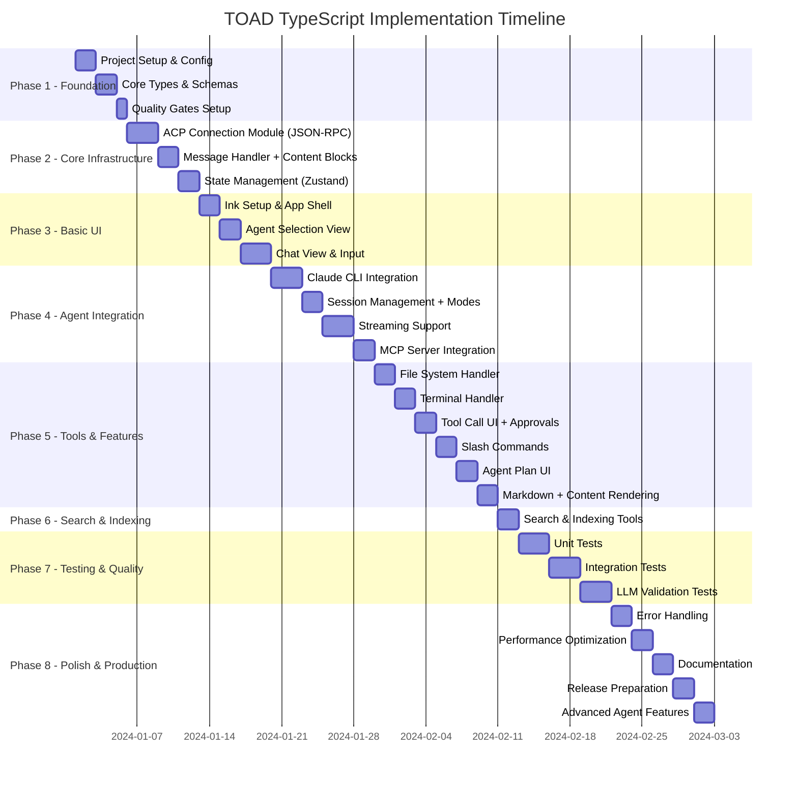

# TOAD TypeScript - Master Implementation Plan

Revision: v1.2.0
Document Role: Canonical roadmap for TOAD-TS execution; see spec.md for authoritative definitions.

## Executive Summary

This document provides the complete implementation roadmap for TOAD TypeScript, a terminal interface for AI coding agents. The project is divided into 8 phases over approximately 14 weeks of active development, progressing from foundational setup to production-ready features.

**Current Status**: Execution underway. Phase 2 fully complete; Phase 4 ready to start.
**Interoperability Focus**: Full ACP protocol implementation complete. Phase 4 will add agent integration.

## Project Timeline



---

## Phase 1: Foundation & Setup (Week 1)

### Goal
Establish project structure, TypeScript configuration, and core type system with strict type safety.

### Tasks

#### 1.1 Project Initialization
**Priority**: P0 - Critical
**Duration**: 4 hours

```bash
# Create directory structure
mkdir -p toad-ts/src/{types,core,store,ui,config,utils,testing}
mkdir -p toad-ts/src/ui/{components,hooks}
mkdir -p toad-ts/src/testing/validators
mkdir -p toad-ts/test/{unit,integration,scenarios}

# Initialize npm project
cd toad-ts
npm init -y

# Configure package.json scripts
npm pkg set scripts.dev="tsx src/cli.ts"
npm pkg set scripts.build="tsc && tsup"
npm pkg set scripts.typecheck="tsc --noEmit"
npm pkg set scripts.test="vitest"
npm pkg set scripts.lint="biome check ."
npm pkg set scripts.lint:fix="biome check --apply ."
npm pkg set scripts.format="biome format --write ."
```

**Deliverables**:
-  Project directory structure
-  package.json with scripts
-  Git repository initialized
-  .gitignore configured

#### 1.2 Dependencies Installation
**Priority**: P0 - Critical
**Duration**: 2 hours

```bash
# Core dependencies
npm install ink react @agentclientprotocol/sdk commander zod zustand \
    chalk marked marked-terminal nanoid date-fns

# Development dependencies
npm install -D typescript @types/react @types/node \
    vitest @vitest/ui ink-testing-library \
    tsx tsup biome
```

**Deliverables**:
-  All dependencies installed
-  No version conflicts
-  Lock file created

#### 1.3 TypeScript Configuration
**Priority**: P0 - Critical
**Duration**: 2 hours

Create `tsconfig.json`:
```json
{
  "compilerOptions": {
    "target": "ES2022",
    "module": "NodeNext",
    "moduleResolution": "NodeNext",
    "lib": ["ES2022"],
    "outDir": "./dist",
    "rootDir": "./src",
    "strict": true,
    "noImplicitAny": true,
    "strictNullChecks": true,
    "strictFunctionTypes": true,
    "strictBindCallApply": true,
    "strictPropertyInitialization": true,
    "noImplicitThis": true,
    "alwaysStrict": true,
    "noUnusedLocals": true,
    "noUnusedParameters": true,
    "noImplicitReturns": true,
    "noFallthroughCasesInSwitch": true,
    "noUncheckedIndexedAccess": true,
    "esModuleInterop": true,
    "skipLibCheck": true,
    "forceConsistentCasingInFileNames": true,
    "declaration": true,
    "declarationMap": true,
    "sourceMap": true,
    "jsx": "react-jsx",
    "paths": {
      "@/*": ["./src/*"]
    }
  },
  "include": ["src/**/*"],
  "exclude": ["node_modules", "dist", "test"]
}
```

**Deliverables**:
-  TypeScript strict mode enabled
-  Path aliases configured
-  JSX support for React/Ink

#### 1.4 Biome Configuration
**Priority**: P0 - Critical
**Duration**: 1 hour

Create `biome.json`:
```json
{
  "formatter": {
    "enabled": true,
    "indentStyle": "space",
    "indentWidth": 2,
    "lineWidth": 100
  },
  "linter": {
    "enabled": true,
    "rules": {
      "recommended": true,
      "complexity": {
        "noExplicitAny": "error",
        "noUselessConstructor": "error"
      },
      "style": {
        "noNonNullAssertion": "warn",
        "useConst": "error"
      }
    }
  }
}
```

**Deliverables**:
-  Linting rules configured
-  Formatting rules set
-  Runs without errors

#### 1.5 Core Type Definitions
**Priority**: P0 - Critical
**Duration**: 4 hours

Create `src/types/domain.ts` with:
- Branded types for IDs (SessionID, AgentID, MessageID)
- Zod schemas for all domain types
- Content block types (text, code, tool_call, thinking)
- Message and session types
- Application state types

**Deliverables**:
-  All types defined with Zod schemas
-  Branded types prevent ID mixing
-  TypeScript compiles without errors
-  Type exports organized

### Phase 1 Acceptance Criteria
- [ ] `npm run typecheck` passes with zero errors
- [ ] `npm run lint` passes
- [ ] `npm run format` completes
- [ ] All core types have Zod schemas
- [ ] Project structure matches specification

---

## Phase 2: Core Infrastructure (Weeks 2-3)

### Goal
Build the foundational modules for agent communication, state management, and message processing.

### Tasks

#### 2.1 ACP Connection Module
**Priority**: P0 - Critical
**Duration**: 8 hours

**CURRENT STATUS**: ✅ COMPLETE - ACP SDK fully integrated.

Implement `src/core/acp-connection.ts` using `@agentclientprotocol/sdk`:
- ✅ Process spawning with error handling
- ✅ Integrate ACP SDK's `ndJsonStream` for JSON-RPC over stdio
- ✅ Connection state management
- ✅ Event emitter for session updates
- ✅ Reconnection logic with exponential backoff

**Additional Deliverables**:
- ✅ Created `src/core/acp-client.ts` with full ACP protocol implementation
- ✅ ACPClient class wrapping SDK ClientSideConnection
- ✅ Full ACP protocol methods (`initialize`, `newSession`, `prompt`, `requestPermission`)
- ✅ Session notification handling and permission requests
- ✅ SDK response correlation and error mapping
- ✅ Capability discovery and session update event emission

**Deliverables**:
- ✅ ACPConnection class complete
- ✅ ACP SDK integration working
- ✅ Connection states (disconnected, connecting, connected, error)
- ✅ Error handling and recovery
- ✅ TypeScript types for all methods
- ✅ Unit tests passing

#### 2.2 Zustand Store Setup
**Priority**: P0 - Critical
**Duration**: 6 hours

Implement `src/store/app-store.ts`:
- Application state structure
- Session management actions
- Message management actions
- Connection status tracking
- Computed getters

**Deliverables**:
-  Store with type-safe actions
-  State updates are immutable
-  Computed properties work
-  Store hooks typed correctly

#### 2.3 Message Handler
**Priority**: P0 - Critical
**Duration**: 6 hours

Implement `src/core/message-handler.ts`:
- Stream processing for chunks
- Content block conversion (text, code, resource, resource_link)
- Tool call lifecycle handling (start/update/result)
- Session update events
- Message assembly logic

**Deliverables**:
-  Handles all ACP message types
-  Streaming updates work correctly
-  Tool calls processed with lifecycle states
-  Content blocks preserved for code and resources
-  Events emitted properly

### Phase 2 Acceptance Criteria
- [ ] Can spawn agent process
- [ ] Can establish ACP connection
- [ ] Store manages state correctly
- [ ] Message handler processes streams
- [ ] Content blocks parsed for code/resources
- [ ] All modules have unit tests

---

## Phase 3: Basic UI Implementation (Weeks 4-5)

### Goal
Create the foundational Ink/React UI with navigation, agent selection, and basic chat interface.

### Tasks

#### 3.1 Ink Application Shell
**Priority**: P0 - Critical
**Duration**: 4 hours

Implement `src/ui/components/App.tsx`:
- Main application container
- Router logic for views
- Global keyboard handlers
- Layout structure

**Deliverables**:
-  App renders without crashes
-  Keyboard shortcuts work
-  View routing functional
-  Clean exit handling

#### 3.2 Agent Selection View
**Priority**: P0 - Critical
**Duration**: 4 hours

Implement `src/ui/components/AgentSelect.tsx`:
- List available agents
- Keyboard navigation
- Agent selection handling
- Empty state handling

**Deliverables**:
-  Displays agent list
-  Arrow key navigation
-  Enter selects agent
-  Transitions to chat view

#### 3.3 Chat Interface
**Priority**: P0 - Critical
**Duration**: 8 hours

Implement chat components:
- `Chat.tsx` - Main chat container
- `MessageList.tsx` - Message display
- `MessageItem.tsx` - Individual messages
- `Input.tsx` - User input field
- `StatusLine.tsx` - Connection status
- Content block rendering (code/resource/resource_link) with safe fallbacks

**Deliverables**:
-  Chat view renders
-  Input accepts text
-  Messages display correctly
-  Status shows connection state

### Phase 3 Acceptance Criteria
- [ ] UI launches successfully
- [ ] Can navigate between views
- [ ] Input field works correctly
- [ ] Messages render properly
- [ ] No visual artifacts or crashes

---

## Phase 4: Agent Integration (Weeks 6-8)

### Goal
Complete integration with Claude CLI and implement full session management with streaming. Introduce
harness module registry + config layering (project + user overrides), secure credential storage, and
abstract persistence layer with multiple backends.

### Phase 4.1: Abstract Persistence Layer (Week 6)
**Goal**: Create pluggable persistence architecture with JSON/SQLite toggle
**Duration**: 12 hours

Implement abstract `PersistenceProvider` interface supporting multiple backends:

#### 4.1.1 Abstract Persistence Interface
**Priority**: P1 - High
**Duration**: 2 hours

Create `src/store/persistence/persistence-provider.ts`:
- Define `PersistenceProvider` interface with load/save/search methods
- Add `PersistenceConfig` for provider selection and options
- Implement factory function `createPersistenceProvider()`

#### 4.1.2 Refactor JSON Implementation
**Priority**: P1 - High
**Duration**: 1 hour

Move existing JSON persistence to `src/store/persistence/json-provider.ts`:
- Extract current `createDiskSessionPersistence` logic
- Implement new `PersistenceProvider` interface
- Add basic search functionality (in-memory filtering)

#### 4.1.3 SQLite Provider Implementation
**Priority**: P1 - High
**Duration**: 6 hours

Create `src/store/persistence/sqlite-provider.ts`:
- Full SQLite implementation with Sequelize models
- Worker thread architecture to prevent UI blocking
- FTS5 full-text search capabilities
- Configurable write modes (per_token/per_message/on_session_change)
- Advanced querying with filtering and pagination

#### 4.1.4 Configuration Integration
**Priority**: P1 - High
**Duration**: 2 hours

Add persistence configuration:
- Environment variables for provider selection
- Default to JSON for backwards compatibility
- SQLite configuration options (write modes, paths)
- Migration utilities for data transfer between providers

#### 4.1.5 Search Abstraction
**Priority**: P1 - High
**Duration**: 1 hour

Create `src/store/persistence/search-engine.ts`:
- Abstract search interface across providers
- JSON: Basic in-memory filtering
- SQLite: Full FTS5 queries with advanced filters
- Extensible for future persistence backends

### Phase 4.2: Agent Integration Core (Weeks 7-8)
**Goal**: Complete Claude CLI integration and session management

#### 4.2.1 Harness Registry + Config Layering
**Priority**: P0 - Critical
**Duration**: 6 hours

Implement harness architecture:
- Harness adapter interface (common contract)
- Registry of harness modules (claude-cli, goose, codex)
- Config loader with project `./.toad/harnesses.json` + user `~/.toad/harnesses.json`
- CLI overrides (`--harness`, `--config`) and `.env` defaults

**Deliverables**:
- 􏾽 Harness interface + registry
- 􏾽 Config schema validation + env expansion
- 􏾽 Override precedence documented

#### 4.2.2 Claude CLI Integration
**Priority**: P0 - Critical
**Duration**: 8 hours

Complete agent integration:
- Default Claude CLI configuration (command + args from `.env`)
- Process spawning and management
- Initialize handshake
- Protocol version negotiation (ACP)
- Capability negotiation
- Auth handling (interactive prompt for OAuth/token if required)

**Deliverables**:
-  Claude CLI spawns correctly
-  Handshake completes
-  Capabilities exchanged
-  Connection stable

#### 4.2.3 Session Management
**Priority**: P0 - Critical
**Duration**: 6 hours

Implement session lifecycle:
- Session creation
- Session state tracking
- Message history
- Session persistence (use new abstract provider)
- Session modes (read-only/auto/full-access)
- `session/setMode` support
- Credential store integration (keychain default, encrypted disk fallback)

**Deliverables**:
-  Sessions create successfully
-  State transitions work
-  History maintained via abstract persistence
-  Can resume sessions
-  Session modes enforced
-  Credentials securely stored

#### 4.2.4 Streaming Implementation
**Priority**: P0 - Critical
**Duration**: 8 hours

Complete streaming support:
- Progressive rendering
- Chunk assembly
- Partial message updates
- Stream completion handling

**Deliverables**:
-  Messages stream character by character
-  No dropped chunks
-  Completion detected
-  UI updates smoothly

#### 4.2.5 MCP Server Integration
**Priority**: P1 - High
**Duration**: 4 hours

Implement MCP server configuration:
- Accept MCP server configs (HTTP/SSE/stdio)
- Strict schema validation with env expansion (Claude Code style)
- Pass MCP credentials into session config
- Expose MCP tools via agent capabilities

**Deliverables**:
-  MCP servers included in session setup
-  MCP tools discoverable to the agent
-  MCP errors surfaced clearly

### Phase 4 Acceptance Criteria
- [ ] Can connect to Claude CLI using configured command/args
- [ ] Auth flow works (interactive prompt for OAuth/token when required)
- [ ] Sessions create and persist via pluggable store (disk default)
- [ ] Session modes enforced correctly
- [ ] Messages stream in real-time
- [ ] MCP servers configurable per session (strict schema + env expansion)
- [ ] Harness config supports project + user overrides
- [ ] No data loss or corruption
- [ ] Error states handled gracefully

---

## Phase 5: Tools & Features (Weeks 8-9)

### Goal
Implement tool calling with approval flow, search/indexing tools, slash commands, agent plan UI, and
content rendering.

### Tasks

#### 5.1 File System Handler
**Priority**: P1 - High
**Duration**: 6 hours

Implement `src/core/fs-handler.ts`:
- Read file operations
- Write file operations
- Path resolution
- Permission handling

**Deliverables**:
-  File reading works
-  File writing works
-  Paths resolved correctly
-  Errors handled gracefully

#### 5.2 Terminal Handler
**Priority**: P1 - High
**Duration**: 6 hours

Implement `src/core/terminal-handler.ts`:
- Command execution
- Output streaming
- Process management
- Error handling

**Deliverables**:
-  Commands execute
-  Output captured
-  Errors reported
-  Process cleanup works

#### 5.3 Tool Call UI
**Priority**: P1 - High
**Duration**: 6 hours

Enhance UI for tool calls:
- Tool call indicators
- Progress display
- Result rendering
- Confirmation prompts
- Permission profiles (allow/ask/deny)
- Tool result streaming updates

**Deliverables**:
-  Tool calls visible
-  Status updates live
-  Results display clearly
-  User can confirm/deny

#### 5.4 Slash Commands
**Priority**: P1 - High
**Duration**: 4 hours

Implement slash command support:
- Command discovery from ACP agents
- Command routing and execution
- Dynamic registration updates
- Autocomplete hints in input

**Deliverables**:
-  Commands discoverable at runtime
-  Slash commands execute reliably
-  Autocomplete hints displayed

#### 5.5 Agent Plan Feature
**Priority**: P1 - High
**Duration**: 4 hours

Implement agent plan handling:
- Plan announcement parsing
- Plan approval/deny flow
- Step progress tracking
- UI display of active plan

**Deliverables**:
-  Plans display before execution
-  User can approve/reject plans
-  Progress updates per step

#### 5.6 Markdown & Content Rendering
**Priority**: P1 - High
**Duration**: 4 hours

Implement markdown and content block rendering:
- Configure marked-terminal
- Syntax highlighting
- Code block rendering with language
- Link handling
- Resource and resource_link rendering

**Deliverables**:
-  Markdown renders correctly
-  Code blocks highlighted
-  Links indicated
-  Resource blocks rendered
-  Formatting preserved

### Phase 5 Acceptance Criteria
- [ ] File operations work correctly
- [ ] Terminal commands execute
- [ ] Tool calls display properly
- [ ] Slash commands work end-to-end
- [ ] Agent plan UI works end-to-end
- [ ] Markdown renders beautifully
- [ ] All features integration tested

---

## Phase 6: Search & Indexing (Weeks 10-11)

### Goal
Deliver fast file discovery, text search, and structured queries with minimal overhead.

### Tasks

#### 6.1 Search & Indexing Tools
**Priority**: P1 - High
**Duration**: 6 hours

Implement search tooling:
- Ripgrep integration via `@vscode/ripgrep` with `rg --json`
- File indexer using `fdir` (in-memory cache)
- Glob queries via `fast-glob` or `tinyglobby`
- Fuzzy finder with `fuzzysort`
- Optional AST search via `@ast-grep/napi`

**Deliverables**:
-  Text search returns structured JSON results
-  File index supports fast scoped searches
-  Glob and fuzzy searches are exposed as tools

### Phase 6 Acceptance Criteria
- [ ] Search and indexing tools work end-to-end
- [ ] JSON search output parsed and validated
- [ ] Scoped search stays under performance targets

---

## Phase 7: Testing & Quality (Weeks 12-13)

### Goal
Comprehensive testing coverage including unit, integration, and LLM-based validation.

### Tasks

#### 7.1 Unit Test Suite
**Priority**: P0 - Critical
**Duration**: 8 hours

Write unit tests for:
- Type validation (Zod schemas)
- Store actions and state
- Message processing logic
- Utility functions

**Deliverables**:
-  >80% code coverage
-  All critical paths tested
-  Tests run quickly
-  Clear test descriptions

#### 7.2 Integration Tests
**Priority**: P0 - Critical
**Duration**: 8 hours

Integration test coverage:
- ACP connection flow + capability negotiation
- Session lifecycle + mode switching
- Tool execution + approval flow
- MCP server integration
- Error recovery

**Deliverables**:
-  E2E flows tested
-  Mock agent for testing
-  Network conditions simulated
-  Recovery scenarios verified

#### 7.3 LLM Validation Framework
**Priority**: P1 - High
**Duration**: 8 hours

Implement `src/testing/validators/llm-validator.ts`:
- Semantic validation
- Quality scoring
- Criteria checking
- Result analysis

**Deliverables**:
-  LLM validator works
-  Scoring is consistent
-  Criteria evaluation accurate
-  Integration with test suite

### Phase 7 Acceptance Criteria
- [ ] Unit test coverage >80%
- [ ] Integration tests pass
- [ ] LLM validation scores >0.8
- [ ] No flaky tests
- [ ] CI/CD pipeline green

---

## Phase 8: Polish & Production (Week 14)

### Goal
Final polish, performance optimization, documentation, and release preparation.

### Tasks

#### 8.1 Error Handling & Recovery
**Priority**: P0 - Critical
**Duration**: 6 hours

Comprehensive error handling:
- Connection recovery
- Graceful degradation
- User-friendly messages
- Error logging

**Deliverables**:
-  All errors caught
-  Recovery works
-  Messages helpful
-  Logging comprehensive

#### 8.2 Performance Optimization
**Priority**: P1 - High
**Duration**: 6 hours

Performance improvements:
- Render optimization
- Memory usage
- Stream buffering
- Component memoization

**Deliverables**:
-  60fps rendering
-  <100ms latency
-  Memory stable
-  No jank or lag

#### 8.3 Documentation
**Priority**: P0 - Critical
**Duration**: 6 hours

Complete documentation:
- README.md with setup
- API documentation
- Architecture guide
- Troubleshooting guide

**Deliverables**:
-  README complete
-  All APIs documented
-  Examples provided
-  FAQ section

#### 8.4 Release Preparation
**Priority**: P0 - Critical
**Duration**: 4 hours

Prepare for release:
- Version tagging
- Build verification
- Package publishing setup
- Release notes

**Deliverables**:
-  Version 1.0.0 tagged
-  Build artifacts clean
-  NPM package ready
-  Announcement prepared

#### 8.5 Advanced Agent Features (Optional)
**Priority**: P2 - Medium
**Duration**: 6 hours

Implement differentiators:
- Subagent system and delegation flow
- AGENTS.md auto-load into session context
- Rich content types (images, audio)

**Deliverables**:
-  Subagent workflows functional
-  AGENTS.md injected on session start
-  Rich content blocks rendered

### Phase 8 Acceptance Criteria
- [ ] All quality gates pass
- [ ] Documentation complete
- [ ] Performance targets met
- [ ] Release candidate ready
- [ ] User testing successful
- [ ] Advanced features shipped or explicitly deferred

---

## Quality Gates

Every phase must pass these gates before proceeding:

```bash
# Required for every commit
npm run format        # Code formatting
npm run lint:fix      # Linting with fixes
npm run typecheck     # Type checking
npm run test          # Test suite
npm run build         # Build verification
```

### Definition of Done

A task is only complete when:
1. Code is implemented according to spec
2. TypeScript compiles without errors
3. All tests pass
4. Documentation is updated
5. Code is reviewed (if applicable)
6. Quality gates pass

---

## Risk Mitigation

### Technical Risks

| Risk | Impact | Mitigation |
|------|--------|------------|
| ACP protocol changes | High | Pin SDK version, monitor changelog |
| Claude CLI compatibility | High | Test with multiple versions |
| Performance issues with Ink | Medium | Profile early, optimize rendering |
| Type safety gaps | Medium | Strict mode, comprehensive schemas |
| Streaming edge cases | Medium | Extensive testing, error boundaries |

### Schedule Risks

| Risk | Impact | Mitigation |
|------|--------|------------|
| Underestimated complexity | High | Buffer time in each phase |
| Dependency issues | Medium | Lock versions, test upgrades |
| Testing takes longer | Medium | Start testing early, automate |
| Documentation debt | Low | Document as you code |

---

## Success Metrics

### Technical Metrics
- **Type Coverage**: 100% (no `any` types)
- **Test Coverage**: >80% for critical paths
- **Performance**: <100ms p95 latency, 60fps rendering
- **Reliability**: <0.1% error rate in production
- **Code Quality**: All quality gates passing

### User Experience Metrics
- **Time to First Response**: <2 seconds
- **Streaming Smoothness**: No visible jank
- **Error Recovery**: <5 seconds to reconnect
- **Command Success Rate**: >95%

---

## Implementation Priorities

### P0 - Critical (Must Have)
- TypeScript strict mode
- ACP protocol (JSON-RPC + session lifecycle)
- Tool call system with approval flow
- Content block support (code/resources)
- Basic UI shell
- Message streaming
- Error handling

### P1 - High (Should Have)
- Session modes (read-only/auto/full-access)
- Slash commands
- MCP server integration
- Agent plan feature
- Search and indexing tools
- Markdown rendering
- Session persistence
- LLM validation
- Performance optimization

### P2 - Medium (Nice to Have)
- Subagent system
- AGENTS.md support
- Rich content types (images/audio)
- Themes
- Advanced shortcuts
- Session replay
- Metrics dashboard

### P3 - Low (Future)
- Plugin system
- Custom agents
- Web UI
- Mobile support
- Cloud sync

---

## Daily Checklist

Start each day:
- [ ] Read `progress.md` for current status
- [ ] Read `journal.md` for recent context
- [ ] Select tasks from current phase
- [ ] Update task status to "In Progress"

During work:
- [ ] Follow specifications exactly
- [ ] Run quality gates frequently
- [ ] Document decisions in `journal.md`
- [ ] Update `progress.md` as tasks complete

End each day:
- [ ] Commit only working code
- [ ] Update `progress.md` with final status
- [ ] Write summary in `journal.md`
- [ ] Plan tomorrow's tasks
- [ ] Push changes to repository

---

## Resources & References

### Essential Documentation
- `spec.md` - Complete technical specification
- `init.md` - Getting started guide
- `progress.md` - Current task status (to be created)
- `journal.md` - Work log and decisions (to be created)

### Research Documentation
- `research/toad-typescript-implementation-spec.md` - Implementation spec
- `research/toad-enhanced-spec.md` - Package ecosystem analysis
- `research/README.md` - Research overview

### External Resources
- [ACP Protocol Spec](https://agentclientprotocol.com)
- [Ink Documentation](https://github.com/vadimdemedes/ink)
- [Zod Documentation](https://zod.dev)
- [Claude CLI Docs](https://docs.anthropic.com/claude-code)

### Architecture References
- `engineering/engineering-design-plan.md` - Detailed architecture
- `engineering/swift-engineering-design.md` - Protocol patterns
- `CODE_QUALITY_REMEDIATION.md` - Quality standards

### Design Documentation
- `design/` directory exists but is currently empty
- Glass UI concepts are documented in engineering files

---

## Final Notes

This plan is designed to be executed by an AI agent with minimal human intervention. Each phase builds on the previous, with clear dependencies and acceptance criteria. The focus is on:

1. **Correctness** - Type safety and validation at every level
2. **Quality** - Continuous testing and quality gates
3. **Performance** - Optimized for terminal environments
4. **Maintainability** - Clean architecture and documentation

Remember: Build it right the first time. The cost of fixing issues increases exponentially as the project progresses.

---

**Document Version**: 1.2.0
**Last Updated**: 2026-01-14
**Next Review**: After Phase 4 completion

**Start Implementation**: Begin with Phase 1, Task 1.1!

---

## Changelog
- v1.2.0 (2026-01-14): Updated Phase 2 status to complete, added ACPClient implementation details, reflected actual code completion.
- v1.1.0 (2026-01-14): Refreshed status, added revision tag, clarified document role, aligned timelines with current execution state.
