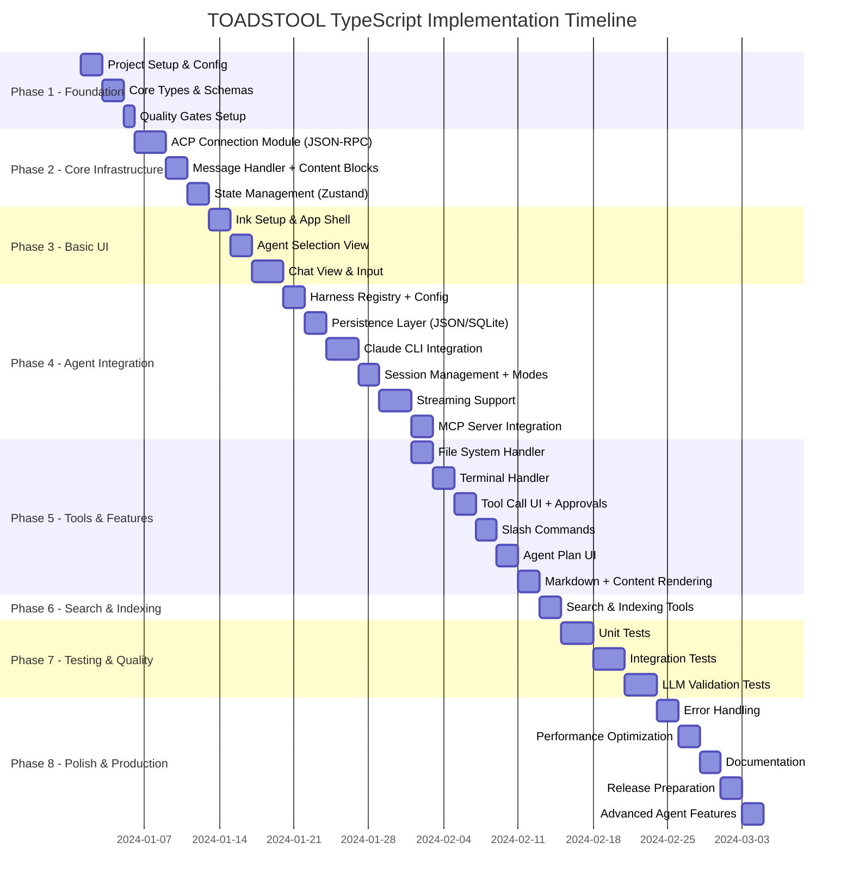

# TOADSTOOL TypeScript - Master Implementation Plan

Revision: v1.3.0
Document Role: Canonical roadmap for TOADSTOOL-TS execution; see spec.md for authoritative definitions.

## Executive Summary

This document provides the complete implementation roadmap for TOADSTOOL TypeScript, a terminal interface for AI coding agents. The project is divided into 8 phases over approximately 14 weeks of active development, progressing from foundational setup to production-ready features.

**Current Status**: Execution underway. Phases 0–6 complete; Phase 7 (Testing) in progress; Phase 8 (UI Parity & Production Polish) planned with comprehensive UI feature implementation including file tree/folder explorer.
**Interoperability Focus**: ACP protocol complete; Claude harness + streaming + sandboxing + search/indexing implemented; UI/UX parity sprint detailed in Phase 8 with major features like folder explorer, streaming markdown, and prompt editor enhancements.

## Project Timeline



---

## Phase 1: Foundation & Setup (Week 1)

### Goal
Establish project structure, TypeScript configuration, and core type system with strict type safety.

### Tasks

#### 1.1 Project Initialization
**Priority**: P0 - Critical
**Duration**: 4 hours

```bash
# Create directory structure
mkdir -p toadstool-ts/src/{types,core,store,ui,config,utils,testing}
mkdir -p toadstool-ts/src/ui/{components,hooks}
mkdir -p toadstool-ts/src/testing/validators
mkdir -p toadstool-ts/test/{unit,integration,scenarios}

# Initialize npm project
cd toadstool-ts
npm init -y

# Configure package.json scripts
npm pkg set scripts.dev="tsx src/cli.ts"
npm pkg set scripts.build="tsc && tsup"
npm pkg set scripts.typecheck="tsc --noEmit"
npm pkg set scripts.test="vitest"
npm pkg set scripts.lint="biome check ."
npm pkg set scripts.lint:fix="biome check --apply ."
npm pkg set scripts.format="biome format --write ."
```

**Deliverables**:
-  Project directory structure
-  package.json with scripts
-  Git repository initialized
-  .gitignore configured

#### 1.2 Dependencies Installation
**Priority**: P0 - Critical
**Duration**: 2 hours

```bash
# Core dependencies
npm install ink react @agentclientprotocol/sdk commander zod zustand \
    chalk marked marked-terminal nanoid date-fns

# Development dependencies
npm install -D typescript @types/react @types/node \
    vitest @vitest/ui ink-testing-library \
    tsx tsup biome
```

**Deliverables**:
-  All dependencies installed
-  No version conflicts
-  Lock file created

#### 1.3 TypeScript Configuration
**Priority**: P0 - Critical
**Duration**: 2 hours

Create `tsconfig.json`:
```json
{
  "compilerOptions": {
    "target": "ES2022",
    "module": "NodeNext",
    "moduleResolution": "NodeNext",
    "lib": ["ES2022"],
    "outDir": "./dist",
    "rootDir": "./src",
    "strict": true,
    "noImplicitAny": true,
    "strictNullChecks": true,
    "strictFunctionTypes": true,
    "strictBindCallApply": true,
    "strictPropertyInitialization": true,
    "noImplicitThis": true,
    "alwaysStrict": true,
    "noUnusedLocals": true,
    "noUnusedParameters": true,
    "noImplicitReturns": true,
    "noFallthroughCasesInSwitch": true,
    "noUncheckedIndexedAccess": true,
    "esModuleInterop": true,
    "skipLibCheck": true,
    "forceConsistentCasingInFileNames": true,
    "declaration": true,
    "declarationMap": true,
    "sourceMap": true,
    "jsx": "react-jsx",
    "paths": {
      "@/*": ["./src/*"]
    }
  },
  "include": ["src/**/*"],
  "exclude": ["node_modules", "dist", "test"]
}
```

**Deliverables**:
-  TypeScript strict mode enabled
-  Path aliases configured
-  JSX support for React/Ink

#### 1.4 Biome Configuration
**Priority**: P0 - Critical
**Duration**: 1 hour

Create `biome.json`:
```json
{
  "formatter": {
    "enabled": true,
    "indentStyle": "space",
    "indentWidth": 2,
    "lineWidth": 100
  },
  "linter": {
    "enabled": true,
    "rules": {
      "recommended": true,
      "complexity": {
        "noExplicitAny": "error",
        "noUselessConstructor": "error"
      },
      "style": {
        "noNonNullAssertion": "warn",
        "useConst": "error"
      }
    }
  }
}
```

**Deliverables**:
-  Linting rules configured
-  Formatting rules set
-  Runs without errors

#### 1.5 Core Type Definitions
**Priority**: P0 - Critical
**Duration**: 4 hours

Create `src/types/domain.ts` with:
- Branded types for IDs (SessionID, AgentID, MessageID)
- Zod schemas for all domain types
- Content block types (text, code, tool_call, thinking)
- Message and session types
- Application state types

**Deliverables**:
-  All types defined with Zod schemas
-  Branded types prevent ID mixing
-  TypeScript compiles without errors
-  Type exports organized

### Phase 1 Acceptance Criteria
- [ ] `npm run typecheck` passes with zero errors
- [ ] `npm run lint` passes
- [ ] `npm run format` completes
- [ ] All core types have Zod schemas
- [ ] Project structure matches specification

---

## Phase 2: Core Infrastructure (Weeks 2-3)

### Goal
Build the foundational modules for agent communication, state management, and message processing.

### Tasks

#### 2.1 ACP Connection Module
**Priority**: P0 - Critical
**Duration**: 8 hours

**CURRENT STATUS**: ✅ COMPLETE - ACP SDK fully integrated.

Implement `src/core/acp-connection.ts` using `@agentclientprotocol/sdk`:
- ✅ Process spawning with error handling
- ✅ Integrate ACP SDK's `ndJsonStream` for JSON-RPC over stdio
- ✅ Connection state management
- ✅ Event emitter for session updates
- ✅ Reconnection logic with exponential backoff

**Additional Deliverables**:
- ✅ Created `src/core/acp-client.ts` with full ACP protocol implementation
- ✅ ACPClient class wrapping SDK ClientSideConnection
- ✅ Full ACP protocol methods (`initialize`, `newSession`, `prompt`, `requestPermission`)
- ✅ Session notification handling and permission requests
- ✅ SDK response correlation and error mapping
- ✅ Capability discovery and session update event emission

**Deliverables**:
- ✅ ACPConnection class complete
- ✅ ACP SDK integration working
- ✅ Connection states (disconnected, connecting, connected, error)
- ✅ Error handling and recovery
- ✅ TypeScript types for all methods
- ✅ Unit tests passing

#### 2.2 Zustand Store Setup
**Priority**: P0 - Critical
**Duration**: 6 hours

Implement `src/store/app-store.ts`:
- Application state structure
- Session management actions
- Message management actions
- Connection status tracking
- Computed getters

**Deliverables**:
-  Store with type-safe actions
-  State updates are immutable
-  Computed properties work
-  Store hooks typed correctly

#### 2.3 Message Handler
**Priority**: P0 - Critical
**Duration**: 6 hours

Implement `src/core/message-handler.ts`:
- Stream processing for chunks
- Content block conversion (text, code, resource, resource_link)
- Tool call lifecycle handling (start/update/result)
- Session update events
- Message assembly logic

**Deliverables**:
-  Handles all ACP message types
-  Streaming updates work correctly
-  Tool calls processed with lifecycle states
-  Content blocks preserved for code and resources
-  Events emitted properly

### Phase 2 Acceptance Criteria
- [ ] Can spawn agent process
- [ ] Can establish ACP connection
- [ ] Store manages state correctly
- [ ] Message handler processes streams
- [ ] Content blocks parsed for code/resources
- [ ] All modules have unit tests

---

## Phase 3: Basic UI Implementation (Weeks 4-5)

### Goal
Create the foundational Ink/React UI with navigation, agent selection, and basic chat interface.

### Tasks

#### 3.1 Ink Application Shell
**Priority**: P0 - Critical
**Duration**: 4 hours

Implement `src/ui/components/App.tsx`:
- Main application container
- Router logic for views
- Global keyboard handlers
- Layout structure

**Deliverables**:
-  App renders without crashes
-  Keyboard shortcuts work
-  View routing functional
-  Clean exit handling

#### 3.2 Agent Selection View
**Priority**: P0 - Critical
**Duration**: 4 hours

Implement `src/ui/components/AgentSelect.tsx`:
- List available agents
- Keyboard navigation
- Agent selection handling
- Empty state handling

**Deliverables**:
-  Displays agent list
-  Arrow key navigation
-  Enter selects agent
-  Transitions to chat view

#### 3.3 Chat Interface
**Priority**: P0 - Critical
**Duration**: 8 hours

Implement chat components:
- `Chat.tsx` - Main chat container
- `MessageList.tsx` - Message display
- `MessageItem.tsx` - Individual messages
- `Input.tsx` - User input field
- `StatusLine.tsx` - Connection status
- Content block rendering (code/resource/resource_link) with safe fallbacks

**Deliverables**:
-  Chat view renders
-  Input accepts text
-  Messages display correctly
-  Status shows connection state

### Phase 3 Acceptance Criteria
- [ ] UI launches successfully
- [ ] Can navigate between views
- [ ] Input field works correctly
- [ ] Messages render properly
- [ ] No visual artifacts or crashes

### Phase 3 Verification (Pre-Phase 4)
**Goal**: Confirm Phase 3 acceptance criteria are still satisfied.

Verification tasks:
- Validate UI navigation flow and agent selection
- Confirm chat rendering + input behavior remain stable
- Note any regressions or missing acceptance criteria

---

## Phase 4: Agent Integration (Weeks 6-8)

### Goal
Complete integration with Claude CLI and implement full session management with streaming. Introduce
harness module registry + config layering (project + user overrides), secure credential storage, and
abstract persistence layer with multiple backends.

### Parallel Tracks (Phase 3 Verification + Phase 4.0–4.2)

**Track A: Persistence + Session Flow**
- Phase 3 verification checklist (UI flow + chat rendering)
- Phase 4.1.1–4.1.5 persistence abstraction (JSON + SQLite toggle)
- Phase 4.2.3 session lifecycle + modes (uses persistence)

**Track B: Harness + Streaming**
- Phase 4.0.1–4.0.3 harness registry + config layering
- Phase 4.2.2 Claude CLI integration (ACP handshake)
- Phase 4.2.4 streaming implementation
- Phase 4.2.5 MCP server integration

### Phase 4.0: Harness Registry + Config Layering (Week 6)
**Goal**: Centralize harness configuration and provider selection.
**Duration**: 6 hours

#### 4.0.1 Harness Adapter Contract
**Priority**: P0 - Critical
**Duration**: 2 hours

Define harness adapter interface (common contract), including connection lifecycle hooks.

#### 4.0.2 Harness Registry
**Priority**: P0 - Critical
**Duration**: 2 hours

Create registry for harness modules (claude-cli, goose, codex) with safe defaults.

#### 4.0.3 Config Layering
**Priority**: P0 - Critical
**Duration**: 2 hours

Implement config loader with project `./.toadstool/harnesses.json` + user `~/.toadstool/harnesses.json`, plus CLI overrides.

### Phase 4.1: Abstract Persistence Layer (Week 6)
**Goal**: Create pluggable persistence architecture with JSON/SQLite toggle
**Duration**: 12 hours

Implement abstract `PersistenceProvider` interface supporting multiple backends:

#### 4.1.1 Abstract Persistence Interface
**Priority**: P1 - High
**Duration**: 2 hours

Create `src/store/persistence/persistence-provider.ts`:
- Define `PersistenceProvider` interface with load/save/search methods
- Add `PersistenceConfig` for provider selection and options
- Implement factory function `createPersistenceProvider()`

#### 4.1.2 Refactor JSON Implementation
**Priority**: P1 - High
**Duration**: 1 hour

Move existing JSON persistence to `src/store/persistence/json-provider.ts`:
- Extract current `createDiskSessionPersistence` logic
- Implement new `PersistenceProvider` interface
- Add basic search functionality (in-memory filtering)

#### 4.1.3 SQLite Provider Implementation
**Priority**: P1 - High
**Duration**: 6 hours

Create `src/store/persistence/sqlite-provider.ts`:
- Full SQLite implementation with Sequelize models
- Worker thread architecture to prevent UI blocking
- FTS5 full-text search capabilities
- Configurable write modes (per_token/per_message/on_session_change)
- Advanced querying with filtering and pagination

#### 4.1.4 Configuration Integration
**Priority**: P1 - High
**Duration**: 2 hours

Add persistence configuration:
- Environment variables for provider selection
- Default to JSON for backwards compatibility
- SQLite configuration options (write modes, paths)
- Migration utilities for data transfer between providers

#### 4.1.5 Search Abstraction
**Priority**: P1 - High
**Duration**: 1 hour

Create `src/store/persistence/search-engine.ts`:
- Abstract search interface across providers
- JSON: Basic in-memory filtering
- SQLite: Full FTS5 queries with advanced filters
- Extensible for future persistence backends

### Phase 4.2: Agent Integration Core (Weeks 7-8)
**Goal**: Complete Claude CLI integration and session management

#### 4.2.1 Harness Registry + Config Layering
**Priority**: P0 - Critical
**Duration**: 6 hours

Implement harness architecture:
- Harness adapter interface (common contract)
- Registry of harness modules (claude-cli, goose, codex)
- Config loader with project `./.toadstool/harnesses.json` + user `~/.toadstool/harnesses.json`
- CLI overrides (`--harness`, `--config`) and `.env` defaults

**Deliverables**:
- 􏾽 Harness interface + registry
- 􏾽 Config schema validation + env expansion
- 􏾽 Override precedence documented

#### 4.2.2 Claude CLI Integration
**Priority**: P0 - Critical
**Duration**: 8 hours

Complete agent integration:
- Default Claude CLI configuration (command + args from `.env`)
- Process spawning and management
- Initialize handshake
- Protocol version negotiation (ACP)
- Capability negotiation
- Auth handling (interactive prompt for OAuth/token if required)

**Deliverables**:
-  Claude CLI spawns correctly
-  Handshake completes
-  Capabilities exchanged
-  Connection stable

#### 4.2.3 Session Management
**Priority**: P0 - Critical
**Duration**: 6 hours

Implement session lifecycle:
- Session creation
- Session state tracking
- Message history
- Session persistence (use new abstract provider)
- Session modes (read-only/auto/full-access)
- `session/setMode` support
- Credential store integration (keychain default, encrypted disk fallback)

**Deliverables**:
-  Sessions create successfully
-  State transitions work
-  History maintained via abstract persistence
-  Can resume sessions
-  Session modes enforced
-  Credentials securely stored

#### 4.2.4 Streaming Implementation
**Priority**: P0 - Critical
**Duration**: 8 hours

Complete streaming support:
- Progressive rendering
- Chunk assembly
- Partial message updates
- Stream completion handling

**Deliverables**:
-  Messages stream character by character
-  No dropped chunks
-  Completion detected
-  UI updates smoothly

#### 4.2.5 MCP Server Integration
**Priority**: P1 - High
**Duration**: 4 hours

Implement MCP server configuration:
- Accept MCP server configs (HTTP/SSE/stdio)
- Strict schema validation with env expansion (Claude Code style)
- Pass MCP credentials into session config
- Expose MCP tools via agent capabilities

**Deliverables**:
-  MCP servers included in session setup
-  MCP tools discoverable to the agent
-  MCP errors surfaced clearly

### Phase 4 Acceptance Criteria
- [ ] Can connect to Claude CLI using configured command/args
- [ ] Auth flow works (interactive prompt for OAuth/token when required)
- [ ] Sessions create and persist via pluggable store (disk default)
- [ ] Session modes enforced correctly
- [ ] Messages stream in real-time
- [ ] MCP servers configurable per session (strict schema + env expansion)
- [ ] Harness config supports project + user overrides
- [ ] No data loss or corruption
- [ ] Error states handled gracefully

---

## Phase 5: Tools & Features (Weeks 8-9)

### Goal
Implement tool calling with approval flow, search/indexing tools, slash commands, agent plan UI, and
content rendering.

### Status
✅ Complete for tools/handlers/plan/slash; markdown streaming and TOAD-level UI polish are deferred to the UI Parity Sprint (see Phase 8 addendum).

### Tasks

#### 5.1 File System Handler
**Priority**: P1 - High
**Duration**: 6 hours

Implement `src/core/fs-handler.ts`:
- Read file operations
- Write file operations
- Path resolution
- Permission handling

**Deliverables**:
-  File reading works
-  File writing works
-  Paths resolved correctly
-  Errors handled gracefully

#### 5.2 Terminal Handler
**Priority**: P1 - High
**Duration**: 6 hours

Implement `src/core/terminal-handler.ts`:
- Command execution
- Output streaming
- Process management
- Error handling

**Deliverables**:
-  Commands execute
-  Output captured
-  Errors reported
-  Process cleanup works

#### 5.3 Tool Call UI
**Priority**: P1 - High
**Duration**: 6 hours

Enhance UI for tool calls:
- Tool call indicators
- Progress display
- Result rendering
- Confirmation prompts
- Permission profiles (allow/ask/deny)
- Tool result streaming updates

**Deliverables**:
-  Tool calls visible
-  Status updates live
-  Results display clearly
-  User can confirm/deny

#### 5.4 Slash Commands
**Priority**: P1 - High
**Duration**: 4 hours

Implement slash command support:
- Command discovery from ACP agents
- Command routing and execution
- Dynamic registration updates
- Autocomplete hints in input

**Deliverables**:
-  Commands discoverable at runtime
-  Slash commands execute reliably
-  Autocomplete hints displayed

#### 5.5 Agent Plan Feature
**Priority**: P1 - High
**Duration**: 4 hours

Implement agent plan handling:
- Plan announcement parsing
- Plan approval/deny flow
- Step progress tracking
- UI display of active plan

**Deliverables**:
-  Plans display before execution
-  User can approve/reject plans
-  Progress updates per step

#### 5.6 Markdown & Content Rendering
**Priority**: P1 - High
**Duration**: 4 hours

Implement markdown and content block rendering:
- Configure marked-terminal
- Syntax highlighting
- Code block rendering with language
- Link handling
- Resource and resource_link rendering

**Deliverables**:
-  Markdown renders correctly
-  Code blocks highlighted
-  Links indicated
-  Resource blocks rendered
-  Formatting preserved

### Phase 5 Acceptance Criteria
- [x] File operations work correctly
- [x] Terminal commands execute
- [x] Tool calls display properly
- [x] Slash commands work end-to-end
- [x] Agent plan UI works end-to-end
- [ ] Markdown renders beautifully (to be superseded by streaming markdown in UI parity sprint)
- [x] All features integration tested

---

## Phase 6: Search & Indexing (Weeks 10-11)

### Goal
Deliver fast file discovery, text search, and structured queries with minimal overhead.


### Status
✅ Complete (file index + glob + ripgrep text search APIs implemented)

### Tasks

#### 6.1 Search & Indexing Tools
**Priority**: P1 - High
**Duration**: 6 hours

Implement search tooling:
- Ripgrep integration via `@vscode/ripgrep` with structured text search results
- File indexer using `fdir` (in-memory cache, scoped to project root)
- Glob queries via `fast-glob`
- Fuzzy finder with `fuzzysort`

**Deliverables**:
-  Text search returns structured JSON results
-  File index supports fast scoped searches
-  Glob and fuzzy searches are exposed as tools

### Phase 6 Acceptance Criteria
- [x] Search and indexing tools work end-to-end
- [x] JSON search output parsed and validated
- [x] Scoped search stays under performance targets

---

## Phase 7: Testing & Quality (Weeks 12-13)

### Goal
Comprehensive testing coverage including unit, integration, and LLM-based validation.

### Tasks

#### 7.1 Unit Test Suite
**Priority**: P0 - Critical
**Duration**: 8 hours

Write unit tests for:
- Type validation (Zod schemas)
- Store actions and state
- Message processing logic
- Utility functions

**Deliverables**:
-  >80% code coverage
-  All critical paths tested
-  Tests run quickly
-  Clear test descriptions

#### 7.2 Integration Tests
**Priority**: P0 - Critical
**Duration**: 8 hours

Integration test coverage:
- ACP connection flow + capability negotiation
- Session lifecycle + mode switching
- Tool execution + approval flow
- MCP server integration
- Error recovery

**Deliverables**:
-  E2E flows tested
-  Mock agent for testing
-  Network conditions simulated
-  Recovery scenarios verified

#### 7.3 LLM Validation Framework
**Priority**: P1 - High
**Duration**: 8 hours

Implement `src/testing/validators/llm-validator.ts`:
- Semantic validation
- Quality scoring
- Criteria checking
- Result analysis

**Deliverables**:
-  LLM validator works
-  Scoring is consistent
-  Criteria evaluation accurate
-  Integration with test suite

### Phase 7 Acceptance Criteria
- [ ] Unit test coverage >80%
- [ ] Integration tests pass
- [ ] LLM validation scores >0.8
- [ ] No flaky tests
- [ ] CI/CD pipeline green

---

## Phase 8: UI Parity & Production Polish (Weeks 14-16)

### Goal
Achieve visual/interaction parity with original TOAD, implement major missing UI features (especially folder explorer), optimize performance, complete documentation, and prepare for release.

### UI Parity Sprint Overview
**Goal**: Achieve visual/interaction parity with original TOAD (see `scratchpad/ui-toad-fix.md`, `scratchpad/ui-design-brief.md`, `scratchpad/ui-implementation-roadmap.md`).

**Key Missing Features to Implement**:
- **Folder Explorer (File Tree)** - P0 Critical: Left sidebar file tree with expand/collapse, icons, selection
- **Streaming Markdown Renderer** - P0 Critical: Block-level parsing, incremental updates, syntax highlighting
- **Prompt Editor Enhancements** - P0 Critical: Multiline, @ file mentions with fuzzy search, .gitignore respect
- **Sidebar Accordion Sections** - P0 Critical: Expand/collapse for Files/Plan/Context/Sessions
- **Agent Selection Grid** - P1 High: Card layout with quick-select
- **Command Palette** - P1 High: Ctrl+P overlay with search
- **Virtual Scrolling** - P1 High: Performance for 1000+ messages

### Phase 8.0: UI Foundation (Week 14, Days 1-3)

#### 8.0.1 Install Phase 1 Ink Packages
**Priority**: P0 - Critical
**Duration**: 1 hour
**Dependencies**: None

Install essential Ink component packages:
```bash
npm install \
  ink-virtual-list \
  ink-select-input \
  ink-text-input \
  ink-spinner \
  ink-divider \
  ink-table
```

**Deliverables**:
- [ ] All packages install without conflicts
- [ ] TypeScript types available
- [ ] No breaking changes to existing code
- [ ] Packages tested in basic components

#### 8.0.2 Update Color System to TOAD Palette
**Priority**: P0 - Critical
**Duration**: 2 hours
**Dependencies**: 8.0.1

Update color constants and theme to match exact TOAD palette:
- Background: `#000000` (pure black)
- User messages: `#00BFFF` (cyan)
- Assistant: `#90EE90` (light green)
- System: `#FFD700` (gold)
- Code blocks: `#2F4F4F` (dark slate gray background)
- Borders: `#404040` (dark gray)
- Error: `#FF6B6B` (coral)
- Success: `#4CAF50` (green)
- Warning: `#FFA726` (orange)

**Files to Update**:
- `src/constants/colors.ts` - Add TOAD palette hex codes
- `src/ui/theme.ts` - Extend with full token system (see `scratchpad/ui-design-tokens.md`)

**Deliverables**:
- [ ] All components use new color constants
- [ ] Visual matches TOAD palette exactly
- [ ] No regressions in existing UI
- [ ] Design tokens documented

#### 8.0.3 Enhance MessageItem Component
**Priority**: P0 - Critical
**Duration**: 4 hours
**Dependencies**: 8.0.2

Improve message rendering:
- Enhanced role badges (bold, uppercase, proper TOAD colors)
- Proper spacing (1-unit margin between messages)
- Improved code block rendering (round border, language label, syntax highlighting)
- Timestamp formatting (right-aligned, dimmed)

**Files to Update**:
- `src/ui/components/MessageItem.tsx`

**Deliverables**:
- [ ] Role badges match TOAD style exactly
- [ ] Code blocks have round borders and language labels
- [ ] Spacing is consistent (1-unit margins)
- [ ] Timestamps are properly formatted
- [ ] All content block types render correctly

#### 8.0.4 Refine StatusFooter with Context-Sensitive Shortcuts
**Priority**: P0 - Critical
**Duration**: 3 hours
**Dependencies**: 8.0.2

Enhance status footer:
- Add context-sensitive shortcuts (change based on focus: editor vs conversation vs selection)
- Improve layout (two rows: shortcuts, status)
- Add proper spacing and borders matching TOAD style
- Show task progress when available

**Files to Update**:
- `src/ui/components/StatusFooter.tsx`
- `src/ui/components/App.tsx` (pass context/focus state)

**Deliverables**:
- [ ] Shortcuts change based on current focus
- [ ] Two-row layout with proper spacing
- [ ] Status information displays correctly
- [ ] Borders and colors match TOAD style
- [ ] Task progress shows when available

### Phase 8.1: Core UI Features (Week 14, Days 4-8)

#### 8.1.1 Implement Sidebar File Tree (Folder Explorer)
**Priority**: P0 - Critical
**Duration**: 6 hours
**Dependencies**: 8.0.1 (ink-virtual-list)

**MAJOR FEATURE**: Implement complete file tree/folder explorer in left sidebar.

**Changes**:
1. Create FileTree component with directory structure parsing
2. Implement expand/collapse for directories (keyboard: Space/Enter, arrow keys)
3. Add file type icons (📁 directories, 📄 files, language-specific icons)
4. Handle file selection (click or Enter to select, show in context)
5. Respect .gitignore (filter out ignored files)
6. Support project root detection and scoping

**Files to Create**:
- `src/ui/components/FileTree.tsx`
- `src/utils/file-tree.ts` (directory parsing utilities)

**Files to Update**:
- `src/ui/components/Sidebar.tsx` (integrate FileTree)

**Implementation Notes**:
- Use `fdir` (already in dependencies) for directory scanning
- Use `ignore` package for .gitignore parsing
- Cache directory structure for performance
- Watch for file changes (optional, can defer)

**Acceptance Criteria**:
- [ ] File tree displays project structure correctly
- [ ] Directories expand/collapse with Space/Enter
- [ ] Arrow keys navigate tree
- [ ] Files show appropriate type icons
- [ ] File selection works (highlights selected file)
- [ ] .gitignore is respected
- [ ] Performance: Tree renders quickly even for large projects (1000+ files)

#### 8.1.2 Sidebar Accordion Sections
**Priority**: P0 - Critical
**Duration**: 4 hours
**Dependencies**: 8.1.1

Convert sidebar sections to accordion (expand/collapse):
- Files section (contains FileTree from 8.1.1)
- Plan section (existing, enhance with accordion)
- Context section (show attached files, @ mentions)
- Sessions section (session history with accordion)

**Changes**:
1. Add expand/collapse state for each section
2. Visual indicators: `▼` expanded, `▶` collapsed
3. Keyboard navigation (Space/Enter toggles, arrow keys navigate)
4. Persist expanded state (optional, can defer)

**Files to Update**:
- `src/ui/components/Sidebar.tsx`
- Create `src/ui/components/AccordionSection.tsx` (reusable)

**Acceptance Criteria**:
- [ ] Sections toggle with Space/Enter
- [ ] Visual indicators (▼/▶) show state correctly
- [ ] Keyboard navigation works smoothly
- [ ] Context files display correctly
- [ ] All sections work independently

#### 8.1.3 Streaming Markdown Renderer
**Priority**: P0 - Critical
**Duration**: 8 hours
**Dependencies**: 8.0.1

Implement optimized streaming markdown renderer with block-level parsing:
- Block-level parsing (only parse top-level blocks: paragraphs, code, lists, tables)
- Incremental parsing (parse only new/changed content)
- Minimal widget replacement (update only changed blocks)
- Token buffering (5ms debounce for performance)

**Performance Targets**:
- Parse time: <1ms per update
- Display lag: <10ms behind incoming tokens
- Rendering: 60fps target

**Files to Create**:
- `src/ui/components/MarkdownStreamer.tsx` (core streaming logic)
- `src/ui/components/MarkdownRenderer.tsx` (React component wrapper)

**Files to Update**:
- `src/ui/components/MessageItem.tsx` (use new renderer)

**Implementation Notes**:
- Use `marked` (already in dependencies) with streaming adapter
- Implement block-level parsing as described in `ui-toad-fix.md`
- Support all markdown elements: tables, lists, blockquotes, code blocks, headings
- Handle dynamic block type transitions during streaming

**Acceptance Criteria**:
- [ ] Streaming is smooth (60fps target, no visible jank)
- [ ] Display lag < 10ms behind tokens
- [ ] Parse time < 1ms per update
- [ ] All markdown elements render correctly (tables, lists, quotes, code, headings)
- [ ] Block type transitions handled correctly (e.g., paragraph → list)

#### 8.1.4 Prompt Editor with @ File Mentions
**Priority**: P0 - Critical
**Duration**: 6 hours
**Dependencies**: 8.0.1 (ink-text-input), 8.1.1 (file tree)

Enhance prompt editor with advanced features:
- Multiline support (Enter for new line, Ctrl+Enter to submit)
- @ trigger for file mentions (when user types @, show file suggestions)
- Fuzzy file search (fast search through project files)
- Respect .gitignore (don't suggest ignored files)
- Show autocomplete suggestions (overlay with file list)
- Keyboard navigation (arrow keys, Enter to select)

**Files to Create**:
- `src/ui/components/FileSuggest.tsx` (file suggestion overlay)
- `src/ui/components/PromptEditor.tsx` (enhanced input, or refactor InputWithAutocomplete)

**Files to Update**:
- `src/ui/components/InputWithAutocomplete.tsx` (or replace with PromptEditor)
- `src/ui/components/Chat.tsx` (use new editor)

**Implementation Notes**:
- Use `fuzzysort` (already in dependencies) for fuzzy search
- Use `ignore` package for .gitignore parsing
- Debounce search (100-200ms) for performance
- Limit suggestions (top 10 matches)

**Acceptance Criteria**:
- [ ] Multiline input works (Enter for new line, Ctrl+Enter submits)
- [ ] @ triggers file suggestions immediately
- [ ] Fuzzy search finds files quickly (<500ms for large projects)
- [ ] .gitignore is respected (ignored files not suggested)
- [ ] Autocomplete displays correctly (overlay with file list)
- [ ] Keyboard navigation works (arrow keys navigate, Enter selects)
- [ ] Selected files are inserted into prompt correctly

### Phase 8.2: Advanced UI Features (Week 15, Days 9-12)

#### 8.2.1 Agent Selection Grid Layout
**Priority**: P1 - High
**Duration**: 4 hours
**Dependencies**: 8.0.1 (ink-select-input)

Convert agent selection from list to grid/card layout:
- Grid layout (3 columns, responsive)
- Visual cards with borders and spacing
- Quick-select with numbers (1-9 keys)
- Status indicators (available, loading, error)
- Agent descriptions and icons

**Files to Update**:
- `src/ui/components/AgentSelect.tsx`

**Acceptance Criteria**:
- [ ] Grid layout displays correctly (3 columns)
- [ ] Cards have proper borders and spacing
- [ ] Quick-select works (1-9 keys select agents)
- [ ] Status indicators show correctly
- [ ] Keyboard navigation works (arrow keys, numbers, Enter)

#### 8.2.2 Command Palette (Ctrl+P)
**Priority**: P1 - High
**Duration**: 6 hours
**Dependencies**: 8.0.1 (ink-quicksearch-input recommended, or custom)

Implement command palette overlay:
- Ctrl+P opens palette
- Search/filter commands as user types
- Keyboard navigation (arrow keys navigate, Enter executes)
- Show command descriptions
- Support dynamic commands from ACP agents

**Files to Create**:
- `src/ui/components/CommandPalette.tsx`

**Files to Update**:
- `src/ui/components/App.tsx` (add Ctrl+P handler, manage palette state)

**Commands to Support**:
- `/help` - Show available commands
- `/mode <mode>` - Change session mode
- `/clear` - Clear chat messages
- `/plan <title>` - Create plan
- `/export` - Export session (future)
- `/settings` - Open settings (future)
- Dynamic commands from ACP agents

**Acceptance Criteria**:
- [ ] Ctrl+P opens palette instantly
- [ ] Search filters commands as user types
- [ ] Arrow keys navigate results
- [ ] Enter executes selected command
- [ ] Escape closes palette
- [ ] Dynamic commands from agents appear

#### 8.2.3 Code Block Syntax Highlighting
**Priority**: P0 - Critical
**Duration**: 4 hours
**Dependencies**: 8.1.3 (markdown renderer)

Enhance code blocks with syntax highlighting:
- Integrate syntax highlighting (use existing `shiki` dependency)
- Language detection (from code fence or auto-detect)
- Proper color scheme matching TOAD style
- Line numbers for long blocks (optional, can defer)

**Files to Update**:
- `src/ui/components/MessageItem.tsx` (code block rendering)
- `src/ui/components/MarkdownRenderer.tsx` (code block integration)

**Acceptance Criteria**:
- [ ] Syntax highlighting works for common languages (TypeScript, JavaScript, Python, etc.)
- [ ] Language is detected automatically or from fence
- [ ] Colors match TOAD style (light green text on dark slate background)
- [ ] Performance: Highlighting doesn't block rendering
- [ ] Long code blocks handle gracefully

### Phase 8.3: Performance & Polish (Week 15, Days 13-15)

#### 8.3.1 Virtual Scrolling for Messages
**Priority**: P1 - High
**Duration**: 6 hours
**Dependencies**: 8.0.1 (ink-virtual-list), 8.1.3 (markdown renderer)

Implement virtual scrolling for MessageList:
- Only render visible messages (performance for 1000+ messages)
- Maintain scroll position correctly
- Handle streaming messages (keep streaming message visible)
- Smooth scrolling behavior

**Files to Update**:
- `src/ui/components/MessageList.tsx`

**Acceptance Criteria**:
- [ ] 1000+ messages render without lag
- [ ] Scroll position maintained correctly
- [ ] Streaming messages remain visible
- [ ] Performance targets met (60fps, <100ms latency)
- [ ] No visual artifacts during scrolling

#### 8.3.2 Visual Regression Tests
**Priority**: P1 - High
**Duration**: 4 hours
**Dependencies**: All UI tasks

Create screenshot comparison tests:
- Capture screenshots of key components
- Compare against baseline images
- Test on multiple terminal sizes
- Test all component states
- Document visual changes

**Files to Create**:
- `__tests__/visual/` directory
- Screenshot comparison utilities
- Baseline images

**Acceptance Criteria**:
- [ ] Screenshots captured for key components
- [ ] Comparisons work correctly
- [ ] Tests run in CI
- [ ] Visual changes documented

#### 8.3.3 Terminal Compatibility Testing
**Priority**: P1 - High
**Duration**: 4 hours
**Dependencies**: All UI tasks

Test on multiple terminals:
- iTerm2 (macOS)
- Windows Terminal
- Alacritty
- Basic terminals (256-color minimum)
- Document compatibility issues

**Acceptance Criteria**:
- [ ] Works on all target terminals
- [ ] Graceful degradation for missing features
- [ ] Compatibility documented
- [ ] Known issues listed in README

### Phase 8.4: Production Polish (Week 16)

#### 8.4.1 Error Handling & Recovery
**Priority**: P0 - Critical
**Duration**: 6 hours
**Dependencies**: None

Comprehensive error handling:
- Connection recovery with exponential backoff
- Graceful degradation for missing features
- User-friendly error messages
- Error logging with context

**Deliverables**:
- [ ] All errors caught and handled
- [ ] Recovery works automatically
- [ ] Error messages are helpful
- [ ] Logging is comprehensive

#### 8.4.2 Performance Optimization
**Priority**: P1 - High
**Duration**: 6 hours
**Dependencies**: 8.3.1 (virtual scrolling)

Performance improvements:
- Render optimization (memoization, shouldComponentUpdate)
- Memory usage optimization
- Stream buffering optimization
- Component lazy loading (if applicable)

**Deliverables**:
- [ ] 60fps rendering achieved
- [ ] <100ms latency (p95)
- [ ] Memory usage stable
- [ ] No jank or lag

#### 8.4.3 Documentation
**Priority**: P0 - Critical
**Duration**: 6 hours
**Dependencies**: All previous tasks

Complete documentation:
- README.md with setup and usage
- API documentation (JSDoc)
- Architecture guide
- Troubleshooting guide
- UI component documentation

**Deliverables**:
- [ ] README complete with examples
- [ ] All APIs documented
- [ ] Architecture guide written
- [ ] Troubleshooting guide with common issues
- [ ] FAQ section

#### 8.4.4 Release Preparation
**Priority**: P0 - Critical
**Duration**: 4 hours
**Dependencies**: 8.4.3

Prepare for release:
- Version tagging (1.0.0)
- Build verification
- Package publishing setup
- Release notes
- Changelog

**Deliverables**:
- [ ] Version 1.0.0 tagged
- [ ] Build artifacts clean
- [ ] NPM package ready
- [ ] Release notes prepared
- [ ] Changelog updated

#### 8.4.5 Advanced Agent Features (Optional)
**Priority**: P2 - Medium
**Duration**: 6 hours
**Dependencies**: None

Implement differentiators (if time permits):
- Subagent system and delegation flow
- AGENTS.md auto-load into session context
- Rich content types (images, audio)

**Deliverables**:
- [ ] Subagent workflows functional (if implemented)
- [ ] AGENTS.md injected on session start (if implemented)
- [ ] Rich content blocks rendered (if implemented)

### Phase 8 Acceptance Criteria
- [ ] All quality gates pass
- [ ] **File tree/folder explorer fully functional** (P0)
- [ ] **Streaming markdown renders smoothly** (P0)
- [ ] **Prompt editor with @ mentions works** (P0)
- [ ] **Sidebar accordion sections work** (P0)
- [ ] Visual parity with TOAD (90%+ similarity)
- [ ] All keyboard shortcuts work
- [ ] Performance targets met (60fps, <100ms latency)
- [ ] Documentation complete
- [ ] Release candidate ready
- [ ] User testing successful
- [ ] Terminal compatibility verified

---

## Phase 9: Architecture Refactoring - Agent Port Abstraction (Week 17)

### Goal
Decouple core services from ACP implementation by introducing a clean Agent Port interface. This enables multi-agent support without core changes and improves testability. **This abstraction is critical for adding future providers** including Codex, Goose, Cursor AI, Gemini, and other ACP-compatible agents.

### Tasks

#### 9.1 Agent Port Interface
**Priority**: P0 - Critical
**Duration**: 4 hours
**Dependencies**: None

Create `src/core/ports/agent-port.ts`:
- Define `AgentPort` interface with `sendMessage`, `streamMessage`, `cancelRequest`, `getCapabilities`
- Define message types: `SendMessageParams`, `MessageChunk`, `MessageResponse`
- Add TypeScript types for request IDs and capabilities

**Deliverables**:
- [ ] Agent port interface defined
- [ ] All types exported and documented
- [ ] Interface follows dependency inversion principle
- [ ] Interface designed to support Codex, Goose, Cursor AI, Gemini, and other providers

#### 9.2 ACP Adapter Implementation
**Priority**: P0 - Critical
**Duration**: 6 hours
**Dependencies**: 9.1

Create `src/core/adapters/acp-adapter.ts`:
- Implement `AgentPort` interface
- Wrap existing `ACPClient` and `ACPConnection`
- Map ACP protocol to port interface
- Handle streaming with backpressure support
- **Note**: This adapter pattern will be replicated for future providers (Codex, Goose, Cursor AI, Gemini, etc.)

**Deliverables**:
- [ ] ACP adapter implements AgentPort
- [ ] All ACP functionality accessible through port
- [ ] Streaming works with backpressure
- [ ] Unit tests pass
- [ ] Adapter pattern documented for future providers

#### 9.3 Refactor SessionStream
**Priority**: P0 - Critical
**Duration**: 4 hours
**Dependencies**: 9.2

Refactor `src/core/session-stream.ts`:
- Replace direct `ACPClient` usage with `AgentPort`
- Update all method calls to use port interface
- Maintain existing functionality

**Deliverables**:
- [ ] SessionStream uses AgentPort
- [ ] No direct ACPClient imports
- [ ] All tests pass
- [ ] Functionality unchanged

#### 9.4 Update Tests
**Priority**: P0 - Critical
**Duration**: 4 hours
**Dependencies**: 9.3

Update test suite:
- Create mock `AgentPort` implementation for tests
- Update integration tests to use port
- Verify all tests pass with new architecture

**Deliverables**:
- [ ] Mock AgentPort available for tests
- [ ] All unit tests pass
- [ ] All integration tests pass
- [ ] Test coverage maintained

### Phase 9 Acceptance Criteria
- [ ] No direct `ACPClient` imports in core services
- [ ] All agent communication goes through `AgentPort`
- [ ] Can swap ACP adapter for mock in tests
- [ ] All tests pass
- [ ] Functionality unchanged from user perspective
- [ ] Architecture ready for multi-provider support (Codex, Goose, Cursor AI, Gemini, etc.)

---

## Phase 10: Reliability Middleware Layer (Week 18)

### Goal
Add production-grade reliability patterns: retry with exponential backoff, circuit breakers, and rate limiting. This prevents transient failures from causing user-visible errors.

### Tasks

#### 10.1 Reliability Middleware Interface
**Priority**: P0 - Critical
**Duration**: 3 hours
**Dependencies**: None

Create `src/core/reliability/middleware.ts`:
- Define `ReliabilityMiddleware` interface
- Define `OperationContext` with retry, circuit breaker, rate limit configs
- Define policy types: `RetryPolicy`, `CircuitBreakerConfig`, `RateLimitConfig`

**Deliverables**:
- [ ] Middleware interface defined
- [ ] All config types exported
- [ ] Types are well-documented

#### 10.2 Retry Implementation
**Priority**: P0 - Critical
**Duration**: 4 hours
**Dependencies**: 10.1

Create `src/core/reliability/retry.ts`:
- Implement exponential backoff retry
- Support configurable max attempts, base delay, max delay
- Handle retryable vs non-retryable errors
- Add jitter to prevent thundering herd

**Deliverables**:
- [ ] Retry logic implemented
- [ ] Exponential backoff works correctly
- [ ] Jitter prevents synchronized retries
- [ ] Unit tests pass

#### 10.3 Circuit Breaker Implementation
**Priority**: P0 - Critical
**Duration**: 6 hours
**Dependencies**: 10.1

Create `src/core/reliability/circuit-breaker.ts`:
- Implement three-state circuit breaker (closed, open, half-open)
- Track failure/success thresholds
- Auto-recovery with half-open state
- Configurable timeout and max calls

**Deliverables**:
- [ ] Circuit breaker implemented
- [ ] Three states work correctly
- [ ] Auto-recovery functions
- [ ] Unit tests pass

#### 10.4 Rate Limiter Implementation
**Priority**: P0 - Critical
**Duration**: 4 hours
**Dependencies**: 10.1

Create `src/core/reliability/rate-limiter.ts`:
- Implement token bucket algorithm
- Support sliding window alternative
- Configurable max requests and window
- Queue requests when limit exceeded

**Deliverables**:
- [ ] Rate limiter implemented
- [ ] Token bucket works correctly
- [ ] Queueing prevents dropped requests
- [ ] Unit tests pass

#### 10.5 Middleware Orchestration
**Priority**: P0 - Critical
**Duration**: 4 hours
**Dependencies**: 10.2, 10.3, 10.4

Create `src/core/reliability/middleware-orchestrator.ts`:
- Compose retry, circuit breaker, rate limiter
- Apply in correct order (rate limit → circuit breaker → retry)
- Handle errors at each layer
- Add metrics collection

**Deliverables**:
- [ ] Middleware orchestrator works
- [ ] Order of operations correct
- [ ] Errors handled gracefully
- [ ] Integration tests pass

#### 10.6 Integrate with ACP Adapter
**Priority**: P0 - Critical
**Duration**: 4 hours
**Dependencies**: 10.5, Phase 9

Update `src/core/adapters/acp-adapter.ts`:
- Wrap all operations with reliability middleware
- Configure per-operation policies
- Add default configs for common operations

**Deliverables**:
- [ ] ACP adapter uses middleware
- [ ] Retry works for transient failures
- [ ] Circuit breaker prevents cascading failures
- [ ] Rate limiting prevents API abuse
- [ ] Integration tests pass

### Phase 10 Acceptance Criteria
- [ ] Retry logic handles transient failures
- [ ] Circuit breaker opens on repeated failures
- [ ] Rate limiter prevents API abuse
- [ ] All middleware components unit tested
- [ ] Integration tests verify end-to-end reliability
- [ ] Metrics collected for monitoring

---

## Phase 11: Store Separation (Week 19)

### Goal
Split UI state from domain state to improve testability, reduce coupling, and align with clean architecture principles.

### Tasks

#### 11.1 Domain Store Creation
**Priority**: P0 - Critical
**Duration**: 6 hours
**Dependencies**: None

Create `src/store/domain-store.ts`:
- Extract sessions, messages, plans from `app-store.ts`
- Keep only pure domain state (no UI concerns)
- Maintain existing API surface for compatibility
- Add computed getters for domain queries

**Deliverables**:
- [ ] Domain store created
- [ ] All domain state migrated
- [ ] API compatible with existing code
- [ ] Unit tests pass

#### 11.2 UI Store Creation
**Priority**: P0 - Critical
**Duration**: 4 hours
**Dependencies**: 11.1

Create `src/store/ui-store.ts`:
- Extract UI state: connection status, view state, keyboard focus
- Add UI-specific actions: setView, setFocus, toggleSidebar
- Keep UI state separate from domain

**Deliverables**:
- [ ] UI store created
- [ ] All UI state migrated
- [ ] UI actions defined
- [ ] Unit tests pass

#### 11.3 Refactor Components
**Priority**: P0 - Critical
**Duration**: 6 hours
**Dependencies**: 11.1, 11.2

Update UI components:
- Update `App.tsx` to use both stores
- Update `Chat.tsx` to use domain store
- Update `StatusLine.tsx` to use UI store
- Update all components to use appropriate store

**Deliverables**:
- [ ] All components updated
- [ ] No circular dependencies
- [ ] UI works correctly
- [ ] Tests pass

#### 11.4 Update Core Services
**Priority**: P0 - Critical
**Duration**: 4 hours
**Dependencies**: 11.1

Update core services:
- Update `SessionManager` to use domain store
- Update `MessageHandler` to use domain store
- Remove UI state dependencies from core

**Deliverables**:
- [ ] Core services use domain store only
- [ ] No UI dependencies in core
- [ ] Tests pass
- [ ] Architecture cleaner

### Phase 11 Acceptance Criteria
- [ ] Domain store contains only domain state
- [ ] UI store contains only UI state
- [ ] No circular dependencies
- [ ] Domain store testable without UI
- [ ] All tests pass
- [ ] Functionality unchanged

---

## Phase 12: Streaming Backpressure (Week 20)

### Goal
Implement backpressure control for streaming messages to prevent memory issues during high-throughput streaming and ensure smooth UX.

### Tasks

#### 12.1 Queue Management
**Priority**: P0 - Critical
**Duration**: 4 hours
**Dependencies**: None

Add queue management to `src/core/session-stream.ts`:
- Implement render queue with configurable size
- Track queue depth and render latency
- Add queue metrics for monitoring

**Deliverables**:
- [ ] Queue management implemented
- [ ] Queue size configurable
- [ ] Metrics collected
- [ ] Unit tests pass

#### 12.2 Pause/Resume Logic
**Priority**: P0 - Critical
**Duration**: 6 hours
**Dependencies**: 12.1

Implement pause/resume:
- Pause streaming when queue > threshold
- Resume when queue drains below threshold
- Handle pause state in UI (show indicator)
- Prevent message loss during pause

**Deliverables**:
- [ ] Pause/resume works correctly
- [ ] No message loss
- [ ] UI shows pause state
- [ ] Integration tests pass

#### 12.3 Backpressure Integration
**Priority**: P0 - Critical
**Duration**: 4 hours
**Dependencies**: 12.2

Integrate with AgentPort:
- Add backpressure support to `streamMessage`
- Return promises from `onChunk` callback
- Wait for render before accepting next chunk

**Deliverables**:
- [ ] Backpressure integrated
- [ ] Streaming respects queue limits
- [ ] Smooth rendering maintained
- [ ] Performance tests pass

#### 12.4 Configuration
**Priority**: P1 - High
**Duration**: 2 hours
**Dependencies**: 12.3

Add configuration:
- Configurable queue thresholds
- Environment variable overrides
- Default values for common scenarios

**Deliverables**:
- [ ] Configuration added
- [ ] Environment variables work
- [ ] Defaults are sensible
- [ ] Documentation updated

### Phase 12 Acceptance Criteria
- [ ] Queue management prevents memory growth
- [ ] Pause/resume works smoothly
- [ ] No message loss during backpressure
- [ ] UI remains responsive
- [ ] Performance targets met (60fps, <100ms latency)
- [ ] Load tests pass (10k tokens/second)

---

## Phase 13: Observability Integration (Week 21)

### Goal
Add production-grade observability: metrics, traces, and structured logging to enable debugging and performance monitoring.

### Tasks

#### 13.1 Metrics Collection
**Priority**: P0 - Critical
**Duration**: 6 hours
**Dependencies**: None

Create `src/core/observability/metrics.ts`:
- Define metrics interface
- Implement in-memory metrics collector
- Track: request latency, error rates, stream throughput
- Add histogram support for latency distribution

**Deliverables**:
- [ ] Metrics collector implemented
- [ ] Key metrics tracked
- [ ] Histograms for latency
- [ ] Unit tests pass

#### 13.2 Trace Collection
**Priority**: P0 - Critical
**Duration**: 6 hours
**Dependencies**: None

Create `src/core/observability/traces.ts`:
- Implement request ID propagation
- Add correlation ID support
- Track request flow through system
- Add span support for operations

**Deliverables**:
- [ ] Trace collection implemented
- [ ] Request IDs propagated
- [ ] Correlation IDs work
- [ ] Spans track operations
- [ ] Unit tests pass

#### 13.3 Enhanced Logging
**Priority**: P0 - Critical
**Duration**: 4 hours
**Dependencies**: 13.2

Enhance `src/utils/logging/logger.utils.ts`:
- Add structured JSON logging
- Include request/correlation IDs
- Add log levels and filtering
- Support log aggregation

**Deliverables**:
- [ ] Structured logging implemented
- [ ] JSON format for logs
- [ ] Context included in logs
- [ ] Log levels work correctly

#### 13.4 Integration Points
**Priority**: P0 - Critical
**Duration**: 6 hours
**Dependencies**: 13.1, 13.2, 13.3

Add observability to key points:
- Instrument `ACPAdapter` with metrics and traces
- Add logging to `SessionManager`
- Track streaming performance
- Monitor reliability middleware

**Deliverables**:
- [ ] Observability integrated throughout
- [ ] Key operations instrumented
- [ ] Metrics visible in dev mode
- [ ] Traces follow request flow

#### 13.5 OpenTelemetry Integration (Optional)
**Priority**: P1 - High
**Duration**: 4 hours
**Dependencies**: 13.4

Add optional OpenTelemetry support:
- Export metrics to OTLP
- Export traces to OTLP
- Support common backends (Prometheus, Jaeger)
- Make it optional (dev vs production)

**Deliverables**:
- [ ] OpenTelemetry integration (if implemented)
- [ ] Metrics exportable
- [ ] Traces exportable
- [ ] Optional dependency
- [ ] Documentation updated

### Phase 13 Acceptance Criteria
- [ ] Metrics collected for key operations
- [ ] Traces follow request flow
- [ ] Logs are structured JSON
- [ ] Request IDs propagated correctly
- [ ] Observability can be disabled in dev
- [ ] Performance impact < 5%

---

## Quality Gates

Every phase must pass these gates before proceeding:

```bash
# Required for every commit
npm run format        # Code formatting
npm run lint:fix      # Linting with fixes
npm run typecheck     # Type checking
npm run test          # Test suite
npm run build         # Build verification
```

### Definition of Done

A task is only complete when:
1. Code is implemented according to spec
2. TypeScript compiles without errors
3. All tests pass
4. Documentation is updated
5. Code is reviewed (if applicable)
6. Quality gates pass

---

## Risk Mitigation

### Technical Risks

| Risk | Impact | Mitigation |
|------|--------|------------|
| ACP protocol changes | High | Pin SDK version, monitor changelog |
| Claude CLI compatibility | High | Test with multiple versions |
| Performance issues with Ink | Medium | Profile early, optimize rendering |
| Type safety gaps | Medium | Strict mode, comprehensive schemas |
| Streaming edge cases | Medium | Extensive testing, error boundaries |

### Schedule Risks

| Risk | Impact | Mitigation |
|------|--------|------------|
| Underestimated complexity | High | Buffer time in each phase |
| Dependency issues | Medium | Lock versions, test upgrades |
| Testing takes longer | Medium | Start testing early, automate |
| Documentation debt | Low | Document as you code |

---

## Success Metrics

### Technical Metrics
- **Type Coverage**: 100% (no `any` types)
- **Test Coverage**: >80% for critical paths
- **Performance**: <100ms p95 latency, 60fps rendering
- **Reliability**: <0.1% error rate in production
- **Code Quality**: All quality gates passing

### User Experience Metrics
- **Time to First Response**: <2 seconds
- **Streaming Smoothness**: No visible jank
- **Error Recovery**: <5 seconds to reconnect
- **Command Success Rate**: >95%

---

## Implementation Priorities

### P0 - Critical (Must Have)
- TypeScript strict mode
- ACP protocol (JSON-RPC + session lifecycle)
- Tool call system with approval flow
- Content block support (code/resources)
- Basic UI shell
- Message streaming
- Error handling
- **UI Parity Features (Phase 8)**:
  - File tree/folder explorer in sidebar
  - Streaming markdown renderer (block-level parsing)
  - Prompt editor with @ file mentions
  - Sidebar accordion sections
  - Enhanced MessageItem with TOAD styling
  - Status footer with context-sensitive shortcuts
  - Code block syntax highlighting

### P1 - High (Should Have)
- Session modes (read-only/auto/full-access)
- Slash commands
- MCP server integration
- Agent plan feature
- Search and indexing tools
- Markdown rendering
- Session persistence
- LLM validation
- Performance optimization
- **Multi-Provider Support (Phase 9)**:
  - Codex adapter
  - Goose adapter
  - Cursor AI adapter
  - Gemini adapter
- **UI Polish Features (Phase 8)**:
  - Agent selection grid layout
  - Command palette (Ctrl+P)
  - Virtual scrolling for messages
  - Visual regression tests
  - Terminal compatibility testing

### P2 - Medium (Nice to Have)
- Subagent system
- AGENTS.md support
- Rich content types (images/audio)
- Themes
- Advanced shortcuts
- Session replay
- Metrics dashboard

### P3 - Low (Future)
- Plugin system
- Custom agents
- Web UI
- Mobile support
- Cloud sync

---

## Daily Checklist

Start each day:
- [ ] Read `progress.md` for current status
- [ ] Read `journal.md` for recent context
- [ ] Select tasks from current phase
- [ ] Update task status to "In Progress"

During work:
- [ ] Follow specifications exactly
- [ ] Run quality gates frequently
- [ ] Document decisions in `journal.md`
- [ ] Update `progress.md` as tasks complete

End each day:
- [ ] Commit only working code
- [ ] Update `progress.md` with final status
- [ ] Write summary in `journal.md`
- [ ] Plan tomorrow's tasks
- [ ] Push changes to repository

---

## Resources & References

### Essential Documentation
- `spec.md` - Complete technical specification
- `init.md` - Getting started guide
- `progress.md` - Current task status (to be created)
- `journal.md` - Work log and decisions (to be created)

### Research Documentation
- `research/toadstool-typescript-implementation-spec.md` - Implementation spec
- `research/toadstool-enhanced-spec.md` - Package ecosystem analysis
- `research/README.md` - Research overview

### External Resources
- [ACP Protocol Spec](https://agentclientprotocol.com)
- [Ink Documentation](https://github.com/vadimdemedes/ink)
- [Zod Documentation](https://zod.dev)
- [Claude CLI Docs](https://docs.anthropic.com/claude-code)

### Architecture References
- `engineering/engineering-design-plan.md` - Detailed architecture
- `engineering/swift-engineering-design.md` - Protocol patterns
- `CODE_QUALITY_REMEDIATION.md` - Quality standards

### Design Documentation
- `design/` directory exists but is currently empty
- Glass UI concepts are documented in engineering files

---

## Final Notes

This plan is designed to be executed by an AI agent with minimal human intervention. Each phase builds on the previous, with clear dependencies and acceptance criteria. The focus is on:

1. **Correctness** - Type safety and validation at every level
2. **Quality** - Continuous testing and quality gates
3. **Performance** - Optimized for terminal environments
4. **Maintainability** - Clean architecture and documentation

Remember: Build it right the first time. The cost of fixing issues increases exponentially as the project progresses.

---

**Document Version**: 1.4.0
**Last Updated**: 2026-01-16
**Next Review**: After Phase 13 observability integration completion

**Start Implementation**: Begin with Phase 1, Task 1.1!

---

## Changelog
- v1.4.0 (2026-01-16): Added Phases 9-13 for architecture refactoring. Phase 9: Agent Port abstraction to decouple core from ACP. Phase 10: Reliability middleware (retry, circuit breaker, rate limiting). Phase 11: Store separation (UI vs domain state). Phase 12: Streaming backpressure. Phase 13: Observability integration (metrics, traces, structured logging). See `scratchpad/arch_discussion.md` for detailed architecture review and ADRs.
- v1.3.0 (2026-01-16): Expanded Phase 8 with comprehensive UI parity sprint. Added detailed tasks for file tree/folder explorer (P0), streaming markdown renderer, prompt editor enhancements, sidebar accordion, agent selection grid, command palette, and performance optimizations. Integrated UI design review findings from `scratchpad/ui-design-brief.md` and `scratchpad/ui-implementation-roadmap.md`. Updated implementation priorities to reflect UI features as P0 critical.
- v1.2.0 (2026-01-14): Updated Phase 2 status to complete, added ACPClient implementation details, reflected actual code completion.
- v1.1.0 (2026-01-14): Refreshed status, added revision tag, clarified document role, aligned timelines with current execution state.
