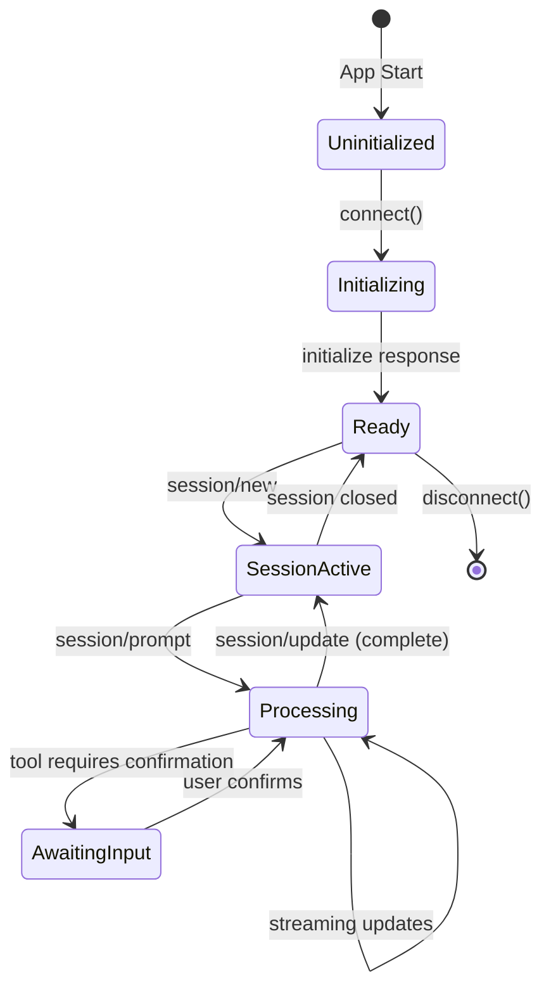
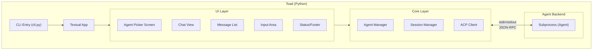
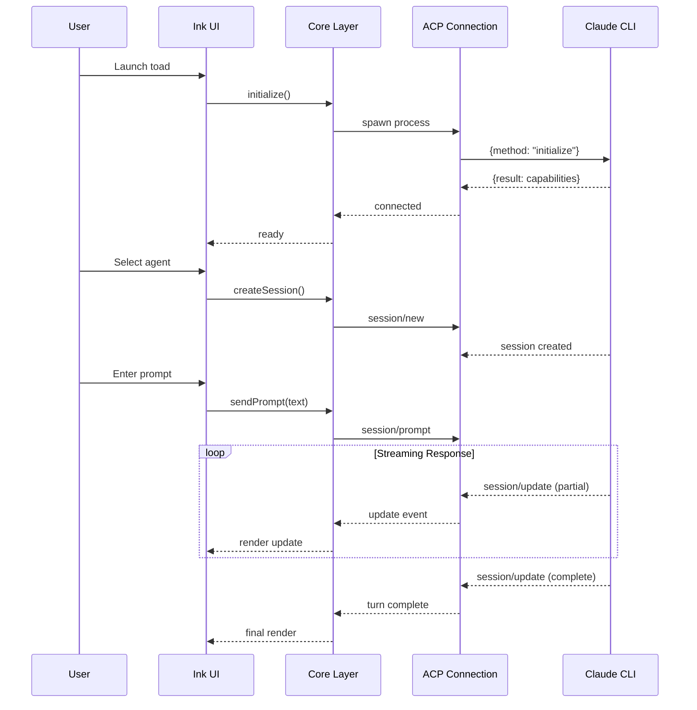
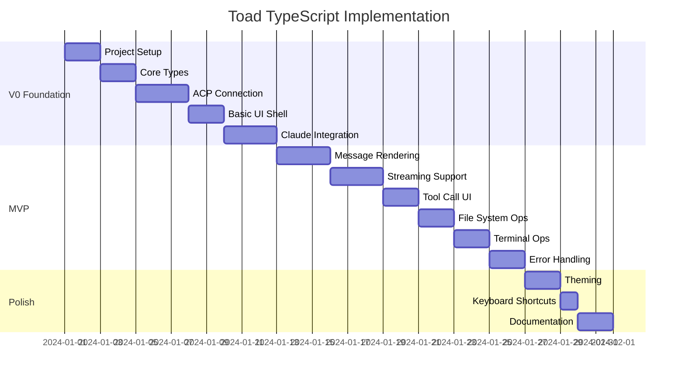
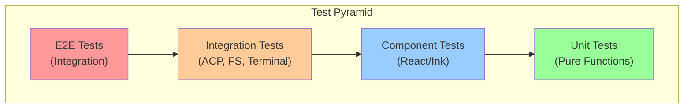

# Toad TypeScript Implementation Specification

Revision: v1.1.0
Document Role: Supplemental implementation notes; defer to scratchpad/spec.md as canonical.
Last Updated: 2026-01-14

## Document Purpose & Scope

This document provides a complete technical specification for recreating [Toad](https://github.com/batrachianai/toad) - a unified terminal interface for AI coding agents - in **TypeScript** using **Claude CLI** as the primary AI backend. The goal is to simplify while maintaining strict typing, following DRY principles and TypeScript best practices.

---

## Changelog
- v1.1.0 (2026-01-14): Added revision tag, document role, and refreshed metadata; defer to spec.md as canonical.

---

## Table of Contents

1. [Glossary & Common Domain Language](#glossary--common-domain-language)
2. [Original Toad Architecture Analysis](#original-toad-architecture-analysis)
3. [Target Architecture Overview](#target-architecture-overview)
4. [Technology Stack](#technology-stack)
5. [Core Type Definitions](#core-type-definitions)
6. [Implementation Roadmap](#implementation-roadmap)
7. [Phase 1: V0 (Foundation)](#phase-1-v0-foundation)
8. [Phase 2: MVP](#phase-2-mvp)
9. [Testing Strategy](#testing-strategy)
10. [Proof of Correctness](#proof-of-correctness)
11. [File Structure](#file-structure)
12. [Implementation Examples](#implementation-examples)

---

## Glossary & Common Domain Language

### Core Terms

| Term | Abbreviation | Definition |
|------|--------------|------------|
| **Agent** | - | An AI-powered coding assistant (e.g., Claude CLI, Gemini, Codex) that processes prompts and performs actions |
| **Client** | - | The UI application that connects to agents (our Toad implementation) |
| **Session** | - | A conversation context with an agent, maintaining state across prompts |
| **ACP** | Agent Client Protocol | JSON-RPC 2.0 based protocol standardizing client-agent communication |
| **MCP** | Model Context Protocol | Protocol for connecting AI models to external tools/data sources |
| **TUI** | Terminal User Interface | A text-based interface rendered in the terminal |
| **Prompt** | - | User input sent to an agent for processing |
| **Turn** | - | One prompt + response cycle in a session |
| **Content Block** | - | Structured content unit (text, code, image, etc.) in messages |
| **Tool Call** | - | An agent's request to execute a capability (read file, run command, etc.) |
| **Transport** | - | Communication mechanism (stdio, HTTP, SSE) between client and agent |

### Domain Entities

```typescript
// Reference type names used throughout this document
type AgentId = string;        // Unique identifier for registered agents
type SessionId = string;      // Unique identifier for active sessions  
type MessageId = string;      // Unique identifier for messages
type ToolCallId = string;     // Unique identifier for tool invocations
```

### Lifecycle States



---

## Original Toad Architecture Analysis

### Python/Textual Implementation Overview

Toad (batrachianai/toad) is built with:

- **Python 3.12+** - Core language
- **Textual** - TUI framework (from Textualize)
- **ACP Protocol** - Agent communication
- **UV** - Package management

### Key Architectural Patterns



### Toad's Key Features

1. **Agent Registry** - Discover, install, and manage multiple agents
2. **Unified UI** - Single interface for all ACP-compatible agents
3. **Session Management** - Create, switch, and persist conversations
4. **Streaming Updates** - Real-time response rendering
5. **File System Access** - Agent can read/write files via client
6. **Terminal Integration** - Agent can execute shell commands
7. **Theming** - CSS-based styling (Textual TCSS)
8. **Web Server Mode** - Serve TUI via browser

### What We're Simplifying

| Original Toad | Our Implementation | Rationale |
|--------------|-------------------|-----------|
| Multi-agent registry | Claude CLI focus | Scope reduction, can extend later |
| Dynamic agent discovery | Config-based agents | Simpler initial setup |
| Agent installation | Pre-installed agents | User handles installation |
| Web server mode | Terminal only | Focus on core TUI |
| Python/Textual | TypeScript/Ink | Ecosystem preference |

---

## Target Architecture Overview

### High-Level Architecture

```mermaid
flowchart TB
    subgraph ToadTS["Toad TypeScript"]
        CLI["CLI Entry\n(commander)"]
        
        subgraph UILayer["UI Layer (Ink/React)"]
            App["<App/>"]
            Router["<Router/>"]
            AgentSelect["<AgentSelect/>"]
            Chat["<Chat/>"]
            MessageView["<MessageView/>"]
            Input["<Input/>"]
            StatusLine["<StatusLine/>"]
        end
        
        subgraph CoreLayer["Core Layer"]
            AgentRegistry["AgentRegistry"]
            SessionManager["SessionManager"]
            ACPConnection["ACPConnection"]
            MessageStore["MessageStore"]
        end
        
        subgraph Transport["Transport Layer"]
            StdioTransport["StdioTransport"]
            ProcessManager["ProcessManager"]
        end
    end
    
    subgraph External["External Agents"]
        ClaudeCLI["claude-code-acp"]
        Gemini["gemini --experimental-acp"]
        Other["Other ACP Agents"]
    end
    
    CLI --> App
    App --> Router
    Router --> AgentSelect
    Router --> Chat
    Chat --> MessageView
    Chat --> Input
    Chat --> StatusLine
    
    UILayer --> CoreLayer
    CoreLayer --> Transport
    Transport <-->|"JSON-RPC\nover stdio"| External
```



### Data Flow



---

## Technology Stack

### Core Dependencies

```json
{
  "dependencies": {
    "ink": "^5.0.0",
    "ink-ui": "^2.0.0",
    "react": "^18.2.0",
    "@agentclientprotocol/sdk": "^0.12.0",
    "commander": "^12.0.0",
    "zod": "^3.22.0",
    "zustand": "^4.5.0",
    "chalk": "^5.3.0",
    "marked": "^11.0.0",
    "marked-terminal": "^6.0.0"
  },
  "devDependencies": {
    "typescript": "^5.3.0",
    "@types/react": "^18.2.0",
    "vitest": "^1.0.0",
    "ink-testing-library": "^4.0.0",
    "tsx": "^4.0.0",
    "eslint": "^8.56.0",
    "@typescript-eslint/eslint-plugin": "^6.0.0",
    "@typescript-eslint/parser": "^6.0.0"
  }
}
```

### Why These Choices

| Package | Purpose | Rationale |
|---------|---------|-----------|
| **ink** | TUI framework | React-based, TypeScript support, flexbox layout, active maintenance |
| **@inkjs/ui** | UI components | Pre-built inputs, selects, spinners - reduces boilerplate |
| **@agentclientprotocol/sdk** | ACP implementation | Official TypeScript SDK, type-safe, maintained |
| **commander** | CLI parsing | Standard, well-typed, feature-complete |
| **zod** | Schema validation | Runtime type safety, excellent TS inference |
| **zustand** | State management | Minimal, TypeScript-first, React-compatible |
| **marked + marked-terminal** | Markdown rendering | Terminal-optimized markdown output |
| **vitest** | Testing | Fast, TypeScript-native, ESM support |

---

## Core Type Definitions

### Domain Types

```typescript
// src/types/domain.ts

import { z } from 'zod';

// ============================================
// Identifiers (branded types for type safety)
// ============================================

declare const AgentIdBrand: unique symbol;
export type AgentId = string & { readonly [AgentIdBrand]: typeof AgentIdBrand };
export const AgentId = (id: string): AgentId => id as AgentId;

declare const SessionIdBrand: unique symbol;
export type SessionId = string & { readonly [SessionIdBrand]: typeof SessionIdBrand };
export const SessionId = (id: string): SessionId => id as SessionId;

declare const MessageIdBrand: unique symbol;
export type MessageId = string & { readonly [MessageIdBrand]: typeof MessageIdBrand };
export const MessageId = (id: string): MessageId => id as MessageId;

// ============================================
// Agent Configuration
// ============================================

export const AgentConfigSchema = z.object({
  id: z.string(),
  name: z.string(),
  command: z.string(),
  args: z.array(z.string()).default([]),
  env: z.record(z.string()).optional(),
  description: z.string().optional(),
  projectDir: z.string().optional(),
});

export type AgentConfig = z.infer<typeof AgentConfigSchema>;

// ============================================
// Message Types
// ============================================

export const ContentBlockSchema = z.discriminatedUnion('type', [
  z.object({
    type: z.literal('text'),
    text: z.string(),
  }),
  z.object({
    type: z.literal('code'),
    language: z.string().optional(),
    code: z.string(),
  }),
  z.object({
    type: z.literal('tool_call'),
    toolCallId: z.string(),
    name: z.string(),
    arguments: z.record(z.unknown()),
    status: z.enum(['pending', 'running', 'completed', 'error']),
    result: z.string().optional(),
  }),
  z.object({
    type: z.literal('thinking'),
    text: z.string(),
  }),
]);

export type ContentBlock = z.infer<typeof ContentBlockSchema>;

export const MessageRoleSchema = z.enum(['user', 'assistant', 'system']);
export type MessageRole = z.infer<typeof MessageRoleSchema>;

export const MessageSchema = z.object({
  id: z.string(),
  sessionId: z.string(),
  role: MessageRoleSchema,
  content: z.array(ContentBlockSchema),
  timestamp: z.date(),
  isStreaming: z.boolean().default(false),
});

export type Message = z.infer<typeof MessageSchema>;

// ============================================
// Session Types
// ============================================

export const SessionStateSchema = z.enum([
  'idle',
  'processing', 
  'awaiting_confirmation',
  'error',
  'closed',
]);
export type SessionState = z.infer<typeof SessionStateSchema>;

export const SessionSchema = z.object({
  id: z.string(),
  agentId: z.string(),
  state: SessionStateSchema,
  messages: z.array(MessageSchema),
  createdAt: z.date(),
  projectDir: z.string().optional(),
});

export type Session = z.infer<typeof SessionSchema>;

// ============================================
// Application State
// ============================================

export const AppStateSchema = z.object({
  // Connection state
  connectionStatus: z.enum(['disconnected', 'connecting', 'connected', 'error']),
  
  // Current context
  currentAgentId: z.string().nullable(),
  currentSessionId: z.string().nullable(),
  
  // View state
  view: z.enum(['agent_select', 'chat', 'settings']),
  
  // Data
  agents: z.array(AgentConfigSchema),
  sessions: z.map(z.string(), SessionSchema),
  
  // Error handling
  lastError: z.string().nullable(),
});

export type AppState = z.infer<typeof AppStateSchema>;
```

### ACP Types (from SDK)

```typescript
// src/types/acp.ts

// Re-export and extend ACP SDK types for internal use
import type {
  InitializeRequest,
  InitializeResult,
  SessionNewRequest,
  SessionPromptRequest,
  SessionUpdateNotification,
  ContentBlock as ACPContentBlock,
  ClientCapabilities,
  AgentCapabilities,
} from '@agentclientprotocol/sdk';

export type {
  InitializeRequest,
  InitializeResult,
  SessionNewRequest,
  SessionPromptRequest,
  SessionUpdateNotification,
  ACPContentBlock,
  ClientCapabilities,
  AgentCapabilities,
};

// Our client capabilities
export const CLIENT_CAPABILITIES: ClientCapabilities = {
  fs: {
    readTextFile: true,
    writeTextFile: true,
  },
  terminal: true,
};

export const CLIENT_INFO = {
  name: 'toad-ts',
  title: 'Toad TypeScript',
  version: '0.1.0',
} as const;
```

### Store Types

```typescript
// src/types/store.ts

import type { AgentConfig, Session, Message, ContentBlock, SessionState } from './domain';

export interface AppStore {
  // State
  connectionStatus: 'disconnected' | 'connecting' | 'connected' | 'error';
  currentAgentId: string | null;
  currentSessionId: string | null;
  view: 'agent_select' | 'chat' | 'settings';
  agents: AgentConfig[];
  sessions: Map<string, Session>;
  lastError: string | null;
  
  // Actions
  setConnectionStatus: (status: AppStore['connectionStatus']) => void;
  selectAgent: (agentId: string) => void;
  setView: (view: AppStore['view']) => void;
  addAgent: (agent: AgentConfig) => void;
  
  // Session actions
  createSession: (sessionId: string, agentId: string) => void;
  setSessionState: (sessionId: string, state: SessionState) => void;
  addMessage: (sessionId: string, message: Message) => void;
  updateMessage: (sessionId: string, messageId: string, updates: Partial<Message>) => void;
  appendToMessage: (sessionId: string, messageId: string, content: ContentBlock) => void;
  
  // Computed
  getCurrentSession: () => Session | null;
  getCurrentAgent: () => AgentConfig | null;
}
```

---

## Implementation Roadmap

### Phase Overview



---

## Phase 1: V0 (Foundation)

### Goals

- [ ] Project scaffolding with TypeScript strict mode
- [ ] Core type definitions with Zod validation
- [ ] ACP connection to Claude CLI
- [ ] Basic TUI shell with Ink
- [ ] Single agent, single session proof of concept

### V0.1: Project Setup

```bash
# Initialize project
mkdir toad-ts && cd toad-ts
npm init -y

# Install dependencies
npm install ink ink-ui react @agentclientprotocol/sdk \
  commander zod zustand chalk marked marked-terminal

npm install -D typescript @types/react vitest \
  ink-testing-library tsx eslint @typescript-eslint/eslint-plugin \
  @typescript-eslint/parser
```

**tsconfig.json:**

```json
{
  "compilerOptions": {
    "target": "ES2022",
    "module": "NodeNext",
    "moduleResolution": "NodeNext",
    "lib": ["ES2022"],
    "outDir": "./dist",
    "rootDir": "./src",
    "strict": true,
    "strictNullChecks": true,
    "strictFunctionTypes": true,
    "strictBindCallApply": true,
    "strictPropertyInitialization": true,
    "noImplicitAny": true,
    "noImplicitThis": true,
    "noUnusedLocals": true,
    "noUnusedParameters": true,
    "noImplicitReturns": true,
    "noFallthroughCasesInSwitch": true,
    "esModuleInterop": true,
    "skipLibCheck": true,
    "forceConsistentCasingInFileNames": true,
    "declaration": true,
    "declarationMap": true,
    "sourceMap": true,
    "jsx": "react-jsx",
    "jsxImportSource": "react"
  },
  "include": ["src/**/*"],
  "exclude": ["node_modules", "dist"]
}
```

### V0.2: ACP Connection Module

```typescript
// src/core/acp-connection.ts

import { spawn, ChildProcess } from 'node:child_process';
import { EventEmitter } from 'node:events';
import { 
  ClientSideConnection, 
  StdioClientTransport 
} from '@agentclientprotocol/sdk';
import type { AgentConfig } from '../types/domain';
import { CLIENT_CAPABILITIES, CLIENT_INFO } from '../types/acp';

export type ConnectionState = 
  | 'disconnected' 
  | 'connecting' 
  | 'connected' 
  | 'error';

export interface ACPConnectionEvents {
  'state-change': (state: ConnectionState) => void;
  'session-update': (update: unknown) => void;
  'error': (error: Error) => void;
}

export class ACPConnection extends EventEmitter {
  private process: ChildProcess | null = null;
  private connection: ClientSideConnection | null = null;
  private _state: ConnectionState = 'disconnected';
  
  constructor(private readonly config: AgentConfig) {
    super();
  }
  
  get state(): ConnectionState {
    return this._state;
  }
  
  private setState(state: ConnectionState): void {
    this._state = state;
    this.emit('state-change', state);
  }
  
  async connect(): Promise<void> {
    if (this._state !== 'disconnected') {
      throw new Error(`Cannot connect from state: ${this._state}`);
    }
    
    this.setState('connecting');
    
    try {
      // Spawn agent process
      this.process = spawn(this.config.command, this.config.args, {
        cwd: this.config.projectDir ?? process.cwd(),
        env: { ...process.env, ...this.config.env },
        stdio: ['pipe', 'pipe', 'inherit'],
      });
      
      if (!this.process.stdin || !this.process.stdout) {
        throw new Error('Failed to establish stdio with agent process');
      }
      
      // Create transport and connection
      const transport = new StdioClientTransport(
        this.process.stdout,
        this.process.stdin
      );
      
      this.connection = new ClientSideConnection(transport);
      
      // Initialize connection
      await this.connection.initialize({
        protocolVersion: 1,
        clientCapabilities: CLIENT_CAPABILITIES,
        clientInfo: CLIENT_INFO,
      });
      
      // Set up event handlers
      this.setupEventHandlers();
      
      this.setState('connected');
    } catch (error) {
      this.setState('error');
      this.emit('error', error instanceof Error ? error : new Error(String(error)));
      throw error;
    }
  }
  
  private setupEventHandlers(): void {
    if (!this.connection) return;
    
    // Handle session updates
    this.connection.onNotification('session/update', (params) => {
      this.emit('session-update', params);
    });
    
    // Handle process exit
    this.process?.on('exit', (code) => {
      this.setState('disconnected');
      if (code !== 0) {
        this.emit('error', new Error(`Agent process exited with code ${code}`));
      }
    });
  }
  
  async createSession(projectDir?: string): Promise<string> {
    if (!this.connection || this._state !== 'connected') {
      throw new Error('Not connected');
    }
    
    const result = await this.connection.request('session/new', {
      projectDir: projectDir ?? this.config.projectDir ?? process.cwd(),
    });
    
    return result.sessionId;
  }
  
  async sendPrompt(sessionId: string, content: string): Promise<void> {
    if (!this.connection || this._state !== 'connected') {
      throw new Error('Not connected');
    }
    
    await this.connection.request('session/prompt', {
      sessionId,
      content: [{ type: 'text', text: content }],
    });
  }
  
  async cancelSession(sessionId: string): Promise<void> {
    if (!this.connection || this._state !== 'connected') {
      throw new Error('Not connected');
    }
    
    await this.connection.request('session/cancel', { sessionId });
  }
  
  async disconnect(): Promise<void> {
    this.connection = null;
    
    if (this.process) {
      this.process.kill();
      this.process = null;
    }
    
    this.setState('disconnected');
  }
}
```

### V0.3: State Store

```typescript
// src/store/app-store.ts

import { create } from 'zustand';
import type { AppStore } from '../types/store';
import type { Session, Message, ContentBlock, SessionState, AgentConfig } from '../types/domain';
import { MessageId, SessionId } from '../types/domain';

export const useAppStore = create<AppStore>((set, get) => ({
  // Initial state
  connectionStatus: 'disconnected',
  currentAgentId: null,
  currentSessionId: null,
  view: 'agent_select',
  agents: [],
  sessions: new Map(),
  lastError: null,
  
  // Connection actions
  setConnectionStatus: (status) => set({ connectionStatus: status }),
  
  // Agent actions
  selectAgent: (agentId) => set({ currentAgentId: agentId }),
  
  addAgent: (agent) => set((state) => ({
    agents: [...state.agents, agent],
  })),
  
  // View actions
  setView: (view) => set({ view }),
  
  // Session actions
  createSession: (sessionId, agentId) => set((state) => {
    const newSession: Session = {
      id: sessionId,
      agentId,
      state: 'idle',
      messages: [],
      createdAt: new Date(),
    };
    const sessions = new Map(state.sessions);
    sessions.set(sessionId, newSession);
    return { 
      sessions, 
      currentSessionId: sessionId,
      view: 'chat',
    };
  }),
  
  setSessionState: (sessionId, sessionState) => set((state) => {
    const sessions = new Map(state.sessions);
    const session = sessions.get(sessionId);
    if (session) {
      sessions.set(sessionId, { ...session, state: sessionState });
    }
    return { sessions };
  }),
  
  addMessage: (sessionId, message) => set((state) => {
    const sessions = new Map(state.sessions);
    const session = sessions.get(sessionId);
    if (session) {
      sessions.set(sessionId, {
        ...session,
        messages: [...session.messages, message],
      });
    }
    return { sessions };
  }),
  
  updateMessage: (sessionId, messageId, updates) => set((state) => {
    const sessions = new Map(state.sessions);
    const session = sessions.get(sessionId);
    if (session) {
      const messages = session.messages.map((m) =>
        m.id === messageId ? { ...m, ...updates } : m
      );
      sessions.set(sessionId, { ...session, messages });
    }
    return { sessions };
  }),
  
  appendToMessage: (sessionId, messageId, content) => set((state) => {
    const sessions = new Map(state.sessions);
    const session = sessions.get(sessionId);
    if (session) {
      const messages = session.messages.map((m) =>
        m.id === messageId 
          ? { ...m, content: [...m.content, content] }
          : m
      );
      sessions.set(sessionId, { ...session, messages });
    }
    return { sessions };
  }),
  
  // Computed getters
  getCurrentSession: () => {
    const { currentSessionId, sessions } = get();
    return currentSessionId ? sessions.get(currentSessionId) ?? null : null;
  },
  
  getCurrentAgent: () => {
    const { currentAgentId, agents } = get();
    return agents.find((a) => a.id === currentAgentId) ?? null;
  },
}));
```

### V0.4: Basic UI Components

```typescript
// src/ui/components/App.tsx

import React, { useEffect } from 'react';
import { Box, Text, useApp } from 'ink';
import { useAppStore } from '../../store/app-store';
import { AgentSelect } from './AgentSelect';
import { Chat } from './Chat';
import { StatusLine } from './StatusLine';

export const App: React.FC = () => {
  const { view, connectionStatus } = useAppStore();
  const { exit } = useApp();
  
  // Global keyboard shortcuts
  useEffect(() => {
    const handleKeypress = (ch: string, key: { ctrl: boolean; name: string }) => {
      if (key.ctrl && key.name === 'c') {
        exit();
      }
    };
    
    process.stdin.on('keypress', handleKeypress);
    return () => {
      process.stdin.removeListener('keypress', handleKeypress);
    };
  }, [exit]);
  
  return (
    <Box flexDirection="column" width="100%" height="100%">
      {/* Header */}
      <Box borderStyle="single" borderColor="cyan" paddingX={1}>
        <Text bold color="cyan">🐸 Toad</Text>
        <Text> - </Text>
        <Text color="gray">AI Coding Agent Interface</Text>
      </Box>
      
      {/* Main content */}
      <Box flexGrow={1} flexDirection="column">
        {view === 'agent_select' && <AgentSelect />}
        {view === 'chat' && <Chat />}
      </Box>
      
      {/* Status line */}
      <StatusLine />
    </Box>
  );
};
```

```typescript
// src/ui/components/AgentSelect.tsx

import React, { useState } from 'react';
import { Box, Text, useInput } from 'ink';
import { Select } from '@inkjs/ui';
import { useAppStore } from '../../store/app-store';
import type { AgentConfig } from '../../types/domain';

interface AgentOption {
  label: string;
  value: string;
}

export const AgentSelect: React.FC = () => {
  const { agents, selectAgent, setView } = useAppStore();
  
  const options: AgentOption[] = agents.map((agent) => ({
    label: `${agent.name} - ${agent.description ?? 'No description'}`,
    value: agent.id,
  }));
  
  const handleSelect = (value: string) => {
    selectAgent(value);
    setView('chat');
  };
  
  if (agents.length === 0) {
    return (
      <Box flexDirection="column" padding={2}>
        <Text color="yellow">No agents configured.</Text>
        <Text color="gray">Add agents to your config file.</Text>
      </Box>
    );
  }
  
  return (
    <Box flexDirection="column" padding={2}>
      <Text bold marginBottom={1}>Select an Agent:</Text>
      <Select options={options} onChange={handleSelect} />
    </Box>
  );
};
```

```typescript
// src/ui/components/Chat.tsx

import React, { useState, useCallback } from 'react';
import { Box, Text, useInput } from 'ink';
import { TextInput } from '@inkjs/ui';
import { useAppStore } from '../../store/app-store';
import { MessageList } from './MessageList';

export const Chat: React.FC = () => {
  const [input, setInput] = useState('');
  const { getCurrentSession, getCurrentAgent } = useAppStore();
  
  const session = getCurrentSession();
  const agent = getCurrentAgent();
  
  const handleSubmit = useCallback((value: string) => {
    if (!value.trim()) return;
    
    // TODO: Send prompt to agent
    console.log('Sending:', value);
    setInput('');
  }, []);
  
  if (!session || !agent) {
    return (
      <Box padding={2}>
        <Text color="red">No active session</Text>
      </Box>
    );
  }
  
  return (
    <Box flexDirection="column" flexGrow={1}>
      {/* Messages */}
      <Box flexGrow={1} flexDirection="column" overflow="hidden">
        <MessageList messages={session.messages} />
      </Box>
      
      {/* Input */}
      <Box borderStyle="single" borderColor="blue" paddingX={1}>
        <Text color="blue">{'> '}</Text>
        <TextInput
          value={input}
          onChange={setInput}
          onSubmit={handleSubmit}
          placeholder="Type your message..."
        />
      </Box>
    </Box>
  );
};
```

```typescript
// src/ui/components/MessageList.tsx

import React from 'react';
import { Box, Text, Static } from 'ink';
import type { Message, ContentBlock } from '../../types/domain';
import { renderMarkdown } from '../../utils/markdown';

interface MessageListProps {
  messages: Message[];
}

export const MessageList: React.FC<MessageListProps> = ({ messages }) => {
  return (
    <Static items={messages}>
      {(message) => (
        <MessageItem key={message.id} message={message} />
      )}
    </Static>
  );
};

interface MessageItemProps {
  message: Message;
}

const MessageItem: React.FC<MessageItemProps> = ({ message }) => {
  const roleColor = message.role === 'user' ? 'green' : 'cyan';
  const roleLabel = message.role === 'user' ? 'You' : 'Assistant';
  
  return (
    <Box flexDirection="column" marginY={1}>
      <Text bold color={roleColor}>{roleLabel}</Text>
      {message.content.map((block, index) => (
        <ContentBlockView key={index} block={block} />
      ))}
    </Box>
  );
};

interface ContentBlockViewProps {
  block: ContentBlock;
}

const ContentBlockView: React.FC<ContentBlockViewProps> = ({ block }) => {
  switch (block.type) {
    case 'text':
      return <Text>{renderMarkdown(block.text)}</Text>;
    
    case 'code':
      return (
        <Box 
          flexDirection="column" 
          borderStyle="single" 
          borderColor="gray"
          paddingX={1}
        >
          {block.language && (
            <Text color="gray" dimColor>{block.language}</Text>
          )}
          <Text>{block.code}</Text>
        </Box>
      );
    
    case 'tool_call':
      return (
        <Box flexDirection="column" paddingLeft={2}>
          <Text color="yellow">
            ⚙️ {block.name} [{block.status}]
          </Text>
          {block.result && (
            <Text color="gray" dimColor>{block.result}</Text>
          )}
        </Box>
      );
    
    case 'thinking':
      return (
        <Text color="gray" dimColor italic>
          💭 {block.text}
        </Text>
      );
    
    default:
      return null;
  }
};
```

```typescript
// src/ui/components/StatusLine.tsx

import React from 'react';
import { Box, Text } from 'ink';
import { useAppStore } from '../../store/app-store';

export const StatusLine: React.FC = () => {
  const { connectionStatus, getCurrentAgent, getCurrentSession } = useAppStore();
  const agent = getCurrentAgent();
  const session = getCurrentSession();
  
  const statusColor = {
    disconnected: 'gray',
    connecting: 'yellow',
    connected: 'green',
    error: 'red',
  }[connectionStatus] as const;
  
  return (
    <Box 
      borderStyle="single" 
      borderColor="gray" 
      paddingX={1}
      justifyContent="space-between"
    >
      <Box>
        <Text color={statusColor}>● {connectionStatus}</Text>
        {agent && <Text color="gray"> | {agent.name}</Text>}
      </Box>
      <Box>
        <Text color="gray">Ctrl+C: Exit | Ctrl+P: Command Palette</Text>
      </Box>
    </Box>
  );
};
```

### V0.5: CLI Entry Point

```typescript
// src/cli.ts

#!/usr/bin/env node

import { program } from 'commander';
import { render } from 'ink';
import React from 'react';
import { App } from './ui/components/App';
import { useAppStore } from './store/app-store';
import { loadConfig } from './config/loader';
import type { AgentConfig } from './types/domain';

// Default Claude CLI configuration
const DEFAULT_AGENTS: AgentConfig[] = [
  {
    id: 'claude-cli',
    name: 'Claude CLI',
    command: 'claude',
    args: ['--experimental-acp'],
    description: 'Anthropic Claude coding agent',
  },
];

program
  .name('toad')
  .description('A unified interface for AI coding agents')
  .version('0.1.0')
  .argument('[project-dir]', 'Project directory', process.cwd())
  .option('-a, --agent <name>', 'Launch with specific agent')
  .option('-c, --config <path>', 'Config file path')
  .action(async (projectDir: string, options: { agent?: string; config?: string }) => {
    // Load configuration
    const config = options.config ? await loadConfig(options.config) : null;
    const agents = config?.agents ?? DEFAULT_AGENTS;
    
    // Initialize store
    const store = useAppStore.getState();
    agents.forEach((agent) => store.addAgent({ ...agent, projectDir }));
    
    // Auto-select agent if specified
    if (options.agent) {
      const agent = agents.find(
        (a) => a.id === options.agent || a.name.toLowerCase() === options.agent?.toLowerCase()
      );
      if (agent) {
        store.selectAgent(agent.id);
        store.setView('chat');
      }
    }
    
    // Render the app
    const { waitUntilExit } = render(React.createElement(App));
    await waitUntilExit();
  });

program.parse();
```

---

## Phase 2: MVP

### Goals

- [ ] Full message streaming with partial renders
- [ ] Tool call display and confirmation
- [ ] File system operations (read/write)
- [ ] Terminal command execution
- [ ] Markdown rendering with syntax highlighting
- [ ] Error recovery and reconnection
- [ ] Session persistence

### MVP.1: Streaming Message Handler

```typescript
// src/core/message-handler.ts

import { EventEmitter } from 'node:events';
import { useAppStore } from '../store/app-store';
import type { Message, ContentBlock } from '../types/domain';
import { MessageId } from '../types/domain';

interface SessionUpdate {
  sessionId: string;
  kind: 'agent_message_chunk' | 'tool_call' | 'tool_call_update' | 'done';
  content?: {
    role: string;
    content: Array<{ type: string; text?: string; [key: string]: unknown }>;
  };
}

export class MessageHandler extends EventEmitter {
  private currentMessageId: string | null = null;
  
  handleUpdate(update: SessionUpdate): void {
    const store = useAppStore.getState();
    const { sessionId, kind, content } = update;
    
    switch (kind) {
      case 'agent_message_chunk':
        this.handleChunk(sessionId, content);
        break;
      
      case 'tool_call':
        this.handleToolCall(sessionId, update);
        break;
      
      case 'tool_call_update':
        this.handleToolCallUpdate(sessionId, update);
        break;
      
      case 'done':
        this.handleDone(sessionId);
        break;
    }
  }
  
  private handleChunk(sessionId: string, content: SessionUpdate['content']): void {
    if (!content) return;
    
    const store = useAppStore.getState();
    
    // Create new message if needed
    if (!this.currentMessageId) {
      this.currentMessageId = MessageId(crypto.randomUUID());
      
      const message: Message = {
        id: this.currentMessageId,
        sessionId,
        role: 'assistant',
        content: [],
        timestamp: new Date(),
        isStreaming: true,
      };
      
      store.addMessage(sessionId, message);
    }
    
    // Convert and append content blocks
    for (const block of content.content) {
      const contentBlock = this.convertContentBlock(block);
      if (contentBlock) {
        store.appendToMessage(sessionId, this.currentMessageId, contentBlock);
      }
    }
  }
  
  private handleToolCall(sessionId: string, update: SessionUpdate): void {
    const store = useAppStore.getState();
    
    if (this.currentMessageId) {
      const toolBlock: ContentBlock = {
        type: 'tool_call',
        toolCallId: (update as any).toolCallId ?? 'unknown',
        name: (update as any).name ?? 'unknown',
        arguments: (update as any).arguments ?? {},
        status: 'running',
      };
      
      store.appendToMessage(sessionId, this.currentMessageId, toolBlock);
    }
    
    // Emit for confirmation if needed
    this.emit('tool-call', update);
  }
  
  private handleToolCallUpdate(sessionId: string, update: SessionUpdate): void {
    // Tool call result - update the existing tool block
    this.emit('tool-result', update);
  }
  
  private handleDone(sessionId: string): void {
    const store = useAppStore.getState();
    
    if (this.currentMessageId) {
      store.updateMessage(sessionId, this.currentMessageId, {
        isStreaming: false,
      });
    }
    
    store.setSessionState(sessionId, 'idle');
    this.currentMessageId = null;
    this.emit('done', sessionId);
  }
  
  private convertContentBlock(
    block: { type: string; text?: string; [key: string]: unknown }
  ): ContentBlock | null {
    switch (block.type) {
      case 'text':
        return { type: 'text', text: block.text ?? '' };
      
      case 'code':
        return {
          type: 'code',
          code: (block.code as string) ?? '',
          language: block.language as string | undefined,
        };
      
      default:
        return null;
    }
  }
}
```

### MVP.2: File System Handler

```typescript
// src/core/fs-handler.ts

import { readFile, writeFile, access, constants } from 'node:fs/promises';
import { dirname } from 'node:path';

export interface FileSystemCapabilities {
  readTextFile: (path: string) => Promise<string>;
  writeTextFile: (path: string, content: string) => Promise<void>;
  exists: (path: string) => Promise<boolean>;
}

export const createFSHandler = (projectDir: string): FileSystemCapabilities => ({
  readTextFile: async (path: string): Promise<string> => {
    const fullPath = path.startsWith('/') ? path : `${projectDir}/${path}`;
    return readFile(fullPath, 'utf-8');
  },
  
  writeTextFile: async (path: string, content: string): Promise<void> => {
    const fullPath = path.startsWith('/') ? path : `${projectDir}/${path}`;
    await writeFile(fullPath, content, 'utf-8');
  },
  
  exists: async (path: string): Promise<boolean> => {
    const fullPath = path.startsWith('/') ? path : `${projectDir}/${path}`;
    try {
      await access(fullPath, constants.F_OK);
      return true;
    } catch {
      return false;
    }
  },
});
```

### MVP.3: Terminal Handler

```typescript
// src/core/terminal-handler.ts

import { spawn } from 'node:child_process';
import { EventEmitter } from 'node:events';

export interface TerminalResult {
  exitCode: number;
  stdout: string;
  stderr: string;
}

export class TerminalHandler extends EventEmitter {
  constructor(private readonly cwd: string) {
    super();
  }
  
  async execute(command: string, args: string[] = []): Promise<TerminalResult> {
    return new Promise((resolve, reject) => {
      const proc = spawn(command, args, {
        cwd: this.cwd,
        shell: true,
      });
      
      let stdout = '';
      let stderr = '';
      
      proc.stdout?.on('data', (data) => {
        const chunk = data.toString();
        stdout += chunk;
        this.emit('stdout', chunk);
      });
      
      proc.stderr?.on('data', (data) => {
        const chunk = data.toString();
        stderr += chunk;
        this.emit('stderr', chunk);
      });
      
      proc.on('close', (code) => {
        resolve({
          exitCode: code ?? 0,
          stdout,
          stderr,
        });
      });
      
      proc.on('error', reject);
    });
  }
}
```

---

## Testing Strategy

### Test Categories



### Unit Tests

```typescript
// src/types/__tests__/domain.test.ts

import { describe, it, expect } from 'vitest';
import { 
  AgentConfigSchema, 
  MessageSchema, 
  ContentBlockSchema 
} from '../domain';

describe('Domain Types', () => {
  describe('AgentConfigSchema', () => {
    it('validates valid agent config', () => {
      const config = {
        id: 'claude-cli',
        name: 'Claude CLI',
        command: 'claude',
        args: ['--experimental-acp'],
      };
      
      const result = AgentConfigSchema.safeParse(config);
      expect(result.success).toBe(true);
    });
    
    it('rejects config without required fields', () => {
      const config = { id: 'test' };
      
      const result = AgentConfigSchema.safeParse(config);
      expect(result.success).toBe(false);
    });
  });
  
  describe('ContentBlockSchema', () => {
    it('validates text content', () => {
      const block = { type: 'text', text: 'Hello world' };
      const result = ContentBlockSchema.safeParse(block);
      expect(result.success).toBe(true);
    });
    
    it('validates code content', () => {
      const block = { type: 'code', code: 'console.log()', language: 'javascript' };
      const result = ContentBlockSchema.safeParse(block);
      expect(result.success).toBe(true);
    });
    
    it('validates tool_call content', () => {
      const block = {
        type: 'tool_call',
        toolCallId: '123',
        name: 'read_file',
        arguments: { path: '/test.txt' },
        status: 'pending',
      };
      const result = ContentBlockSchema.safeParse(block);
      expect(result.success).toBe(true);
    });
  });
});
```

### Component Tests

```typescript
// src/ui/components/__tests__/MessageList.test.tsx

import React from 'react';
import { render } from 'ink-testing-library';
import { describe, it, expect } from 'vitest';
import { MessageList } from '../MessageList';
import type { Message } from '../../../types/domain';

describe('MessageList', () => {
  it('renders empty state', () => {
    const { lastFrame } = render(<MessageList messages={[]} />);
    expect(lastFrame()).toBe('');
  });
  
  it('renders user message', () => {
    const messages: Message[] = [{
      id: '1',
      sessionId: 'session-1',
      role: 'user',
      content: [{ type: 'text', text: 'Hello' }],
      timestamp: new Date(),
      isStreaming: false,
    }];
    
    const { lastFrame } = render(<MessageList messages={messages} />);
    expect(lastFrame()).toContain('You');
    expect(lastFrame()).toContain('Hello');
  });
  
  it('renders assistant message with code block', () => {
    const messages: Message[] = [{
      id: '1',
      sessionId: 'session-1',
      role: 'assistant',
      content: [
        { type: 'text', text: 'Here is the code:' },
        { type: 'code', code: 'console.log("test")', language: 'javascript' },
      ],
      timestamp: new Date(),
      isStreaming: false,
    }];
    
    const { lastFrame } = render(<MessageList messages={messages} />);
    expect(lastFrame()).toContain('Assistant');
    expect(lastFrame()).toContain('console.log');
    expect(lastFrame()).toContain('javascript');
  });
});
```

### Integration Tests

```typescript
// src/core/__tests__/acp-connection.test.ts

import { describe, it, expect, beforeEach, afterEach, vi } from 'vitest';
import { ACPConnection } from '../acp-connection';
import type { AgentConfig } from '../../types/domain';

// Mock child_process
vi.mock('node:child_process', () => ({
  spawn: vi.fn(() => ({
    stdin: { write: vi.fn() },
    stdout: { on: vi.fn() },
    on: vi.fn(),
    kill: vi.fn(),
  })),
}));

describe('ACPConnection', () => {
  const mockConfig: AgentConfig = {
    id: 'test-agent',
    name: 'Test Agent',
    command: 'echo',
    args: [],
  };
  
  let connection: ACPConnection;
  
  beforeEach(() => {
    connection = new ACPConnection(mockConfig);
  });
  
  afterEach(async () => {
    await connection.disconnect();
  });
  
  it('starts in disconnected state', () => {
    expect(connection.state).toBe('disconnected');
  });
  
  it('transitions to connecting on connect()', async () => {
    const stateChanges: string[] = [];
    connection.on('state-change', (state) => stateChanges.push(state));
    
    // Note: This will fail without proper mocking of the ACP SDK
    // This is a structural test showing the pattern
    try {
      await connection.connect();
    } catch {
      // Expected in test environment
    }
    
    expect(stateChanges).toContain('connecting');
  });
});
```

---

## Proof of Correctness

### V0 Acceptance Criteria

| Criterion | Test | Proof |
|-----------|------|-------|
| TypeScript strict mode compiles | `tsc --noEmit` passes | Zero type errors |
| ACP connection establishes | Integration test | Process spawns, initialize succeeds |
| Session creates | Integration test | session/new returns sessionId |
| Prompt sends | Integration test | session/prompt doesn't error |
| UI renders | Component test | Ink renders without crash |
| Store updates | Unit test | Zustand state transitions work |

### MVP Acceptance Criteria

| Criterion | Test | Proof |
|-----------|------|-------|
| Streaming renders progressively | E2E test | Messages appear character by character |
| Tool calls display | Component test | Tool UI shows name, status, result |
| File read works | Integration test | fs/read_text_file returns content |
| File write works | Integration test | fs/write_text_file creates file |
| Terminal executes | Integration test | Command runs, output captured |
| Errors recover | Integration test | Reconnect after disconnect |

### Manual Testing Checklist

```markdown
## V0 Manual Tests

- [ ] `npm run build` completes without errors
- [ ] `npm run start` launches the app
- [ ] Agent selection appears with Claude CLI
- [ ] Selecting agent transitions to chat view
- [ ] Typing in input updates input field
- [ ] Ctrl+C exits the application
- [ ] Status line shows connection status

## MVP Manual Tests

- [ ] Enter prompt, receive streaming response
- [ ] Response includes formatted markdown
- [ ] Code blocks render with syntax highlighting
- [ ] Tool calls show progress indicator
- [ ] File operations succeed
- [ ] Terminal commands execute
- [ ] Can start new session
- [ ] Error messages display clearly
```

---

## File Structure

```
toad-ts/
├── src/
│   ├── cli.ts                    # Entry point
│   ├── types/
│   │   ├── domain.ts             # Domain types with Zod schemas
│   │   ├── acp.ts                # ACP type re-exports
│   │   ├── store.ts              # Store interface
│   │   └── __tests__/
│   │       └── domain.test.ts
│   ├── core/
│   │   ├── acp-connection.ts     # ACP client wrapper
│   │   ├── message-handler.ts    # Stream processing
│   │   ├── fs-handler.ts         # File system operations
│   │   ├── terminal-handler.ts   # Shell execution
│   │   └── __tests__/
│   │       ├── acp-connection.test.ts
│   │       └── message-handler.test.ts
│   ├── store/
│   │   ├── app-store.ts          # Zustand store
│   │   └── __tests__/
│   │       └── app-store.test.ts
│   ├── ui/
│   │   ├── components/
│   │   │   ├── App.tsx
│   │   │   ├── AgentSelect.tsx
│   │   │   ├── Chat.tsx
│   │   │   ├── MessageList.tsx
│   │   │   ├── MessageItem.tsx
│   │   │   ├── ContentBlock.tsx
│   │   │   ├── Input.tsx
│   │   │   └── StatusLine.tsx
│   │   ├── hooks/
│   │   │   ├── useAgent.ts
│   │   │   ├── useSession.ts
│   │   │   └── useKeyboard.ts
│   │   └── __tests__/
│   │       └── components/
│   │           └── MessageList.test.tsx
│   ├── config/
│   │   ├── loader.ts             # Config file parsing
│   │   └── schema.ts             # Config schemas
│   └── utils/
│       ├── markdown.ts           # Markdown rendering
│       └── id.ts                 # ID generation
├── package.json
├── tsconfig.json
├── vitest.config.ts
├── .eslintrc.js
└── README.md
```

---

## Implementation Examples

### Example: Complete Chat Flow

```typescript
// src/hooks/useChat.ts

import { useCallback, useEffect } from 'react';
import { useAppStore } from '../store/app-store';
import { ACPConnection } from '../core/acp-connection';
import { MessageHandler } from '../core/message-handler';
import type { Message } from '../types/domain';
import { MessageId } from '../types/domain';

export function useChat() {
  const {
    currentSessionId,
    getCurrentAgent,
    addMessage,
    setSessionState,
  } = useAppStore();
  
  const agent = getCurrentAgent();
  
  // Initialize connection and handlers
  const [connection, setConnection] = useState<ACPConnection | null>(null);
  const [messageHandler] = useState(() => new MessageHandler());
  
  useEffect(() => {
    if (!agent) return;
    
    const conn = new ACPConnection(agent);
    
    conn.on('session-update', (update) => {
      messageHandler.handleUpdate(update);
    });
    
    conn.on('error', (error) => {
      console.error('Connection error:', error);
    });
    
    conn.connect().then(() => {
      setConnection(conn);
    });
    
    return () => {
      conn.disconnect();
    };
  }, [agent]);
  
  const sendMessage = useCallback(async (text: string) => {
    if (!connection || !currentSessionId) return;
    
    // Add user message
    const userMessage: Message = {
      id: MessageId(crypto.randomUUID()),
      sessionId: currentSessionId,
      role: 'user',
      content: [{ type: 'text', text }],
      timestamp: new Date(),
      isStreaming: false,
    };
    
    addMessage(currentSessionId, userMessage);
    setSessionState(currentSessionId, 'processing');
    
    // Send to agent
    await connection.sendPrompt(currentSessionId, text);
  }, [connection, currentSessionId, addMessage, setSessionState]);
  
  return { sendMessage, isConnected: !!connection };
}
```

### Example: Markdown Rendering Utility

```typescript
// src/utils/markdown.ts

import { marked } from 'marked';
import { markedTerminal } from 'marked-terminal';
import chalk from 'chalk';

// Configure marked for terminal output
marked.use(markedTerminal({
  code: chalk.yellow,
  blockquote: chalk.gray.italic,
  html: chalk.gray,
  heading: chalk.bold,
  firstHeading: chalk.bold.underline,
  hr: chalk.gray,
  listitem: chalk.reset,
  table: chalk.reset,
  paragraph: chalk.reset,
  strong: chalk.bold,
  em: chalk.italic,
  codespan: chalk.yellow,
  del: chalk.strikethrough,
  link: chalk.blue,
  href: chalk.blue.underline,
}));

export function renderMarkdown(text: string): string {
  try {
    // marked returns a string when used synchronously
    return marked.parse(text, { async: false }) as string;
  } catch {
    return text;
  }
}
```

### Example: Configuration Schema

```typescript
// src/config/schema.ts

import { z } from 'zod';
import { AgentConfigSchema } from '../types/domain';

export const ToadConfigSchema = z.object({
  // Agent configurations
  agents: z.array(AgentConfigSchema).default([]),
  
  // Default settings
  defaults: z.object({
    agent: z.string().optional(),
    projectDir: z.string().optional(),
    theme: z.enum(['dark', 'light']).default('dark'),
  }).default({}),
  
  // Keyboard shortcuts
  shortcuts: z.record(z.string()).default({
    'ctrl+p': 'command-palette',
    'ctrl+n': 'new-session',
    'ctrl+w': 'close-session',
  }),
});

export type ToadConfig = z.infer<typeof ToadConfigSchema>;

// Example config file (~/.config/toad/config.json):
const exampleConfig: ToadConfig = {
  agents: [
    {
      id: 'claude-cli',
      name: 'Claude CLI',
      command: 'claude',
      args: ['--experimental-acp'],
      description: 'Anthropic Claude coding agent',
    },
    {
      id: 'gemini',
      name: 'Gemini CLI',
      command: 'gemini',
      args: ['--experimental-acp'],
      description: 'Google Gemini coding agent',
    },
  ],
  defaults: {
    agent: 'claude-cli',
    theme: 'dark',
  },
  shortcuts: {
    'ctrl+p': 'command-palette',
  },
};
```

---

## References

### External Documentation

- [ACP Protocol Specification](https://agentclientprotocol.com/protocol/overview)
- [ACP TypeScript SDK](https://github.com/agentclientprotocol/typescript-sdk)
- [Ink Documentation](https://github.com/vadimdemedes/ink)
- [Ink UI Components](https://github.com/vadimdemedes/ink-ui)
- [Original Toad Repository](https://github.com/batrachianai/toad)
- [Claude CLI Documentation](https://docs.anthropic.com/claude-code)

### Related Projects

- [Textual (Python TUI)](https://github.com/Textualize/textual)
- [Gemini CLI](https://github.com/google-gemini/gemini-cli)
- [Zed Editor (ACP Client)](https://zed.dev)

---

## Appendix: Quick Start Commands

```bash
# Clone and setup
git clone <your-repo>/toad-ts
cd toad-ts
npm install

# Development
npm run dev           # Watch mode
npm run build         # Compile TypeScript
npm run test          # Run tests
npm run lint          # Lint code

# Run the app
npm run start         # Start toad
npm run start -- -a claude-cli  # Start with Claude
npm run start -- ~/projects/myapp  # Specify project dir
```

---

*Document Version: 1.0.0*
*Last Updated: 2024*
*Target: TypeScript + Claude CLI implementation of Toad*
